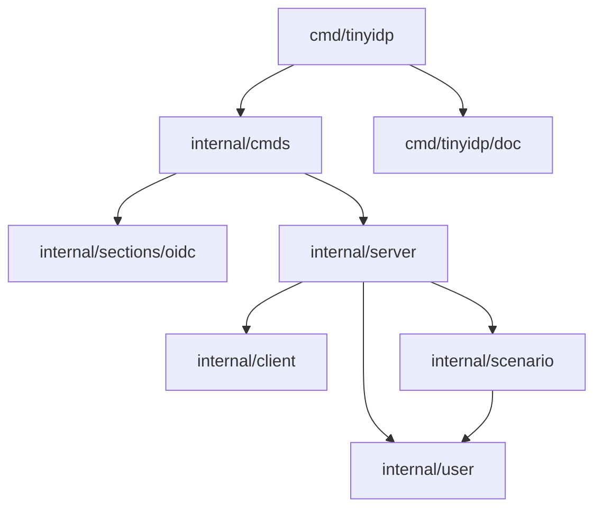

This guide is for developers modifying tinyidp. It explains the package boundaries, the runtime state model, the scenario registry, the configuration layer, and the extension points that are safe to use when adding behavior.

Use `tinyidp help user-guide` if you only need to run the provider. Use `tinyidp help reference` for complete endpoint and field tables.

## Package layout

tinyidp separates command wiring, configuration, protocol behavior, and fixture modeling into small packages.

| Package | Responsibility |
|---|---|
| `cmd/tinyidp` | Cobra root, Glazed help wiring, command registration. |
| `cmd/tinyidp/doc` | Embedded Glazed help pages loaded into the help system. |
| `internal/cmds` | Glazed command implementations such as `serve` and `print-config`. |
| `internal/sections/oidc` | Reusable OIDC configuration section and typed settings decode. |
| `internal/client` | Built-in clients, redirect/scope/PKCE rules, and merge behavior. |
| `internal/scenario` | Scenario registry, built-in scenarios, seeded-user conversion. |
| `internal/server` | HTTP handlers, JWT/JWKS, sessions, refresh tokens, debug routes. |
| `internal/user` | Deterministic synthetic user derivation from login names. |

The dependency direction is deliberate. Commands depend on config sections and server construction. The server depends on clients, scenarios, and users. Scenarios do not depend on HTTP. That keeps fixture modeling testable without starting a server.



## Runtime state model

`internal/server.Server` owns all mutable provider state. It is intentionally in-memory and per-process. A restart invalidates sessions, authorization codes, access tokens, refresh tokens, and signing keys.

The main state fields are:

```go
type Server struct {
    issuer  string
    clients *client.Registry

    key *rsa.PrivateKey
    kid string

    jwksMode string
    registry *scenario.Registry

    mu            sync.Mutex
    codes         map[string]authCode
    tokens        map[string]accessToken
    sessions      map[string]*session
    refreshTokens map[string]refreshToken
    deviceGrants  map[string]deviceGrant
}
```

The mutex protects maps that change during requests. The signing key, client registry, issuer, and scenario registry are constructed before the server starts serving requests and are treated as stable configuration.

The important invariant is that authorization codes and approved device grants carry the authenticated user, scenario, client ID, scope, and authentication time into the token endpoint. The token endpoint should not re-derive that context.

## The scenario registry

A scenario is a data object that describes how a login behaves. Normal users have a scenario with a user and no failure hooks. Failure scenarios set fields such as `AuthError`, `TokenError`, `UserInfoError`, `MutateClaims`, `OmitClaims`, or `SignKey`.

The registry is the only lookup path from login name to behavior:

```go
sc, _ := s.registry.Lookup(login)
```

If a login does not match an explicit scenario, the registry derives a fallback synthetic user. This is why any typed login works by default.

### Add a new scenario

To add a built-in scenario:

1. Add an entry to `builtinScenarios()` in `internal/scenario/scenario.go`.
2. Choose the smallest scenario field that represents the behavior.
3. Add a server-flow test in `internal/server` that exercises the relevant endpoint.
4. Update `cmd/tinyidp/doc/pages/scenarios.md`.

Prefer declarative fields over handler branches. For example, add an `ExtraClaims` or `OmitClaims` scenario instead of checking `if login == "special"` in the token handler.

## Seeded users

Seeded users are file-backed scenario definitions. `internal/scenario/seeded_users.go` loads YAML or JSON and converts each user into a normal scenario.

The conversion pipeline is:

```text
SeededUserFile -> []SeededUser -> []Scenario -> Registry.RegisterAll
```

During conversion, tinyidp:

1. Normalizes `login`.
2. Derives a base synthetic user.
3. Applies explicit `sub`, `email`, and `name` overrides.
4. Expands generic claim helpers.
5. Overlays raw `claims`.
6. Applies `email_verified` / `email-verified`.
7. Copies optional `password` metadata.
8. Copies `omit_claims`.

This boundary is important. Passwords and claim helpers become scenario metadata before the HTTP layer sees them. The token and userinfo handlers do not need to know whether a scenario came from a built-in definition, fallback login, or users file.

## Password validation

Password validation belongs in authorize POST because that is the point where a browser submits credentials and before any session or authorization code can be created.

The policy is intentionally small:

```go
func passwordAccepted(sc scenario.Scenario, submitted string) bool {
    return sc.Password == "" || submitted == sc.Password
}
```

A scenario with an empty password is permissive. A scenario with a non-empty password requires an exact submitted value. Wrong and missing passwords both return `401 invalid login or password`.

Tests should verify state, not just status codes. A failed password attempt must not create a session or code.

## Route mounting and path-based issuers

The server registers routes at root and, when the issuer URL contains a path, under the issuer path prefix:

```go
func (s *Server) RegisterRoutes(mux *http.ServeMux) {
    s.registerRoutesAt(mux, "")
    if prefix := s.issuerPathPrefix(); prefix != "" {
        s.registerRoutesAt(mux, prefix)
    }
}
```

This supports issuer URLs such as:

    http://127.0.0.1:19087/realms/personal-inbox

The path prefix is a routing concern only. Do not use path-based issuers to infer provider-specific claim behavior. Claims are defined by scenarios and seeded users.

When changing routing, test discovery, authorize, device authorization, device approval, token, userinfo, JWKS, logout, health, and debug routes under both root and path prefixes.

## Device authorization workflow

Native device authorization lives in `internal/server/device.go` plus the device-code branch in `internal/server/token.go`.

The flow has two actors:

1. The device client calls `POST /device_authorization` with `client_id` and `scope`.
2. The user opens `/device`, enters the user code, logs in through scenario/seeded-user credentials, and approves or denies.
3. The device polls `/token` with `grant_type=urn:ietf:params:oauth:grant-type:device_code` and the opaque `device_code`.

Implementation boundaries:

- `deviceGrant` is keyed by opaque `device_code` in `Server.deviceGrants`.
- Human-entered `user_code` lookup scans the map under lock; this keeps the first implementation simple and avoids a second index that must be kept in sync.
- User-code normalization is permissive about case, spaces, and hyphens.
- Approval uses `registry.Lookup(login)` and the same `passwordAccepted` fixture-password semantics as authorize POST.
- Token polling returns OAuth device errors: `authorization_pending`, `slow_down`, `expired_token`, `access_denied`, and `invalid_grant`.
- Successful token exchange deletes the device grant so the code is one-time use.
- `/debug/device-grants` shows redacted state for tests without exposing full device codes.

When changing this flow, test both state transitions and returned OAuth error codes. Avoid sleeping in tests; age `LastPoll` or `Expires` under the server mutex to keep the suite fast.

## Configuration section workflow

OIDC configuration fields live in `internal/sections/oidc/section.go` and decode into `internal/sections/oidc/settings.go`. Commands compose the same section so flags, env vars, and config-file keys do not drift.

To add a config field:

1. Add the field to `NewSection()` with help text and a default.
2. Add the field to `Settings` with a matching `glazed` tag.
3. Use the field from command construction or server options.
4. Update `print-config` output.
5. Add tests for section defaults and config-file decode.
6. Update `reference.md` and the relevant guide/tutorial.

Do not read environment variables directly in server code. The command layer resolves configuration; the server receives typed options.

## Client registry workflow

The client registry owns redirect allowlists, scope allowlists, PKCE requirements, and secrets. Built-ins are defined in `internal/client`. The `serve` command builds the registry from settings.

When a configured client ID matches a built-in, tinyidp merges configured redirect URIs into the built-in while preserving behavior such as PKCE requirement. This prevents a config file from accidentally turning `public-spa` into a non-PKCE client.

Tests for client behavior should cover both authorize-time validation and token-time validation. Cross-client code redemption must fail.

## Help page workflow

Help pages are Markdown files with Glazed frontmatter under `cmd/tinyidp/doc/pages/`. The `doc` package embeds the directory and loads every page into the help system.

For each help page:

- Use a unique `Slug`.
- Use `SectionType: Tutorial` for step-by-step flows.
- Use `SectionType: Application` for an end-to-end guide.
- Use `SectionType: GeneralTopic` for reference or architecture material.
- Add `See also` links to adjacent pages.

After adding pages, verify:

    go test ./cmd/tinyidp/doc ./cmd/tinyidp -count=1
    go run ./cmd/tinyidp help <slug>

## Validation commands

Use focused validation while developing and full validation before committing.

Focused commands:

    go test ./internal/scenario -count=1
    go test ./internal/server -count=1
    go test ./internal/cmds -count=1

Full commands:

    GOWORK=off go test ./... -count=1
    GOWORK=off go build ./cmd/tinyidp

For config examples:

    GOWORK=off go run ./cmd/tinyidp print-config --config-file examples/configs/dev-root.yaml
    GOWORK=off go run ./cmd/tinyidp print-config --config-file examples/configs/personal-inbox-root.yaml
    GOWORK=off go run ./cmd/tinyidp print-config --config-file examples/configs/personal-inbox-realm.yaml

For xgoja integration, use the personal-inbox tutorial smokes in the `go-go-goja` repo.

## Common implementation mistakes

| Mistake | Why it is wrong | Better approach |
|---|---|---|
| Branching on login names inside HTTP handlers. | It spreads scenario behavior across endpoints. | Add scenario data and let handlers consult the scenario. |
| Recomputing user state at token time. | It can drift from the authorize step. | Store user and scenario on the authorization code. |
| Adding provider-specific claim fields as first-class schema. | It makes tinyidp a partial provider emulator. | Use generic fields or raw `claims`. |
| Reading env vars in server code. | It bypasses Glazed precedence and `print-config`. | Add a section field and decode settings. |
| Forgetting path-prefixed routes. | Path issuers advertise path-prefixed endpoints. | Test root and path routes together. |
| Creating a session before credential validation. | Failed login can leave valid auth state behind. | Validate first, then create session and code. |
| Reusing an approved device code. | Device codes are bearer credentials and must be one-time use. | Delete the grant during successful token exchange. |
| Testing device polling with real sleeps. | It slows the suite and makes tests flaky. | Mutate `LastPoll`/`Expires` under the server mutex. |

## See also

- `tinyidp help user-guide` — operational usage guide.
- `tinyidp help reference` — endpoint and field reference.
- `tinyidp help scenarios` — built-in scenario catalog.
- `tinyidp help tutorial-seeded-users-and-claims` — fixture user tutorial.
