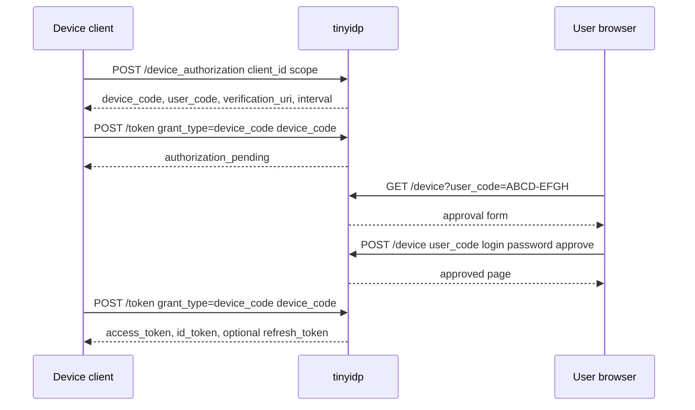

# Device Authorization Grant Design and Implementation Guide

## Executive summary

This ticket designs native OAuth 2.0 Device Authorization Grant support for `tinyidp`. Today, `tinyidp` supports browser-centered OIDC flows: authorization code, PKCE, sessions, refresh tokens, logout, seeded users, and scenario-driven failure cases. The xgoja Step 08 tutorial already contains a device-style flow, but that flow is owned by the generated xgoja host. `tinyidp` is only the browser OIDC provider used when a user approves the generated host's device request.

Native device authorization support would move one specific OAuth grant into `tinyidp` itself. A command-line or TV-style client would call a new device authorization endpoint, receive a `device_code` and human-entered `user_code`, poll the token endpoint, and eventually receive tokens after a user approves the code in a browser.

The feature should stay inside `tinyidp`'s existing test-provider model:

- all state is in memory;
- all users come from built-ins, fallback logins, or seeded users;
- fixture passwords remain local test values;
- scenarios remain the source of user behavior and claims;
- path-based issuers remain URL-shape compatibility, not provider-specific semantics;
- the implementation should be simple, deterministic, and easy to test.

The proposed public surface is:

| Endpoint / field | Purpose |
|---|---|
| `POST /device_authorization` | Client starts a device flow and receives `device_code`, `user_code`, `verification_uri`, `verification_uri_complete`, `expires_in`, and `interval`. |
| `GET /device` | Browser page where a user enters or confirms `user_code`, login, and optional fixture password. |
| `POST /device` | Approves or denies a pending device code. |
| `POST /token` with `grant_type=urn:ietf:params:oauth:grant-type:device_code` | Client polls until pending, approved, denied, expired, or slow-polling. |
| Discovery `device_authorization_endpoint` | Advertises the start endpoint to clients. |
| Discovery `grant_types_supported` | Adds `urn:ietf:params:oauth:grant-type:device_code`. |

## What device authorization is

The OAuth 2.0 Device Authorization Grant is defined by RFC 8628. It exists for clients that cannot easily receive a browser redirect. The client still needs a user to authenticate and approve access, but the client cannot host the normal callback URL used by the authorization-code flow.

The grant splits the flow into two paths that meet at shared server state:

1. The device client starts the flow and polls the token endpoint with a machine-only `device_code`.
2. The user opens a browser, enters a short `user_code`, authenticates, and approves the request.

The token endpoint returns `authorization_pending` while the user has not approved. It returns tokens only after approval. It returns `slow_down` when the client polls too aggressively, `expired_token` after the device code expires, and `access_denied` if the user denies the request.



The grant does not remove normal OIDC validation. The client still has a `client_id`, scopes are still validated, confidential clients still authenticate at the token endpoint, and issued ID tokens still carry the configured issuer, audience, subject, auth time, and claims.

## Current tinyidp architecture relevant to this work

### Server state and route registration

`internal/server/server.go` owns the runtime state. Existing maps store authorization codes, access tokens, sessions, and refresh tokens behind a single mutex:

```go
type Server struct {
    issuer  string
    clients *client.Registry

    key *rsa.PrivateKey
    kid string

    jwksMode string
    registry *scenario.Registry

    mu            sync.Mutex
    codes         map[string]authCode
    tokens        map[string]accessToken
    sessions      map[string]*session
    refreshTokens map[string]refreshToken
}
```

The device grant should follow the same pattern. Add one new in-memory map to `Server`, guarded by the existing mutex:

```go
deviceGrants map[string]deviceGrant // key: device_code
```

Do not add a database. Persistence would be inconsistent with the rest of tinyidp and unnecessary for local tests.

Route registration already supports root and path-based issuers:

```go
func (s *Server) RegisterRoutes(mux *http.ServeMux) {
    s.registerRoutesAt(mux, "")
    if prefix := s.issuerPathPrefix(); prefix != "" {
        s.registerRoutesAt(mux, prefix)
    }
}
```

New device routes must be registered through `registerRoutesAt`, so a path issuer such as `http://127.0.0.1:19087/realms/personal-inbox` gets:

```text
/realms/personal-inbox/device_authorization
/realms/personal-inbox/device
/realms/personal-inbox/token
```

### Token endpoint grant dispatch

`internal/server/token.go` already dispatches by `grant_type`:

```go
switch r.Form.Get("grant_type") {
case "authorization_code":
    s.tokenAuthorizationCode(w, r, clientID, c)
case "refresh_token":
    s.tokenRefresh(w, r, clientID, c)
default:
    tokenError(w, http.StatusBadRequest, "unsupported_grant_type", "only authorization_code and refresh_token are supported")
}
```

Device support should add a third branch:

```go
case deviceGrantType:
    s.tokenDeviceCode(w, r, clientID, c)
```

The existing client-auth logic before the switch should remain shared. That means confidential clients must still present their secret at the token endpoint.

### Scenario and seeded-user model

`internal/scenario/seeded_users.go` now supports fixture passwords and generic claim helpers. This is directly useful for device approval. When a user approves a code as `alice`, tinyidp should resolve `alice` through the same registry used by browser authorize POST.

The same helper policy should apply:

```go
func passwordAccepted(sc scenario.Scenario, submitted string) bool {
    return sc.Password == "" || submitted == sc.Password
}
```

A device approval with `login=alice` and `password=alice-password` should approve a grant as the seeded Alice user. A device approval with the wrong password should fail and leave the grant pending.

## Proposed data model

Add a new type in `internal/server/device.go`:

```go
const (
    deviceGrantType = "urn:ietf:params:oauth:grant-type:device_code"
    defaultDeviceInterval = 5 * time.Second
    defaultDeviceTTL      = 10 * time.Minute
)

type deviceGrantStatus string

const (
    devicePending  deviceGrantStatus = "pending"
    deviceApproved deviceGrantStatus = "approved"
    deviceDenied   deviceGrantStatus = "denied"
)

type deviceGrant struct {
    DeviceCode string
    UserCode   string // canonical display form, e.g. ABCD-EFGH

    ClientID string
    Scope    string
    Expires  time.Time
    Interval time.Duration

    Status deviceGrantStatus

    User     user.User
    Scenario *scenario.Scenario
    AuthTime time.Time

    LastPoll time.Time
    SlowDownCount int
}
```

Important invariants:

- `DeviceCode` is secret and high entropy. It is used only by the polling client.
- `UserCode` is short and human-entered. It is not sufficient to obtain tokens; it only identifies a pending grant in the browser approval path.
- `Status` starts as `pending` and changes to `approved` or `denied` exactly once.
- `User`, `Scenario`, and `AuthTime` are set only when the user approves the grant.
- Expired device grants should never issue tokens, even if approved later.

The server map is keyed by `DeviceCode`. Lookup by `UserCode` can be implemented by scanning the map because tinyidp is a local test tool and the number of active device grants is small. If this later becomes noisy, add a second map `deviceByUserCode map[string]string` from normalized user code to device code.

## User code generation and normalization

The `device_code` should use the existing `randomB64(32)` helper. The `user_code` should be human-friendly, uppercase, and easy to type. A suitable format is eight base32-like characters split by a hyphen:

```text
ABCD-EFGH
```

Use an alphabet that avoids visually ambiguous characters if practical:

```go
const userCodeAlphabet = "ABCDEFGHJKLMNPQRSTUVWXYZ23456789"
```

Normalization should accept common user input differences:

```go
func normalizeUserCode(s string) string {
    s = strings.ToUpper(s)
    s = strings.ReplaceAll(s, "-", "")
    s = strings.ReplaceAll(s, " ", "")
    return s
}
```

Store and display `ABCD-EFGH`, but compare by normalized form.

## Endpoint design

### POST /device_authorization

Request parameters:

| Parameter | Required | Meaning |
|---|---:|---|
| `client_id` | yes | Client starting the device flow. |
| `scope` | no | Requested scopes. Defaults should be conservative; examples should use `openid profile email`. |

Response fields from RFC 8628:

| Field | Meaning |
|---|---|
| `device_code` | Secret polling code used by the device client. |
| `user_code` | Human-entered code shown to the user. |
| `verification_uri` | Browser URL where the user enters `user_code`. |
| `verification_uri_complete` | Browser URL with `user_code` prefilled. |
| `expires_in` | Seconds until the device code expires. |
| `interval` | Minimum polling interval in seconds. |

Example response:

```json
{
  "device_code": "YtK4...opaque...",
  "user_code": "ABCD-EFGH",
  "verification_uri": "http://127.0.0.1:5556/device",
  "verification_uri_complete": "http://127.0.0.1:5556/device?user_code=ABCD-EFGH",
  "expires_in": 600,
  "interval": 5
}
```

Pseudocode:

```go
func (s *Server) deviceAuthorization(w http.ResponseWriter, r *http.Request) {
    if r.Method != http.MethodPost {
        oauthError(w, 405, "invalid_request", "method not allowed")
        return
    }
    r.ParseForm()

    clientID := r.Form.Get("client_id")
    c, ok := s.clients.Lookup(clientID)
    if !ok {
        oauthError(w, 400, "invalid_client", "bad client_id")
        return
    }

    scope := strings.TrimSpace(r.Form.Get("scope"))
    if scope == "" {
        scope = "openid profile email"
    }
    if !hasScope(scope, "openid") || !c.AllowsScope(scope) {
        oauthError(w, 400, "invalid_scope", "scope not allowed")
        return
    }

    grant := deviceGrant{
        DeviceCode: randomB64(32),
        UserCode: generateUserCode(),
        ClientID: clientID,
        Scope: scope,
        Expires: time.Now().Add(defaultDeviceTTL),
        Interval: defaultDeviceInterval,
        Status: devicePending,
    }

    s.mu.Lock()
    s.deviceGrants[grant.DeviceCode] = grant
    s.mu.Unlock()

    writeJSON(w, 200, map[string]any{...})
}
```

The endpoint should set `Cache-Control: no-store` and `Pragma: no-cache`, matching token responses.

### GET /device

`GET /device` renders an approval page. It should work with or without a query parameter:

```text
/device
/device?user_code=ABCD-EFGH
```

The page should include:

- user code input;
- login input;
- password input;
- approve button;
- deny button;
- short explanation that this is a local test device flow.

It should not require a separate relying-party app. This is the user's interaction with the IdP.

The first implementation can use a direct login/password form rather than trying to reuse the existing IdP session cookie. Session reuse can be a later improvement. Direct approval is simpler and deterministic for tests.

### POST /device

Request parameters:

| Parameter | Meaning |
|---|---|
| `user_code` | Human code to approve. |
| `login` | tinyidp login/scenario name. |
| `password` | Optional fixture password. |
| `action` | `approve` or `deny`. |

Approval pseudocode:

```go
func (s *Server) deviceApprove(w http.ResponseWriter, r *http.Request) {
    r.ParseForm()
    userCode := normalizeUserCode(r.Form.Get("user_code"))

    s.mu.Lock()
    grant, deviceCode, ok := s.findDeviceGrantByUserCodeLocked(userCode)
    s.mu.Unlock()
    if !ok || time.Now().After(grant.Expires) {
        renderDevicePage(w, "unknown or expired code")
        return
    }

    if r.Form.Get("action") == "deny" {
        s.mu.Lock()
        grant.Status = deviceDenied
        s.deviceGrants[deviceCode] = grant
        s.mu.Unlock()
        renderDeviceDone(w, "Denied")
        return
    }

    login := user.Normalize(r.Form.Get("login"))
    sc, _ := s.registry.Lookup(login)
    if !passwordAccepted(sc, r.Form.Get("password")) {
        renderDevicePage(w, "invalid login or password")
        return
    }
    if sc.AuthError != "" {
        renderDevicePage(w, "login scenario cannot approve device request: "+sc.AuthError)
        return
    }

    s.mu.Lock()
    grant.Status = deviceApproved
    grant.User = sc.User
    grant.Scenario = &sc
    grant.AuthTime = time.Now()
    s.deviceGrants[deviceCode] = grant
    s.mu.Unlock()

    renderDeviceDone(w, "Approved")
}
```

Do not create an IdP browser session as a side effect in the first implementation. Device approval authenticates and authorizes the device grant; it should not silently log the browser into unrelated authorize flows unless that behavior is explicitly designed later.

### POST /token with device_code grant

Polling request:

```text
grant_type=urn:ietf:params:oauth:grant-type:device_code
device_code=<opaque>
client_id=<client>
```

Confidential clients also authenticate as they already do for other token grants.

Polling behavior:

| Condition | Token response |
|---|---|
| Unknown code | `invalid_grant` |
| Expired code | `expired_token` |
| Client mismatch | `invalid_grant` |
| Polling before `interval` | `slow_down` |
| Pending approval | `authorization_pending` |
| Denied | `access_denied` |
| Approved | access token, optional ID token, optional refresh token |

Pseudocode:

```go
func (s *Server) tokenDeviceCode(w http.ResponseWriter, r *http.Request, clientID string, c client.Client) {
    code := r.Form.Get("device_code")
    now := time.Now()

    s.mu.Lock()
    grant, ok := s.deviceGrants[code]
    if ok && !grant.LastPoll.IsZero() && now.Sub(grant.LastPoll) < grant.Interval {
        grant.SlowDownCount++
        grant.LastPoll = now
        s.deviceGrants[code] = grant
        s.mu.Unlock()
        tokenError(w, 400, "slow_down", "polling too quickly")
        return
    }
    if ok {
        grant.LastPoll = now
        s.deviceGrants[code] = grant
    }
    s.mu.Unlock()

    if !ok { tokenError(... "invalid_grant" ...); return }
    if now.After(grant.Expires) { tokenError(... "expired_token" ...); return }
    if grant.ClientID != clientID { tokenError(... "invalid_grant" ...); return }

    switch grant.Status {
    case devicePending:
        tokenError(w, 400, "authorization_pending", "device authorization is pending")
        return
    case deviceDenied:
        delete grant or leave for debug
        tokenError(w, 400, "access_denied", "device authorization denied")
        return
    case deviceApproved:
        pop grant atomically and issue tokens
    }
}
```

On success, delete the device grant. Device codes are one-time use. A second successful poll should fail with `invalid_grant`.

Token issuance should reuse the same core code path as authorization-code issuance as much as possible. If duplication starts to grow, extract helpers:

```go
func (s *Server) issueAccessToken(u user.User, sc *scenario.Scenario, now time.Time) string
func (s *Server) buildIDTokenClaims(u user.User, sc *scenario.Scenario, clientID, scope, nonce string, authTime, now time.Time) map[string]any
func (s *Server) writeTokenResponse(...)
```

A device token response with `openid` scope should include an ID token. A response with `offline_access` should issue a refresh token using existing `issueRefreshToken`.

## Discovery metadata

Update discovery in `internal/server/jwt.go`:

```go
"device_authorization_endpoint": s.issuer + "/device_authorization",
"grant_types_supported": []string{
    "authorization_code",
    "refresh_token",
    "urn:ietf:params:oauth:grant-type:device_code",
},
```

The rest of discovery can remain unchanged initially. If tests need explicit device-specific metadata later, add it intentionally.

## Debug endpoints

Add `/debug/device-grants` to make tests and manual debugging easier. The response should redact secrets and show only prefixes:

```json
[
  {
    "device_code_prefix": "abc12345",
    "user_code": "ABCD-EFGH",
    "client_id": "dev-client",
    "scope": "openid profile email",
    "status": "pending",
    "expires": "2026-07-06T...Z",
    "last_poll": "2026-07-06T...Z",
    "slow_down_count": 1,
    "login": "alice"
  }
]
```

Do not expose full `device_code` values in debug output.

## Testing plan

### Unit-level helper tests

Add tests for:

- user-code format;
- user-code normalization accepting lower case, spaces, and hyphens;
- duplicate user-code generation retry behavior if implemented;
- device grant expiry calculation if factored.

### Server-flow tests

Add tests in `internal/server`:

1. Discovery advertises `device_authorization_endpoint` and the device-code grant type.
2. `POST /device_authorization` rejects unknown clients.
3. `POST /device_authorization` rejects disallowed scopes.
4. `POST /device_authorization` returns required RFC fields.
5. Initial token poll returns `authorization_pending`.
6. Polling too quickly returns `slow_down`.
7. Expired grants return `expired_token`.
8. Denied grants return `access_denied`.
9. Approved grants return access token and ID token when scope includes `openid`.
10. Approved grants issue refresh token when scope includes `offline_access`.
11. Successful device code is one-time use.
12. Client mismatch at token polling returns `invalid_grant`.
13. Approval with wrong fixture password fails and leaves grant pending.
14. Approval with seeded Alice password yields Alice's fixed subject and claims.
15. Path-based issuer routes expose `/device_authorization` and `/device` under the issuer prefix.

### Manual smoke test

A simple manual smoke can be implemented with `curl`:

```bash
# Start tinyidp.
go run ./cmd/tinyidp serve --users-file examples/users/personal-inbox-users.yaml

# Start device flow.
curl -s -X POST http://localhost:5556/device_authorization \
  -d client_id=dev-client \
  -d 'scope=openid profile email offline_access' | tee /tmp/device.json

# Poll before approval; expect authorization_pending.
DEVICE_CODE=$(jq -r .device_code /tmp/device.json)
curl -s -X POST http://localhost:5556/token \
  -d grant_type=urn:ietf:params:oauth:grant-type:device_code \
  -d client_id=dev-client \
  -d device_code="$DEVICE_CODE"

# Open verification_uri_complete, approve as alice / alice-password.
xdg-open "$(jq -r .verification_uri_complete /tmp/device.json)"

# Poll again; expect tokens.
curl -s -X POST http://localhost:5556/token \
  -d grant_type=urn:ietf:params:oauth:grant-type:device_code \
  -d client_id=dev-client \
  -d device_code="$DEVICE_CODE" | jq .
```

## Implementation phases

### Phase 1: data model and route skeleton

- Add `deviceGrant` types and constants.
- Add `deviceGrants map[string]deviceGrant` to `Server`.
- Initialize the map in `New` and tests.
- Register `/device_authorization` and `/device` in `registerRoutesAt`.
- Add method-not-allowed responses and empty handlers.

### Phase 2: device authorization endpoint

- Implement `POST /device_authorization`.
- Validate client ID and scopes.
- Generate unique `device_code` and `user_code`.
- Store pending grants.
- Return RFC fields with `no-store` headers.
- Add tests for success and validation failures.

### Phase 3: verification UI and approval

- Add embedded template for `/device` or implement a small inline template.
- Implement GET with optional prefilled `user_code`.
- Implement POST approve/deny.
- Validate user code, login, and fixture password.
- Resolve scenario and store approved user/scenario/auth time.
- Add tests for approve, deny, wrong password, unknown code, expired code.

### Phase 4: token polling grant

- Add `deviceGrantType` to token dispatch.
- Implement `tokenDeviceCode`.
- Return `authorization_pending`, `slow_down`, `expired_token`, `access_denied`, and `invalid_grant` correctly.
- Issue access token, ID token, and refresh token where appropriate.
- Delete grants after successful token issuance.
- Add tests for all polling states.

### Phase 5: discovery, debug, docs

- Add `device_authorization_endpoint` and device grant type to discovery.
- Add `/debug/device-grants`.
- Update README.
- Update Glazed help pages:
  - `user-guide`,
  - `developer-guide`,
  - `reference`,
  - a new `tutorial-device-authorization` page.
- Add troubleshooting entries for pending, slow polling, expired codes, and stale user codes.

### Phase 6: validation and integration

- Run `go test ./internal/server -count=1`.
- Run `GOWORK=off go test ./... -count=1`.
- Run `GOWORK=off go build ./cmd/tinyidp`.
- Smoke-render the new help page with `go run ./cmd/tinyidp help tutorial-device-authorization`.
- Decide whether xgoja should keep its host-owned device flow or add an optional tinyidp-native device-flow example. Do not replace the existing Step 08 behavior without a separate xgoja design.

## API reference summary

### Device authorization request

```http
POST /device_authorization
Content-Type: application/x-www-form-urlencoded

client_id=dev-client&scope=openid%20profile%20email
```

Success:

```json
{
  "device_code": "opaque-secret",
  "user_code": "ABCD-EFGH",
  "verification_uri": "http://localhost:5556/device",
  "verification_uri_complete": "http://localhost:5556/device?user_code=ABCD-EFGH",
  "expires_in": 600,
  "interval": 5
}
```

Errors:

```json
{"error":"invalid_client","error_description":"bad client_id"}
{"error":"invalid_scope","error_description":"scope not allowed"}
{"error":"invalid_request","error_description":"method not allowed"}
```

### Token polling request

```http
POST /token
Content-Type: application/x-www-form-urlencoded

grant_type=urn:ietf:params:oauth:grant-type:device_code&client_id=dev-client&device_code=opaque-secret
```

Pending:

```json
{"error":"authorization_pending","error_description":"device authorization is pending"}
```

Slow polling:

```json
{"error":"slow_down","error_description":"polling too quickly"}
```

Expired:

```json
{"error":"expired_token","error_description":"device code expired"}
```

Denied:

```json
{"error":"access_denied","error_description":"device authorization denied"}
```

Success:

```json
{
  "access_token": "opaque-access-token",
  "token_type": "Bearer",
  "expires_in": 3600,
  "scope": "openid profile email",
  "id_token": "header.payload.signature"
}
```

## Risks and decisions

### Decision: direct login form for approval first

- **Context:** A user approving a code must authenticate in the browser.
- **Options considered:** Reuse existing IdP session; redirect through `/authorize`; implement direct login/password form on `/device`.
- **Decision:** Implement a direct `/device` login/password approval form first.
- **Rationale:** It is deterministic, easy to test, and matches tinyidp's local fixture model.
- **Consequence:** Browser IdP sessions are not reused for device approval in the first implementation.
- **Status:** proposed

### Decision: include ID token when `openid` is in scope

- **Context:** tinyidp is an OIDC provider, not only an OAuth access-token server.
- **Options considered:** Access-token-only device grant; issue ID token for `openid` scope.
- **Decision:** Issue ID token when scope includes `openid`.
- **Rationale:** Relying parties using OIDC expect identity claims when requesting `openid`.
- **Consequence:** Device token code should share ID-token claim construction with authorization-code flow where possible.
- **Status:** proposed

### Decision: keep xgoja Step 08 separate

- **Context:** xgoja Step 08 already implements generated-host-owned device authorization.
- **Options considered:** Replace xgoja Step 08 with tinyidp-native device endpoints; keep both as separate examples.
- **Decision:** Keep xgoja Step 08 unchanged unless a separate xgoja ticket chooses to integrate tinyidp-native device grant.
- **Rationale:** The current Step 08 tests app-owned programmatic-token authorization, which is a different subsystem.
- **Consequence:** tinyidp-native device grant should get its own tinyidp tutorial and optional future xgoja example.
- **Status:** proposed

## What a reviewer should check

- Does the implementation preserve existing authorization-code and refresh-token behavior?
- Are device grants one-time use after success?
- Do wrong, denied, expired, pending, and slow-poll states return RFC-style token errors?
- Does a confidential client still authenticate at `/token` before device-code exchange?
- Do ID token claims match the approving user and scenario?
- Do path-based issuer routes include the new endpoints?
- Are debug endpoints redacting full device codes?
- Do docs clearly distinguish tinyidp-native device grant from xgoja's existing host-owned device flow?

## Related files

- `internal/server/server.go` — add state and route registration.
- `internal/server/device.go` — proposed new file for device authorization handlers and helpers.
- `internal/server/token.go` — add token grant dispatch and token polling handler.
- `internal/server/jwt.go` — discovery metadata updates.
- `internal/server/debug.go` — debug view for pending device grants.
- `internal/server/server_test.go` or `internal/server/device_test.go` — end-to-end server tests.
- `internal/scenario/seeded_users.go` — fixture passwords and claims used during approval.
- `cmd/tinyidp/doc/pages/reference.md` — endpoint and grant reference.
- `cmd/tinyidp/doc/pages/developer-guide.md` — implementation guidance.
- `cmd/tinyidp/doc/pages/tutorial-device-authorization.md` — new tutorial for manual and scripted device flow.
