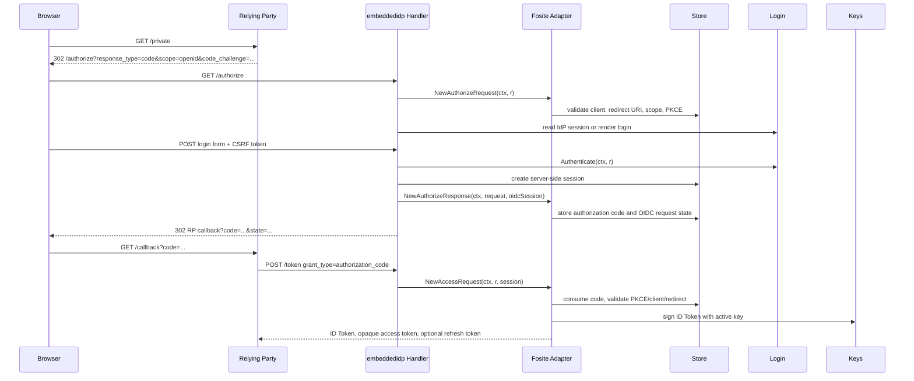

# Production embeddable IdP design and implementation guide

## Executive summary

The current `tinyidp` repository contains a useful local-development OpenID Connect provider. It is intentionally small, stateful in memory, permissive where local testing benefits from permissiveness, and capable of producing broken behavior so relying parties can test their error paths. The production target is different: build a strict embeddable OpenID Provider for Go applications while preserving the mock engine as a testing tool.

The central design decision is to create two engines behind shared domain, configuration, fixture, and metadata concepts:

```text
cmd/tinyidp serve --engine mock      -> current local development behavior
cmd/tinyidp serve --engine fosite    -> strict production-like compatibility engine
pkg/embeddedidp                     -> embeddable production provider API
```

The mock engine should remain able to issue malformed, slow, expired, wrong-audience, wrong-key, and otherwise synthetic behavior. The production engine must refuse unsafe configuration at startup, use exact redirect URI matching, require Authorization Code + PKCE, persist signing keys, store only hashed tokens/codes, expose no debug routes, use secure cookies in production mode, and emit audit events that do not contain raw secrets.

The recommended protocol engine is Ory Fosite, but Fosite should stay inside an adapter package. Fosite should own OAuth/OIDC request parsing, validation, and response writing. The rest of the project should own product behavior: configuration, login, consent, users, claims, persistence, key rotation, audit, documentation, examples, and conformance tests.

## Problem statement and scope

`tinyidp` currently solves the local testing problem well. Its README is explicit that it is not production-grade: it has no real account system, consent screen, persistent keys, token revocation, or TLS enforcement, and its refresh tokens and logout behavior are in-memory testing semantics only (`README.md:1-6`). That is appropriate for a mock. It is not appropriate for software that signs real ID Tokens and participates in real browser login flows.

The production work is not a hardening pass over every mock behavior. It is a reorganization that separates deliberate test behavior from production behavior.

In scope:

- Add a shared domain model for clients, users, sessions, grants, authorization codes, refresh tokens, claims, signing keys, and audit events.
- Add strict mode validation for production configuration.
- Add Fosite-backed Authorization Code + PKCE support through a narrow adapter.
- Add persistent storage interfaces and initial memory + SQLite implementations.
- Add persistent key management and JWKS publication semantics.
- Add `pkg/embeddedidp` as the public Go embedding API.
- Add `tinyidp serve --engine mock|fosite`, leaving `mock` as the CLI default.
- Add intern-quality docs, conformance-plan docs, and reusable tests.

Out of scope for the first production increment:

- Dynamic client registration.
- Implicit flow, hybrid flow, and resource-owner-password grant.
- Arbitrary `request_uri` fetching.
- Multi-instance production deployment as the first store target. SQLite is the first production persistence story; Postgres can follow.
- Replacing the mock engine with Fosite.

## Source material downloaded for this ticket

All external protocol/security references were downloaded with Defuddle into `../sources/`:

- OpenID Connect Core: `../sources/01-openid-net-specs-openid-connect-core-1-0-html.md`.
- OAuth 2.0 Security Best Current Practice / RFC 9700: `../sources/02-datatracker-ietf-org-doc-html-rfc9700.md`.
- Fosite API docs: `../sources/03-pkg-go-dev-github-com-ory-fosite.md`.
- Fosite compose docs: `../sources/04-pkg-go-dev-github-com-ory-fosite-compose.md`.
- OpenID Connect Discovery: `../sources/05-openid-net-specs-openid-connect-discovery-1-0-html.md`.
- OpenID Foundation Certification: `../sources/06-openid-net-certification.md`.
- OWASP OAuth2, Authentication, Session Management, CSRF, TLS, and Logging cheat sheets: `../sources/07-*` through `../sources/12-*`.

These files are the reviewable evidence base for protocol and security requirements. The repository evidence below is the reviewable evidence base for current behavior.

## Current-state analysis

### Repository shape

The current repository is a single mock IdP implementation with CLI wiring, OIDC settings, client registry, scenario registry, and endpoint handlers. The most important files are:

| File | Current responsibility |
|---|---|
| `/home/manuel/workspaces/2026-07-07/prod-tiny-idp/tiny-idp/cmd/tinyidp/main.go` | Cobra/Glazed command entry point. |
| `/home/manuel/workspaces/2026-07-07/prod-tiny-idp/tiny-idp/internal/cmds/serve.go` | Builds settings, scenario registry, client registry, server, mux, and `ListenAndServe`. |
| `/home/manuel/workspaces/2026-07-07/prod-tiny-idp/tiny-idp/internal/sections/oidc/settings.go` | Decodes reusable OIDC settings and trims trailing issuer slash. |
| `/home/manuel/workspaces/2026-07-07/prod-tiny-idp/tiny-idp/internal/server/server.go` | Holds all IdP state and registers routes. |
| `/home/manuel/workspaces/2026-07-07/prod-tiny-idp/tiny-idp/internal/server/authorize.go` | Authorization endpoint, login form, prompt/max_age handling, authorization code creation. |
| `/home/manuel/workspaces/2026-07-07/prod-tiny-idp/tiny-idp/internal/server/token.go` | Token endpoint for authorization-code, refresh-token, and device-code grants. |
| `/home/manuel/workspaces/2026-07-07/prod-tiny-idp/tiny-idp/internal/server/jwt.go` | Discovery, JWKS, JWT signing, PKCE verification. |
| `/home/manuel/workspaces/2026-07-07/prod-tiny-idp/tiny-idp/internal/server/debug.go` | Loopback-only debug routes and state reset. |
| `/home/manuel/workspaces/2026-07-07/prod-tiny-idp/tiny-idp/internal/client/client.go` | Client registry, built-in clients, redirect URI/scope checks. |
| `/home/manuel/workspaces/2026-07-07/prod-tiny-idp/tiny-idp/internal/scenario/scenario.go` | Synthetic users and failure/claim scenarios. |
| `/home/manuel/workspaces/2026-07-07/prod-tiny-idp/tiny-idp/internal/user/user.go` | Deterministic synthetic user derivation from login. |

### Current state is intentionally in-memory

`internal/server/server.go` documents the current state model directly: all state is in-memory and per-process, and the RSA signing key is generated at construction time so restart invalidates codes/tokens and rotates JWKS (`internal/server/server.go:1-10`). The `Server` struct contains the private signing key, key id, scenario registry, authorization codes, access tokens, sessions, refresh tokens, device grants, and DPoP replay cache (`internal/server/server.go:26-49`). `New` generates a fresh 2048-bit RSA key and initializes maps for every state category (`internal/server/server.go:92-120`).

This is correct for local tests because process isolation and key churn make tests easy to reset. It is wrong for production because restart must not invalidate all still-valid tokens, and signing keys must have an auditable lifecycle.

### Current routes mix production-shaped routes with mock-only routes

`RegisterRoutes` registers discovery, JWKS, authorization, device authorization, device approval, token, UserInfo, end-session, health, and debug endpoints (`internal/server/server.go:123-152`). It also registers routes both at root and under the issuer path when the configured issuer contains a path (`internal/server/server.go:126-164`). The README documents the same endpoint list and explicitly includes `GET/POST /debug/*` as loopback-only introspection, reset, and JWKS failure controls (`README.md:234-249`).

Production mode must not register debug routes. Loopback-only is a useful defense for a mock server, but the production engine should remove the route surface entirely.

### Current authorization endpoint is a handwritten mock implementation

`authorize` accepts `GET` and `POST`. On `GET`, it parses and validates the request and either renders the login form or silently issues a code from a valid session (`internal/server/authorize.go:31-88`, `90-128`). On `POST`, it validates the request again, normalizes the login, checks the seeded password if present, creates an IdP session, and issues a code (`internal/server/authorize.go:50-83`).

`parseAuthorizeRequest` is the single handwritten validation chokepoint. It requires `response_type=code`, looks up `client_id`, exact-checks `redirect_uri`, requires `openid` in `scope`, checks client-allowed scopes, and enforces PKCE when the client says `RequirePKCE` (`internal/server/authorize.go:130-172`). This is a good foundation for tests and documents desired behavior, but production should delegate standards mechanics to Fosite so edge cases and error response semantics are maintained by a protocol library.

### Current token endpoint rotates refresh tokens but does not store token-family state

The token endpoint supports `authorization_code`, `refresh_token`, and device-code grant types (`internal/server/token.go:16-49`). Client authentication supports `client_secret_basic`, `client_secret_post`, or public clients with no secret (`internal/server/token.go:52-74`). Authorization-code exchange atomically deletes the authorization code, checks expiry, client ID, redirect URI, and PKCE verifier, issues an opaque access token, signs an ID Token, and optionally issues a refresh token for `offline_access` (`internal/server/token.go:76-147`). It correctly sets `Cache-Control: no-store` and `Pragma: no-cache` (`internal/server/token.go:144-146`).

Refresh-token exchange deletes the presented token and issues a replacement (`internal/server/token.go:149-218`). This implements single-use rotation in memory, but production needs more information: token hashes, parent/child links, consumed/replaced timestamps, reuse detection timestamps, token-family revocation, and audit events. Without that, production cannot distinguish an unknown token from a replay of a previously consumed token, and it cannot revoke the family on reuse.

### Current key and JWKS behavior is designed for RP error-path testing

Discovery advertises `authorization_code`, `refresh_token`, device grant, `S256` and `plain` PKCE, multiple DPoP signing algorithms, and test-oriented claims (`internal/server/jwt.go:66-90`). JWKS publishes the active key plus rotated and bad-signature keys so relying parties can test multiple-key and failure behavior (`internal/server/jwt.go:92-117`). `signJWT` can sign with a rotated key, claim an unknown `kid`, or claim a `kid` whose published key does not match the signer (`internal/server/jwt.go:132-185`).

Those modes are valuable mock behavior. Production must advertise only supported production features, must not advertise plain PKCE, and must not expose synthetic wrong-key behavior.

### Current sessions are useful for tests but not production-hardened

The IdP session cookie is `HttpOnly` and `SameSite=Lax`, but intentionally not `Secure` because the mock serves plain HTTP on loopback (`internal/server/session.go:12-22`, `67-83`). Session state is stored in memory under the raw random session ID (`internal/server/session.go:24-64`). Production should keep the browser cookie as an opaque random handle, store only a hash server-side, use `Secure`, set a path matching the issuer path, support revocation, and record audit events around session creation, refresh, and termination.

### Current client registry is permissive by design

The built-in clients are:

- `dev-client`: public, PKCE optional, no secret.
- `public-spa`: public, PKCE required, no secret.
- `web-app`: confidential, PKCE optional, secret `dev-secret`.

This is documented in code (`internal/client/client.go:85-145`) and README (`README.md:214-232`). Exact redirect URI matching already exists (`internal/client/client.go:44-52`). The production client model should keep exact matching, but it must remove permissive defaults and require explicit client configuration.

### Current scenario registry is a mock-only strength

The scenario registry maps typed login names to behavior. It supports seeded passwords, authorization errors, token endpoint errors, UserInfo errors, ID Token claim mutation, extra claims, omitted claims, and signing-key failure modes (`internal/scenario/scenario.go:21-82`). This is exactly why the mock engine should remain separate: a production IdP should not have runtime behavior where logging in as a specific username intentionally produces a bad signature or wrong audience.

## Gap analysis

| Requirement | Current behavior | Production gap |
|---|---|---|
| Authorization Code Flow | Implemented by handwritten handlers. | Use Fosite for protocol validation and response writing. |
| PKCE | Optional unless client requires it; discovery advertises `plain`. | Require `S256` in production; reject `plain`; require PKCE for public clients and default to all clients. |
| Redirect URIs | Exact allowlist check already exists. | Add startup validation for wildcards, fragments, invalid URLs, duplicate clients, and scheme policy. |
| Signing keys | New RSA key per process; JWKS includes synthetic test keys. | Persistent key store, active key selection, verification-key retention, rotation audit. |
| Authorization codes | Raw code stored in process memory. | Store only hash, one-time transaction, expiry cleanup, audit. |
| Refresh tokens | Raw tokens in memory; rotation deletes old token. | Hash storage, family links, reuse detection, family revocation. |
| Login | Synthetic login and optional fixture password. | Pluggable login handler, password/upstream implementations, CSRF, rate-limiting hooks, audit. |
| Consent | No real consent policy. | Policy interface with skip/require/remember implementations. |
| Sessions | Raw cookie ID key in memory; not Secure. | Hash-backed server-side sessions, Secure cookies, issuer path, revocation, production validation. |
| Debug | Loopback-only `/debug/*`. | No debug routes in production engine. |
| Discovery | Mock-oriented capabilities. | Strict metadata matching production-supported capabilities. |
| Persistence | None. | Memory for tests and SQLite for embedded production; Postgres later. |
| Audit | Minimal logging. | Structured audit sink with no raw tokens/secrets/passwords. |
| Conformance | Unit/smoke tests. | OIDC conformance plan and manual/CI runbook. |

## Proposed architecture

### Package layout

Use this target layout:

```text
cmd/tinyidp
  main.go

internal/cmds
  serve.go                 # adds --engine mock|fosite
  print_config.go
  config.go

internal/engine/mock
  server.go                # wraps current internal/server behavior first

internal/engine/fosite
  handler.go               # strict HTTP engine
  login.go
  consent.go

pkg/embeddedidp
  provider.go              # public embeddable API
  options.go
  interfaces.go
  errors.go

pkg/idptest
  server.go                # httptest helpers
  relying_party.go
  fixtures.go

internal/domain
  client.go
  user.go
  claims.go
  session.go
  grant.go
  token.go
  key.go
  audit.go

internal/storage
  interfaces.go
  testsuite.go

internal/store/memory
  store.go

internal/store/sqlite
  migrations/
  store.go

internal/oidcmeta
  issuer.go
  discovery.go
  jwks.go

internal/fositeadapter
  provider.go
  config.go
  strategy.go
  store.go
  session.go
  client.go

internal/keys
  memory.go
  sqlite.go
  jwk.go
  rotation.go

internal/httpx
  cookies.go
  csrf.go
  middleware.go
  responses.go

internal/audit
  sink.go
  events.go
```

The current `internal/server` package can be moved later. The first low-risk step is to wrap it behind an engine interface without changing behavior. Once tests prove parity, files can be moved into `internal/engine/mock`.

### Engine boundary

```go
type Engine interface {
    Handler() http.Handler
    Issuer() string
    Clients() []domain.Client
}

type EngineKind string

const (
    EngineMock   EngineKind = "mock"
    EngineFosite EngineKind = "fosite"
)
```

The CLI should select engines explicitly:

```bash
tinyidp serve --engine mock
tinyidp serve --engine fosite
```

The default remains `mock`. `pkg/embeddedidp` should not expose the mock engine through its production constructor. Tests can import `pkg/idptest` when they need mock behavior.

### Production HTTP flow



### Public API

`pkg/embeddedidp` should expose an explicit dependency-injection API. The constructor validates the configuration, builds internal adapters, registers only production routes, and returns an `http.Handler`.

```go
package embeddedidp

type Provider struct {
    handler http.Handler
}

func New(opts Options) (*Provider, error) {
    if err := opts.Validate(); err != nil {
        return nil, err
    }
    deps, err := buildDependencies(opts)
    if err != nil {
        return nil, err
    }
    mux := http.NewServeMux()
    registerProductionRoutes(mux, deps)
    return &Provider{handler: secureMiddleware(opts, mux)}, nil
}

func (p *Provider) Handler() http.Handler { return p.handler }
```

Options:

```go
type Mode string

const (
    DevMode        Mode = "dev"
    ProductionMode Mode = "production"
)

type Options struct {
    Issuer string
    Mode   Mode

    Clients ClientStore
    Users   UserStore
    Grants  GrantStore
    Tokens  TokenStore
    Keys    KeyStore
    Sessions SessionStore

    Login   LoginHandler
    Consent ConsentPolicy

    Templates TemplateRenderer
    Audit     AuditSink
    Logger    Logger
    Clock     Clock

    Cookie CookieConfig
    Token  TokenConfig

    AllowInMemoryStoresInProduction bool // tests only; default false
    AutoCreateSigningKey            bool // explicit operational decision
}
```

Validation should fail closed:

```go
func (o Options) Validate() error {
    issuer, err := oidcmeta.ParseIssuer(o.Issuer)
    if err != nil { return err }

    if o.Mode == ProductionMode {
        if issuer.Scheme != "https" {
            return ErrProductionIssuerRequiresHTTPS
        }
        if !o.Cookie.Secure {
            return ErrProductionCookiesMustBeSecure
        }
        if isMemoryStore(o.Grants) && !o.AllowInMemoryStoresInProduction {
            return ErrProductionRequiresPersistentStores
        }
        if isMemoryKeyStore(o.Keys) && !o.AllowInMemoryStoresInProduction {
            return ErrProductionRequiresPersistentKeys
        }
    }

    for _, c := range mustListClients(o.Clients) {
        if err := c.Validate(o.Mode); err != nil { return err }
    }
    return nil
}
```

### Domain model

The production domain should be project-owned, not Fosite-owned. This lets the mock engine, Fosite engine, stores, tests, CLI config, docs, and future non-Fosite internals share one vocabulary.

```go
type Client struct {
    ID string
    SecretHash []byte
    Public bool
    RedirectURIs []string
    PostLogoutRedirectURIs []string
    AllowedScopes []string
    RequirePKCE bool
    AccessTokenTTL time.Duration
    IDTokenTTL time.Duration
    RefreshTokenTTL time.Duration
    CreatedAt time.Time
    UpdatedAt time.Time
    Disabled bool
}

type User struct {
    ID string
    Sub string
    Email string
    EmailVerified bool
    Name string
    PreferredUsername string
    Disabled bool
    LockedUntil *time.Time
    CreatedAt time.Time
    UpdatedAt time.Time
}

type AuthorizationCode struct {
    CodeHash []byte
    ClientID string
    UserID string
    GrantID string
    RedirectURI string
    Scope []string
    Nonce string
    PKCEChallenge string
    PKCEMethod string
    AuthTime time.Time
    ExpiresAt time.Time
    ConsumedAt *time.Time
}

type RefreshToken struct {
    TokenHash []byte
    GrantID string
    ClientID string
    UserID string
    Scope []string
    ParentTokenHash []byte
    ReplacedByHash []byte
    CreatedAt time.Time
    ExpiresAt time.Time
    RevokedAt *time.Time
    ReuseDetectedAt *time.Time
}

type SigningKey struct {
    ID string
    Algorithm string
    PrivateKeyPEM []byte
    CreatedAt time.Time
    NotBefore time.Time
    NotAfter time.Time
    Active bool
}
```

Rules:

- `Client.ID` is unique and non-empty.
- Redirect URIs are exact strings. No wildcards. No fragments. No prefix matching.
- Public clients have no secret and require PKCE.
- Confidential clients have a secret hash, not a plaintext secret.
- `sub` is stable and never derived from mutable email.
- Authorization code and refresh token stores persist hashes only.
- Refresh token rotation is atomic and records parent/child links.
- Signing keys persist across restart and remain in JWKS until all tokens signed by them have expired.

### Storage interfaces

Start with narrow interfaces and a shared test suite. The store test suite matters as much as the interfaces because token replay, code consumption, and key retention correctness are concurrency-sensitive.

```go
type ClientStore interface {
    GetClient(ctx context.Context, id string) (domain.Client, error)
    ListClients(ctx context.Context) ([]domain.Client, error)
}

type UserStore interface {
    GetUser(ctx context.Context, id string) (domain.User, error)
    GetUserByLogin(ctx context.Context, login string) (domain.User, error)
}

type GrantStore interface {
    CreateGrant(ctx context.Context, grant domain.Grant) error
    GetGrant(ctx context.Context, id string) (domain.Grant, error)
    RevokeGrant(ctx context.Context, id string, at time.Time) error
}

type AuthorizationCodeStore interface {
    CreateAuthorizationCode(ctx context.Context, code domain.AuthorizationCode) error
    ConsumeAuthorizationCode(ctx context.Context, codeHash []byte, now time.Time) (domain.AuthorizationCode, error)
}

type RefreshTokenStore interface {
    CreateRefreshToken(ctx context.Context, token domain.RefreshToken) error
    RotateRefreshToken(ctx context.Context, oldHash []byte, next domain.RefreshToken, now time.Time) (domain.RefreshToken, error)
    RevokeRefreshTokenFamily(ctx context.Context, tokenHash []byte, now time.Time) error
}

type KeyStore interface {
    ActiveSigningKey(ctx context.Context) (domain.SigningKey, error)
    VerificationKeys(ctx context.Context) ([]domain.SigningKey, error)
    CreateSigningKey(ctx context.Context, alg string) (domain.SigningKey, error)
    ActivateSigningKey(ctx context.Context, kid string) error
    RetireSigningKey(ctx context.Context, kid string) error
}
```

### Fosite adapter

Fosite should be composed explicitly, not with `ComposeAllEnabled`. The compose docs in `../sources/04-pkg-go-dev-github-com-ory-fosite-compose.md` list factories for authorization code, PKCE, refresh tokens, OpenID Connect explicit flow, introspection, revocation, implicit flow, hybrid flow, and password grant. The production profile should choose only what it supports.

Use:

```go
compose.OAuth2AuthorizeExplicitFactory
compose.OAuth2PKCEFactory
compose.OAuth2RefreshTokenGrantFactory
compose.OpenIDConnectExplicitFactory
compose.OpenIDConnectRefreshFactory
compose.OAuth2TokenRevocationFactory      // when revocation endpoint is enabled
compose.OAuth2TokenIntrospectionFactory   // when introspection endpoint is enabled
```

Do not use:

```go
compose.OAuth2AuthorizeImplicitFactory
compose.OpenIDConnectImplicitFactory
compose.OpenIDConnectHybridFactory
compose.OAuth2ResourceOwnerPasswordCredentialsFactory
```

Provider construction sketch:

```go
func NewProvider(opts Options) (*Provider, error) {
    cfg := &fosite.Config{
        AccessTokenLifespan:      opts.AccessTokenTTL,
        RefreshTokenLifespan:     opts.RefreshTokenTTL,
        AuthorizeCodeLifespan:    opts.AuthorizationCodeTTL,
        IDTokenLifespan:          opts.IDTokenTTL,
        EnforcePKCE:              true,
        EnforcePKCEForPublicClients: true,
        EnablePKCEPlainChallengeMethod: false,
        ScopeStrategy:            fosite.ExactScopeStrategy,
    }

    strategy := newProductionStrategy(opts.Keys, cfg)

    oauth2Provider := compose.Compose(
        cfg,
        opts.Store,
        strategy,
        compose.OAuth2AuthorizeExplicitFactory,
        compose.OAuth2PKCEFactory,
        compose.OAuth2RefreshTokenGrantFactory,
        compose.OpenIDConnectExplicitFactory,
        compose.OpenIDConnectRefreshFactory,
    )

    return &Provider{oauth2: oauth2Provider, store: opts.Store}, nil
}
```

Exact types must be adjusted against the pinned Fosite version during implementation. The design invariant is stable: explicit composition, no implicit/hybrid/password factories, `S256` only, and adapter-contained Fosite types.

### HTTP route set

Production route set:

| Endpoint | Method | Purpose |
|---|---:|---|
| `/.well-known/openid-configuration` | `GET` | Discovery metadata. |
| `/jwks` | `GET` | Public signing keys only. |
| `/authorize` | `GET`, `POST` | Authorization endpoint and login/consent continuation. |
| `/token` | `POST` | Authorization-code and refresh-token exchange. |
| `/userinfo` | `GET` | Scope-filtered claims for valid access token. |
| `/revoke` | `POST` | Token revocation. |
| `/introspect` | `POST` | Optional token introspection. |
| `/end-session` | `GET`, `POST` | Optional RP-initiated logout. |
| `/healthz` | `GET` | Process liveness. |
| `/readyz` | `GET` | Store/key readiness. |

Mock-only route set:

- `/device_authorization` and `/device` until device authorization has a production security profile.
- `/debug/*` always remains mock-only.
- JWKS failure-mode controls remain mock-only.
- Synthetic login scenario behavior remains mock-only.

### Discovery metadata

Production discovery should advertise only strict behavior:

```json
{
  "issuer": "https://example.com/idp",
  "authorization_endpoint": "https://example.com/idp/authorize",
  "token_endpoint": "https://example.com/idp/token",
  "userinfo_endpoint": "https://example.com/idp/userinfo",
  "jwks_uri": "https://example.com/idp/jwks",
  "end_session_endpoint": "https://example.com/idp/end-session",
  "response_types_supported": ["code"],
  "grant_types_supported": ["authorization_code", "refresh_token"],
  "subject_types_supported": ["public"],
  "id_token_signing_alg_values_supported": ["RS256"],
  "scopes_supported": ["openid", "profile", "email", "offline_access"],
  "token_endpoint_auth_methods_supported": ["client_secret_basic", "client_secret_post", "none"],
  "code_challenge_methods_supported": ["S256"],
  "claims_supported": [
    "iss", "sub", "aud", "exp", "iat", "auth_time", "nonce",
    "email", "email_verified", "name", "preferred_username",
    "groups", "roles", "tenant", "locale"
  ]
}
```

OpenID Connect Discovery requires the metadata issuer to match the issuer used by clients and ID Tokens. For path-based issuers, the project should keep its existing issuer-prefix route behavior, but metadata construction belongs in `internal/oidcmeta` so both engines share one exact implementation.

### Login, sessions, CSRF, and consent

The production IdP should treat login as product code behind an interface:

```go
type LoginHandler interface {
    RenderLogin(w http.ResponseWriter, r *http.Request, ar AuthorizationRequest, data LoginPageData) error
    Authenticate(ctx context.Context, r *http.Request) (domain.User, error)
}
```

A default password login implementation can be backed by the user store for embedded apps, but the API should allow host applications to provide upstream, LDAP, WebAuthn, or application-specific login. OIDC Core deliberately leaves end-user authentication method outside the protocol, so the production engine should not bake in only one login implementation.

CSRF protection is required for browser form POSTs:

```go
func (h *Handler) LoginPost(w http.ResponseWriter, r *http.Request) {
    ar, err := h.fosite.NewAuthorizeRequest(r.Context(), r)
    if err != nil { h.fosite.WriteAuthorizeError(r.Context(), w, ar, err); return }

    if err := h.csrf.Validate(r); err != nil {
        h.audit.Emit(r.Context(), audit.LoginCSRFRejected(r))
        http.Error(w, "invalid csrf token", http.StatusBadRequest)
        return
    }

    user, err := h.login.Authenticate(r.Context(), r)
    if err != nil {
        h.audit.Emit(r.Context(), audit.LoginFailed(r, err))
        h.login.RenderLoginError(w, r, ar, "invalid login")
        return
    }

    sess, err := h.sessions.Create(r.Context(), user)
    if err != nil { h.serverError(w, err); return }
    h.cookies.SetSession(w, sess.Handle)
    h.finishAuthorize(w, r, ar, user, sess.AuthTime)
}
```

Consent should be policy-driven:

```go
type ConsentPolicy interface {
    RequireConsent(ctx context.Context, user domain.User, client domain.Client, scopes []string) (bool, error)
    RecordConsent(ctx context.Context, user domain.User, client domain.Client, scopes []string) error
}
```

Defaults:

- `DevMode`: `AlwaysSkipConsent`.
- `ProductionMode`: `RememberConsent`.

### Key management

Production key management should not be a side-effect of server construction. It should be explicit and auditable.

Startup behavior:

```text
1. Load active signing key.
2. If none exists and AutoCreateSigningKey is false, fail startup.
3. If none exists and AutoCreateSigningKey is true, create and activate one key; emit audit event.
4. Load verification keys for JWKS.
5. Start only if active key algorithm is supported and key validity window is acceptable.
```

Rotation procedure:

```text
1. Create a new inactive signing key.
2. Publish the new public key in JWKS.
3. Wait for the configured JWKS cache propagation interval.
4. Activate the new key for signing.
5. Keep the old public key in JWKS until all ID Tokens signed with it have expired.
6. Retire the old key.
7. Delete the old private key only after a separate retention interval and audit approval.
```

This differs from current `tinyidp`, where key churn is intentionally per-process (`internal/server/server.go:92-120`).

### Security profile validated against OWASP material

The OWASP cheat sheets downloaded into `../sources/07-*` through `../sources/12-*` translate into these project rules:

| OWASP area | Project rule |
|---|---|
| OAuth2 | Use Authorization Code + PKCE; no implicit/hybrid/password grants; exact redirect URI matching; no wildcard redirects; no token leakage in URLs. |
| Authentication | Login failures must be generic to the user, audited internally, and rate-limiting hooks must be available. Password storage, if implemented, must use a modern password hashing strategy; fixture passwords remain mock-only. |
| Session management | Cookies contain only opaque handles; production cookies are `HttpOnly`, `Secure`, scoped to issuer path, and `SameSite=Lax` or `Strict`; server stores only session ID hashes. |
| CSRF | Login and consent POSTs require CSRF tokens; state and nonce remain OAuth/OIDC request parameters, not replacements for form CSRF protection. |
| TLS | Production issuer must be HTTPS; HTTP issuer is allowed only for explicit dev/loopback mode. |
| Logging | Audit security events, but never log raw authorization codes, access tokens, refresh tokens, passwords, or client secrets. Hash identifiers when correlation is needed. |

## Decision records

### Decision: Keep mock and production engines separate

- **Context:** The current engine intentionally simulates failures through scenarios, JWKS modes, bad signatures, slow endpoints, and debug reset endpoints. Production needs strict behavior and fail-closed configuration.
- **Options considered:** Harden the current engine in place; fork a separate project; add two engines behind shared packages.
- **Decision:** Add two engines in one repository: mock remains the default CLI engine; Fosite-backed strict engine powers `pkg/embeddedidp` and optional `tinyidp serve --engine fosite`.
- **Rationale:** One codebase preserves fixtures, docs, tests, and CLI ergonomics while avoiding production exposure to mock-only behavior.
- **Consequences:** Shared packages must be carefully separated from engine-specific packages. Tests must assert that debug and scenario behavior do not appear in production mode.
- **Status:** proposed.

### Decision: Use Fosite through an adapter

- **Context:** OAuth/OIDC validation is complex. The current handwritten implementation is valuable but should not carry all production security semantics.
- **Options considered:** Continue handwritten implementation; use Fosite directly throughout the codebase; use Fosite only behind `internal/fositeadapter`.
- **Decision:** Use Fosite behind `internal/fositeadapter`.
- **Rationale:** Fosite owns protocol mechanics while the project keeps its own domain model, storage interfaces, audit, config, login, and key lifecycle.
- **Consequences:** Adapter code must translate between Fosite sessions/clients/stores and project domain objects. Fosite upgrades require adapter-level review.
- **Status:** proposed.

### Decision: SQLite before Postgres

- **Context:** The product goal is an embeddable Go IdP, not only a central identity service.
- **Options considered:** Memory only; Postgres first; SQLite first with Postgres later.
- **Decision:** Implement memory for tests and SQLite for first production persistence.
- **Rationale:** SQLite supports single-process embedded deployments and restart-stable keys/tokens without requiring operators to deploy a database server.
- **Consequences:** Multi-instance deployments are not first-class until a Postgres store lands. The store interface and tests must avoid SQLite-specific assumptions.
- **Status:** proposed.

### Decision: Store token and code hashes only

- **Context:** Authorization codes, access tokens, refresh tokens, and session handles are bearer secrets.
- **Options considered:** Store raw token strings for simplicity; encrypt raw tokens at rest; store keyed hashes.
- **Decision:** Store hashes, not raw values. Use keyed hashing where correlation and offline-guessing resistance matter.
- **Rationale:** A database read should not reveal immediately usable tokens.
- **Consequences:** Debugging must use prefixes or hashes. Token lookup requires deterministic hashing with configured secret material.
- **Status:** proposed.

### Decision: `S256` PKCE only in production

- **Context:** The mock currently accepts `plain` PKCE when a challenge was sent (`internal/server/jwt.go:187-209`) and advertises `plain` in discovery (`internal/server/jwt.go:86`).
- **Options considered:** Support `plain` for compatibility; allow per-client plain; disable plain everywhere in production.
- **Decision:** Disable plain PKCE in production and advertise only `S256`.
- **Rationale:** RFC 9700 and OWASP OAuth2 guidance both point modern deployments toward Authorization Code + PKCE and away from weaker legacy behavior.
- **Consequences:** Some old clients will fail until upgraded. Mock mode can still test legacy clients.
- **Status:** proposed.

## Implementation plan

### Phase 0: Preserve and document current behavior

Commands:

```bash
go test ./...
go run ./cmd/tinyidp serve --print-schema
go run ./cmd/tinyidp print-config
go run ./cmd/tinyidp help reference
```

Deliverables:

- `docs/current-behavior.md` or a docmgr reference under this ticket.
- Endpoint inventory, including all mock-only behaviors.
- Baseline test report.

Acceptance criteria:

- Existing tests pass unchanged.
- Existing CLI defaults still start the mock engine.
- Current debug, scenario, refresh, DPoP, device, and path-based issuer behavior is documented before reorganization.

### Phase 1: Introduce shared domain and validation

Add:

```text
internal/domain/client.go
internal/domain/user.go
internal/domain/claims.go
internal/domain/session.go
internal/domain/grant.go
internal/domain/token.go
internal/domain/key.go
```

Tests:

```text
Client rejects empty ID.
Client rejects wildcard redirect URI.
Client rejects URI fragments.
Client validates exact redirect matches only.
Public client requires PKCE.
Production client rejects plain PKCE.
User sub is stable and not equal to mutable email.
Claims are filtered by scope.
```

### Phase 2: Add storage interfaces and memory store

Add `internal/storage/interfaces.go`, `internal/storage/testsuite.go`, and `internal/store/memory`.

Tests:

```text
Authorization code can be consumed once.
Parallel authorization code consumption has one winner.
Expired authorization code cannot be consumed.
Refresh token rotation is atomic.
Refresh token reuse is detected.
Signing key active/verification sets are consistent.
```

### Phase 3: Extract OIDC metadata and key/JWKS code

Add `internal/oidcmeta` and `internal/keys`.

Tests:

```text
Root issuer discovery path is correct.
Path issuer discovery path is correct.
Discovery issuer exactly matches configured issuer.
JWKS contains public key material only.
JWKS kid matches the token signing key.
Production discovery advertises S256 but not plain.
Production discovery advertises response_types_supported ["code"].
```

### Phase 4: Add Fosite adapter spike

Add `internal/fositeadapter` with minimal client/session/store adapters and explicit Fosite composition.

End-to-end test:

```text
1. Start httptest IdP with Fosite memory store.
2. Fetch discovery and JWKS.
3. Start authorize request with S256 PKCE.
4. Submit login form.
5. Receive callback code.
6. Exchange code at token endpoint.
7. Validate ID Token issuer, audience, expiry, nonce, and signature with JWKS.
8. Call UserInfo with access token.
```

### Phase 5: Add `pkg/embeddedidp`

Public API example:

```go
provider, err := embeddedidp.New(embeddedidp.Options{
    Issuer: "https://example.com/idp",
    Mode: embeddedidp.ProductionMode,
    Clients: clientStore,
    Users: userStore,
    Grants: grantStore,
    Tokens: tokenStore,
    Sessions: sessionStore,
    Keys: keyStore,
    Login: loginHandler,
    Consent: embeddedidp.RememberConsent(),
})
if err != nil { return err }

mux.Handle("/idp/", http.StripPrefix("/idp", provider.Handler()))
```

Acceptance criteria:

- Production mode refuses HTTP issuer.
- Production mode refuses memory stores unless explicitly overridden for tests.
- Production mode refuses insecure cookies.
- Production handler has no `/debug/*` route.

### Phase 6: Add SQLite store

Migrations:

```text
001_clients.sql
002_users.sql
003_sessions.sql
004_grants.sql
005_authorization_codes.sql
006_access_tokens.sql
007_refresh_tokens.sql
008_signing_keys.sql
009_audit_events.sql
```

SQLite acceptance criteria:

- Store test suite passes.
- Restart preserves signing key.
- Restart preserves clients/users when configured in DB.
- Authorization code consume is transactional.
- Refresh token rotation is transactional and detects reuse.
- Cleanup job removes expired codes and sessions without removing still-needed signing keys.

### Phase 7: Add `tinyidp serve --engine fosite`

CLI behavior:

```bash
tinyidp serve                 # mock, unchanged
tinyidp serve --engine mock    # explicit mock
tinyidp serve --engine fosite  # strict compatibility engine
```

Shared config:

- Issuer.
- Listen address.
- Clients.
- Users file.
- Profiles/config-file/env/flag layering.

Mock-only config:

- Debug routes.
- Scenario/failure catalog.
- JWKS failure modes.
- Synthetic malformed tokens.

### Phase 8: Hardening

Add:

- CSRF on login and consent forms.
- Clickjacking headers on IdP pages.
- Secure cookie defaults in production.
- Audit sink and audit event types.
- Rate-limiting hooks for login and token endpoints.
- Startup validation for issuer, clients, stores, keys, cookies, and debug route exclusion.
- Security docs: `docs/security-profile.md`, `docs/threat-model.md`, `docs/key-rotation.md`, `docs/storage.md`, `docs/conformance.md`.

### Phase 9: Conformance

Add:

```text
docs/conformance.md
scripts/run-conformance.sh
```

Acceptance criteria:

- Manual conformance runbook exists.
- At least one basic profile run result is recorded before `v1.0`.
- CI can run local protocol tests even if OpenID Foundation conformance is manual initially.

## Testing strategy

### Unit tests

- Issuer parsing and discovery URL construction.
- Redirect URI exact matching and rejection cases.
- Scope normalization and filtering.
- Claim construction from domain user + scopes.
- Cookie option validation.
- Token hash functions.
- PKCE config validation.
- Client config validation.

### Store tests

Every store must run the same suite:

```go
func TestStoreSuite(t *testing.T, newStore func(t *testing.T) storage.Store) {
    t.Run("authorization code one-time use", ...)
    t.Run("parallel code consume", ...)
    t.Run("refresh rotation", ...)
    t.Run("refresh reuse detection", ...)
    t.Run("key restart persistence", ...)
}
```

### Protocol tests

Run against:

- Mock engine where behavior is applicable.
- Fosite memory engine.
- Fosite SQLite engine.

Required positive cases:

- Discovery.
- JWKS.
- Authorization Code + S256 PKCE.
- Login form.
- Code callback.
- Token exchange.
- ID Token validation with Go OIDC client.
- UserInfo.
- Refresh rotation.
- Logout where enabled.

Required negative cases:

- Unknown client.
- Missing client ID.
- Redirect URI prefix attack.
- Redirect URI wrong host.
- Redirect URI wrong scheme.
- `response_type=token`.
- `response_type=id_token`.
- Missing `openid` scope.
- Missing PKCE for public client.
- Plain PKCE in production.
- Wrong code verifier.
- Code reuse.
- Expired code.
- Code used by wrong client.
- Code used with wrong redirect URI.
- Refresh token reuse.
- Disabled user.
- Disabled client.
- Wrong client secret.
- HTTP issuer in production.
- Debug route in production.

### Browser/session tests

- No session shows login.
- Valid session silently issues code.
- `prompt=login` forces login.
- `prompt=none` without session returns `login_required`.
- `max_age` exceeded forces login.
- `login_hint` pre-fills login.
- CSRF mismatch fails login POST.
- Consent form CSRF mismatch fails consent POST.

### Security tests

- `alg=none` is never issued.
- Wrong signing algorithm is rejected by RP test.
- JWKS `kid` matches token header `kid`.
- Retired key remains in JWKS until old token expiry.
- Token response has `Cache-Control: no-store` and `Pragma: no-cache`.
- Production cookies are `Secure`, `HttpOnly`, and path-scoped.
- Raw tokens/codes/passwords/secrets do not appear in audit logs.

## Intern implementation checklist

### Week 1: Current behavior and engine boundary

- Read the files listed in the current-state table.
- Run `go test ./...`.
- Write `docs/current-behavior.md`.
- Add a minimal engine interface and wrap the current server without changing behavior.

### Week 2: Domain model

- Implement `internal/domain`.
- Add validation unit tests.
- Do not import Fosite from `internal/domain`.

### Week 3: Metadata and keys

- Implement `internal/oidcmeta` and `internal/keys/memory`.
- Add path-based issuer discovery tests.
- Add JWKS public-only tests.

### Week 4: Storage interfaces

- Implement store interfaces and memory store.
- Build a reusable store suite.
- Add concurrency tests for code consume and refresh rotation.

### Week 5: Fosite spike

- Pin Fosite in `go.mod`.
- Implement adapter construction with explicit factories.
- Get one Authorization Code + PKCE end-to-end test passing.

### Week 6: Embedded provider

- Add `pkg/embeddedidp`.
- Implement `Options.Validate`.
- Add examples under `examples/embedded`.

### Week 7: SQLite

- Add migrations.
- Make store suite pass against SQLite.
- Verify restart-stable signing keys.

### Week 8: CLI strict engine and hardening

- Add `tinyidp serve --engine fosite`.
- Add CSRF, audit, security headers, and production startup validation.
- Write conformance runbook.

## Review guide

Start review at the boundaries:

1. `pkg/embeddedidp.Options.Validate`: production should fail closed.
2. `internal/fositeadapter`: only supported factories should be composed.
3. `internal/storage/testsuite.go`: concurrency and replay behavior should be encoded in tests.
4. `internal/oidcmeta`: discovery output should match issuer exactly.
5. `internal/engine/mock`: mock-only debug and scenario behavior should stay outside production.
6. `cmd/tinyidp serve`: default behavior should remain mock.

Validation commands:

```bash
go test ./...
go test -race ./...
govulncheck ./...
go run ./cmd/tinyidp print-config
go run ./cmd/tinyidp serve --engine mock --print-parsed-fields
go run ./cmd/tinyidp serve --engine fosite --print-parsed-fields
```

## Risks and open questions

- Fosite storage interfaces are version-sensitive; pin the version and keep the adapter small.
- SQLite concurrency must be tested under simultaneous token exchanges and refresh rotation.
- Consent UX can be minimal at first, but the policy/storage interface must be stable.
- Key rotation needs operational documentation before production use.
- Device Authorization Grant is currently valuable in the mock; production support should wait for a separate security profile.
- DPoP support exists in mock behavior; production DPoP should be a separate phase after the core Authorization Code + PKCE engine is stable.

## References

Repository evidence:

- `/home/manuel/workspaces/2026-07-07/prod-tiny-idp/tiny-idp/README.md`.
- `/home/manuel/workspaces/2026-07-07/prod-tiny-idp/tiny-idp/internal/server/server.go`.
- `/home/manuel/workspaces/2026-07-07/prod-tiny-idp/tiny-idp/internal/server/authorize.go`.
- `/home/manuel/workspaces/2026-07-07/prod-tiny-idp/tiny-idp/internal/server/token.go`.
- `/home/manuel/workspaces/2026-07-07/prod-tiny-idp/tiny-idp/internal/server/jwt.go`.
- `/home/manuel/workspaces/2026-07-07/prod-tiny-idp/tiny-idp/internal/server/session.go`.
- `/home/manuel/workspaces/2026-07-07/prod-tiny-idp/tiny-idp/internal/server/debug.go`.
- `/home/manuel/workspaces/2026-07-07/prod-tiny-idp/tiny-idp/internal/client/client.go`.
- `/home/manuel/workspaces/2026-07-07/prod-tiny-idp/tiny-idp/internal/scenario/scenario.go`.
- `/home/manuel/workspaces/2026-07-07/prod-tiny-idp/tiny-idp/internal/user/user.go`.

Downloaded sources:

- `../sources/README.md`.
