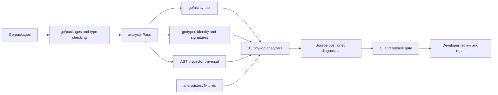
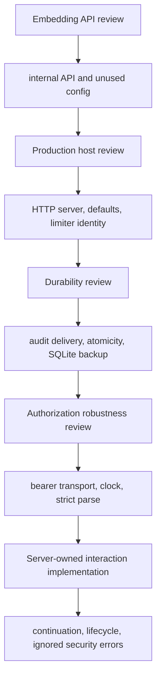

# Static Analysis for tiny-idp Security Engineering

## Executive summary

tiny-idp's static-analysis program began as a production-readiness audit and
became an executable repository policy. General Go tools found ordinary defects,
but they could not express the project's most important local rules: exported
embedding types must not depend on `internal` packages; browser authorization
POSTs must not recover OAuth authority from form fields; token persistence must
join Fosite's lifecycle transaction; security clocks must be injectable; bearer
tokens must use one approved transport; and ignored errors at capability
transitions must be visible.

The resulting `auditlint` multichecker registers fifteen analyzers built with
`golang.org/x/tools/go/analysis`, `go/ast`, `go/types`, and the AST inspector.
Each analyzer is intentionally narrow. It recognizes a concrete code shape,
emits a diagnostic that explains the security consequence, has positive and
negative `analysistest` fixtures, and documents what it does not prove. This
narrowness is the main engineering decision. A small rule that developers trust
and keep enabled is more valuable than a nominally comprehensive rule whose
false positives teach the team to ignore it.

> [!summary]
> - Fifteen typed analyzers encode tiny-idp-specific API, randomness, HTTP,
>   configuration, audit, persistence, bearer, clock, parsing, interaction, and
>   protocol-lifecycle rules.
> - Static analysis is used as a migration witness and regression guard. It is
>   not presented as a formal proof of OAuth/OIDC correctness.
> - The suite is effective because its diagnostics are connected to real defects,
>   dedicated fixtures, repair commits, and complementary runtime evidence.

This report reconstructs that program from the implementation diary, saved
research, analyzer source, fixtures, release runs, and the defects that motivated
each rule. It also explains where AST/type analysis stops and where SSA/IFDS,
model testing, fuzzing, failpoints, runtime monitoring, conformance, and human
review take over.

## The project question

The static-analysis effort asked a precise question:

> Which security and production invariants are stable enough, local enough, and
> syntactically recognizable enough to enforce on every change to tiny-idp?

The answer excludes many important properties. “Fresh authentication occurs
after an interaction requests it” is temporal. “Concurrent refresh operations
are linearizable” is concurrent. “Every mutation survives a named failure
atomically” is dynamic failure evidence. Static analysis contributes by guarding
the structural preconditions on which those properties depend: server-owned
continuation reads, injected clocks, checked errors, explicit lifecycle helpers,
and transaction boundaries.

## Architecture of the analyzer program



`multichecker.Main` exposes the analyzers through one ordinary Go command. The
suite can run over `./pkg/...` and `./internal/...` with the repository's normal
module graph. It composes with vet, Staticcheck, golangci-lint, Glazed lint, and
govulncheck rather than replacing them.

The common execution shape is:

```go
var rule = &analysis.Analyzer{
    Name:     "tinyidp...",
    Doc:      "reports one bounded defect class",
    Requires: []*analysis.Analyzer{inspect.Analyzer},
    Run:      runRule,
}

func runRule(pass *analysis.Pass) (any, error) {
    inspector := pass.ResultOf[inspect.Analyzer].(*inspector.Inspector)
    inspector.Preorder(relevantNodeKinds, func(node ast.Node) {
        if typedStructuralPredicate(pass, node) {
            pass.Reportf(node.Pos(), "diagnostic with consequence and remedy")
        }
    })
    return nil, nil
}
```

The diagnostic is part of the analyzer interface. It does not merely say that a
pattern is forbidden; it states why the pattern is unsafe and what boundary the
replacement must preserve.

## The fifteen analyzers at a glance

| Analyzer | Protected property | Core technique | Principal limitation |
|---|---|---|---|
| `tinyidpinternalapi` | Public APIs remain implementable by external modules | recursive `go/types` traversal | package naming defines the boundary |
| `tinyidprand` | CSPRNG failure cannot be discarded | typed call identity + assignment shape | recognizes `crypto/rand.Read` directly |
| `tinyidphttpserver` | Host has timeout and shutdown ownership | typed package-function call match | does not validate every `http.Server` field |
| `tinyidpsecuritydefault` | Production controls are not silently disabled | typed composite literals + directive | approved defaults require reviewed annotation |
| `tinyidpratelimitkey` | Ephemeral ports do not shard limiter buckets | selector containment | not full interprocedural taint tracking |
| `tinyidpconfiguse` | Exported options affect behavior | definitions/uses from `TypesInfo` | package-local use can still be semantically inert |
| `tinyidpauditdelivery` | Audit delivery failures are handled | method-call and discarded-result shape | interface name matching is deliberately narrow |
| `tinyidpatomicity` | Multi-mutation functions expose a transaction boundary | call-name inventory + loop detection | heuristic, not database transaction proof |
| `tinyidpbackupcopy` | Live SQLite backup is not raw file copy | file scope + typed `io.Copy` match | scoped to known backup location |
| `tinyidpbearertransport` | UserInfo does not accept query/form bearer tokens | exact Fosite helper identity | explicit custom parsers need separate review |
| `tinyidpsecurityclock` | Security time is deterministic and injectable | named security functions + `time.Now` | function allowlist must evolve |
| `tinyidpstrictparse` | Parse failure cannot become acceptance | parser assignment + branch/return shape | local, boolean-only, not interprocedural |
| `tinyidpinteractioncontinuation` | Browser form fields cannot regain OAuth authority | handler name + `PostForm.Get` literals | computed keys and renamed handlers can evade it |
| `tinyidpprotocollifecycle` | Fosite writes use required transaction helper | method/helper matrix | concrete adapter-only structural check |
| `tinyidpignoredsecurityerror` | Capability-transition errors are not discarded | selected method identity + result shape | selected transition registry must be maintained |

## Chronology: analyzers as a record of the review

The analyzer order reflects the production review's expanding model of risk.
The first rules addressed whether the library could be consumed and hosted at
all. The middle rules addressed durable security operations and operational
evidence. The final rules encoded the authorization findings that prompted the
server-owned interaction redesign.



The diary matters because it records false starts. The strict-parser analyzer
initially found the `strconv` assignment but failed to report the expected
branch. The condition walker overwrote a successful match while continuing
through the expression. Making the state monotonic fixed the missing diagnostic.
The repaired analyzer then reported a false positive in a function returning
`(int64, bool, error)`: `true` meant parameter presence, not successful policy
acceptance. Restricting the analyzer to functions whose sole result is `bool`
created an explainable precision boundary. That episode is a compact lesson in
static analysis: an AST pattern is only useful when its abstract meaning matches
the program's semantic role.

## Start with the claim

Tool selection follows the property. Static analysis is effective for forbidden
dataflow or missing error checks. A state model is effective for legal operation
sequences. Linearizability is effective for concurrent histories. Hosted
conformance is effective for standardized external protocol behavior. None is a
universal security oracle.

| Method | Strongest supported claim | Important limitation |
|---|---|---|
| Example test | named behavior works | sparse input/history coverage |
| `go/analysis` | syntactic/typed pattern absent or present | bounded by rule precision |
| Rapid property | generated sequences satisfy model relation | model may be incomplete |
| Native fuzzing | no counterexample in explored input space/time | weak semantic oracle |
| Metamorphic test | controlled transform preserves/changes relation | relation must be correct |
| Failpoints | named intermediate failures preserve invariant | unenumerated failures remain |
| Race detector | executed code has no observed Go data race | not semantic concurrency proof |
| Porcupine | history admits legal sequential explanation | model and observed output are abstractions |
| Trace monitor | emitted facts satisfy temporal property | missing instrumentation is invisible |
| OIDF conformance | external standardized cases pass | not application policy or operations |
| Human review | design assumptions and omissions challenged | reviewer scope and independence matter |

## Static analysis

The custom analyzers use Go AST, types, and local control structure. They detect
browser continuation reads, ignored security errors, insecure bearer transport,
fail-open parsing, direct security wall clocks, limiter identity risks, and
protocol writes outside lifecycle helpers.

Every analyzer needs positive fixtures, negative fixtures, a repository scan,
and a precision statement. The lifecycle analyzer is not a whole-program proof;
it checks concrete adapter methods for required helper calls. This limitation is
part of the tool's contract, not an embarrassment to omit.

## Generated testing and fuzzing

Property testing generates meaningful actions and compares them with a reference
model. Fuzzing mutates bytes and is most effective when the harness has a strong
oracle: no panic, strict parse result, terminal uniqueness, or monitor verdict.
Shrinking and committed replay histories convert discovery into maintainable
regressions.

The seed, plan hash, source commit, action sequence, observations, trace schema,
and assertion versions should eventually form one evidence envelope. A bare
statement that “fuzzing passed” cannot be reproduced.

## Runtime verification and scripting

Security events describe authoritative native transitions. The native monitor
owns verdicts. Goja scripts compile data-only `VerificationPlan` values and may
select scenarios, but they receive no provider, store, network, clock, or
assertion authority. Otherwise the same script could create, conceal, and judge
its own evidence.

The in-process compiler has source, time, and output limits, not a hard heap
quota. Trusted reviewed scripts are the accepted threat model. Hostile tenant
scripts would require process isolation.

## Evidence discipline

Use this template for every claim:

```text
Claim:
Threat/counterexample:
Authoritative state:
Falsification method:
Observed result:
Coverage boundary:
Residual uncertainty:
```

## Retrospective: why layered assurance was necessary

The assurance program began after two code-review findings: forced
reauthentication could be bypassed on POST, and a typed password result requiring
password change was ignored. Neither defect was a malformed string or a memory
race. Both were failures to carry a security fact through control flow.

Diary Step 17 generalized those findings into a review of continuation authority,
strict parsing, consent decisions, limiter identities, multi-handler persistence,
UserInfo bearer transport, error redirects, and storage failure semantics. Diary
Step 18 then asked which analysis technique could falsify each property.

The conclusion was a portfolio:

```text
source structure       -> Go AST/type analyzers
single examples        -> deterministic regression tests
operation sequences    -> reference models + Rapid
input robustness       -> native fuzzing
execution relations    -> metamorphic testing
intermediate failures  -> named failpoints
memory synchronization -> race detector
concurrent semantics   -> Porcupine histories
temporal execution     -> versioned events + monitor
scenario composition   -> data-only Goja plans + native verdicts
external protocol      -> local and hosted conformance
production claim       -> artifact, operations, review, owner ledger
```

The portfolio is not defense by tool count. Each layer observes a different
representation and has a different oracle.

## Claim taxonomy

Before choosing a method, classify the claim.

### Structural claim

A structural claim concerns source shape or typed calls. Examples:

- `resumeAuthorize` does not read browser POST protocol continuation fields;
- a security transition does not discard `ConsumeInteraction` errors;
- token persistence methods use the lifecycle executor;
- production construction does not silently install a no-op audit sink.

Go analysis is appropriate because the prohibited or required shape is visible
without executing the system.

### Functional claim

A functional claim maps a concrete input/state to an output/state. Examples:

- malformed negative `max_age` does not render credentials;
- UserInfo rejects query bearer transport;
- a disabled client cannot resume an interaction.

Deterministic examples are appropriate and document expected protocol details.

### Relational claim

A relational claim compares executions. Examples:

- adding `ui_locales` preserves code issuance and returned `state`;
- memory and SQLite stores should produce equivalent store-independent
  observations;
- retry after a rolled-back refresh failure succeeds.

Metamorphic or differential tests are appropriate.

### Temporal claim

A temporal claim constrains event order. Examples:

- required authentication precedes approval;
- denial excludes artifact commit;
- one interaction has one terminal outcome.

Reference models and runtime monitors are appropriate.

### Concurrent claim

A concurrent claim constrains overlapping operations. Examples:

- exactly one interaction consume succeeds;
- refresh rotation has one winner and a legal reuse outcome.

Histories and linearizability checking are appropriate.

### Failure-atomicity claim

A failure-atomicity claim constrains intermediate failures. Examples:

- code invalidation does not survive failed replacement-token creation;
- disk-full backup does not replace the last published backup.

Failpoints and state inspection are appropriate.

### Operational claim

An operational claim concerns deployed behavior: readiness, filesystem modes,
audit durability, TLS, shutdown, restore, or exact artifact identity. Runtime
probes, drills, platform tests, and human approval are appropriate.

## The custom Go analysis program

The analyzer binary is a `multichecker` under the production-review ticket. It
uses `golang.org/x/tools/go/analysis`, the same framework as vet-style analyzers.
Each analyzer receives syntax trees, type information, package facts, and a
reporting API.

Fixtures use `analysistest`. Source comments mark expected diagnostics. Positive
fixtures demonstrate detection; negative fixtures protect precision. The suite
also runs over `./pkg/...` and `./internal/...` in CI.

### `tinyidpinternalapi`

This analyzer finds exported public API declarations that mention types from an
`internal/` package. The original embedding review found that public construction
leaked internal interfaces, making external consumption impossible.

The analyzer walks exported type, function, and method signatures with type
information. Its supported claim is that checked declarations do not expose
forbidden package paths. It does not prove the API is usable, which is why the
external standalone-module flow remains necessary.

### `tinyidprand`

This analyzer reports ignored errors from cryptographic randomness. A random
handle or nonce created from a failed reader must not degrade into predictable
or empty output.

Its scope is known `crypto/rand` call shapes. It does not evaluate entropy quality
or operating-system RNG health.

### `tinyidphttpserver`

This analyzer reports zero-value or convenience HTTP server startup patterns
that omit explicit timeouts and limits. The production review used it to replace
plain `ListenAndServe` behavior with configured `http.Server` ownership.

It cannot inspect reverse-proxy or kernel configuration. It protects only source
construction patterns.

### `tinyidpsecuritydefault`

This analyzer reports implicit `NoopSink` and `AllowAllRateLimiter` installation
unless a development-default directive documents the boundary. Production
validation separately rejects missing or non-production-ready controls.

The directive is an explicit suppression and therefore review surface. It should
appear only where production mode is rejected or validated upstream.

### `tinyidpratelimitkey`

The initial rule found `RemoteAddr` including ephemeral port in limiter keys.
Later review found a different issue: unauthenticated claimed client IDs could
create unbounded buckets. The implementation now resolves a normalized address
before authentication and uses verified client identity afterward.

The analyzer detects direct shapes, not arbitrary interprocedural taint. The
CodeQL/IFDS research explains how a future whole-program dataflow rule could
track attacker-controlled values more completely.

### `tinyidpconfiguse`

This analyzer reports public configuration fields that are declared but never
read. Security configuration that appears supported but has no effect is more
dangerous than an absent field because operators may rely on it.

The rule proves source usage, not correct semantics. Tests must show that changing
the field changes behavior.

### `tinyidpauditdelivery`

This analyzer reports discarded audit delivery errors. The production design
uses synchronous fsync audit and exposes delivery failures. Some call sites
cannot roll back after commit, so they return typed ambiguity or increment
health counters rather than pretending delivery cannot fail.

The rule cannot prove event completeness. A successful call with the wrong or
missing event requires behavioral review.

### `tinyidpatomicity`

This analyzer looks for multi-mutation persistence functions without an explicit
transaction boundary. It helped identify broad candidates during the production
review.

Transaction-scoped Fosite methods carry a directive because their transaction
is inherited through context rather than begun in the method. This is a precision
compromise documented in source.

The analyzer cannot infer the complete protocol transaction. The later
`tinyidpprotocollifecycle` rule and failpoint tests cover the concrete adapter
more directly.

### `tinyidpbackupcopy`

This analyzer reports raw filesystem copy patterns used as SQLite backup. The
runtime probe demonstrated why: a copied main file can open successfully while
omitting committed WAL state.

The rule does not validate the online backup implementation or backup manifest.
Those are behavioral and recovery claims.

### `tinyidpbearertransport`

This analyzer guards explicit bearer-transport parsing. Fosite's generic helper
accepts query tokens; tiny-idp's UserInfo contract permits one Authorization
header and rejects query/form or mixed transport.

The rule protects known helper/source shapes. HTTP tests provide the exact status,
challenge, cache, and method semantics.

### `tinyidpsecurityclock`

This analyzer reports direct `time.Now` in named security transition code. The
provider injects a clock so freshness, expiry, lockout, and event timing can be
deterministic.

Not every time read is security-sensitive. The rule scopes functions and permits
documented infrastructure use. It does not establish distributed clock accuracy.

### `tinyidpstrictparse`

This analyzer detects boolean security predicates that accept on parse failure.
Its first implementation incorrectly reported `parseMaxAge` because the
function returns `(int64, bool, error)` and the boolean represented presence,
not acceptance. Diary Step 22 records the correction: the rule now limits itself
to single-boolean predicate results.

This episode is an important analyzer lesson. A noisy security rule trains
maintainers to ignore diagnostics. Narrow explainable precision is preferable to
an ambitious but misleading approximation.

### `tinyidpinteractioncontinuation`

This analyzer walks `resumeAuthorize` and reports reads of browser POST fields
that belong to the OAuth continuation. It permits only the native interaction
inputs required by the UI.

Its precision boundary is intentionally local. A helper that reads a forbidden
field interprocedurally could evade it. Tests and review of the rendered form
provide complementary evidence.

### `tinyidpprotocollifecycle`

This analyzer checks concrete SQL Fosite persistence methods for the required
authorization or token lifecycle executor. It encodes the codebase-specific
rule discovered after inspecting Fosite handler ordering.

It is not a general transactional analysis. New storage implementations or
renamed methods require fixture and rule updates.

### `tinyidpignoredsecurityerror`

This analyzer reports ignored errors from high-value transitions such as
`ConsumeInteraction`, `CreateBrowserSession`, `RecordConsent`,
`ActiveSigningKey`, and transaction `Commit`.

The call list is an explicit policy. A new security-returning method is not
covered until added. Code review and error inventories remain necessary.

## Analyzer engineering workflow

For every new rule:

1. Start with a real defect and minimal source pattern.
2. State the supported claim in one sentence.
3. State obvious false positives and false negatives.
4. Create one positive fixture per intended shape.
5. Create negative fixtures for similar legal code.
6. Run `analysistest` before repository scan.
7. Inspect every repository diagnostic manually.
8. Narrow the rule rather than suppressing broad false positives.
9. Document directives as reviewable exceptions.
10. Keep a behavioral test for the original defect.

## Research influence: IFDS and dataflow

The IFDS framework expresses interprocedural distributive dataflow problems as
graph reachability over exploded supergraphs. CodeQL and Semgrep provide
different practical abstractions for taint and patterns.

tiny-idp's current analyzer suite deliberately stays mostly intraprocedural. The
research matters because it identifies where local checks stop being adequate:
limiter identity taint, unverified redirect provenance, and secrets reaching
audit/log sinks are candidates for interprocedural dataflow.

The design document proposes advancing only when a concrete defect justifies the
complexity and fixture burden.

## Deterministic regression tests

Example tests remain the most readable specification for named behavior. The
hardening suite contains forced login, `max_age`, malformed parsing,
`prompt=none`, consent denial, request mutation, concurrent tabs, replay,
expiry, disabled client/user, missing key, CSRF, UserInfo, and storage failures.

A security regression test should assert the protected artifact, not only the
surface response. Useful negative oracles include:

- no authorization code in redirect;
- no token rows in SQL;
- interaction remains pending or has exactly one terminal outcome;
- no credential form for invalid request;
- no forbidden hidden fields;
- no committed security event;
- stable typed error reason.

## Property-based state-machine testing

Rapid generates a sequence length and operations. The reference state predicts
duplicate create, absent get/consume, accepted terminal, expired terminal, and
already-consumed results. The real memory store executes the corresponding
operation.

Generation explores combinations that table tests may omit. Shrinking minimizes
the failing sequence. Labels record drawn values. Reproducibility requires the
seed and final shrunk actions.

The model is intentionally smaller than HTTP. This makes disagreements
diagnosable. It also means provider reconstruction, CSRF, and Fosite behavior are
outside the claim.

## Native fuzzing

Go fuzz targets preserve seed corpora and use coverage feedback. tiny-idp has
targets for issuer parsing, redirect validation, Argon2 hash parsing, bounded
`max_age`, event sequences, and interaction model actions.

Parser targets have strong local oracles: accepted values satisfy strict
normalization and invalid inputs do not panic or escape bounds. State fuzzers
need an invariant oracle such as terminal uniqueness or monitor totality.

The exact-candidate evidence records duration, executions, and interesting
inputs. A bounded campaign supports “no counterexample found in this run,” not
“parser is correct for all strings.”

Two fuzz commands for the same package were accidentally launched concurrently
and stalled. They were rerun sequentially. The diary preserves this because
orchestration is part of reproducibility.

## Coverage-guided property testing

The saved coverage-guided property-testing paper motivates combining semantic
generators and coverage feedback. Ordinary fuzzing reaches code paths but may
generate semantically meaningless protocol sequences. Ordinary property testing
generates meaningful actions but may repeatedly cover the same states.

The current project has not implemented a combined engine. The design inference
is to preserve typed actions and observations now so coverage guidance can be
added later without redefining security semantics.

## Metamorphic testing

Metamorphic testing is useful when outputs contain randomness or time. The
oracle compares a relation, not exact bytes.

The first strict-provider relation varies `ui_locales` and requires unchanged
successful issuance and returned `state`. Future relations should cover query
ordering, irrelevant extension parameters, storage backends, and equivalent
scope encodings where the standard permits equivalence.

Security-sensitive mutation needs an inequality oracle: duplicate redirect,
changed PKCE challenge, or changed interaction handle must not preserve success.

The cybersecurity metamorphic-testing source influenced this separation between
invariance transforms and adversarial transforms.

## Protocol-state fuzzing

The TLS protocol-state fuzzing and stateful greybox papers show why message
sequences reveal logical vulnerabilities that packet mutation misses. A stateful
fuzzer maintains or learns protocol state and chooses messages that reach deeper
transitions.

tiny-idp's typed verification actions are the beginning of such an alphabet:
session login, authorize begin, interaction submit, and time advance. Token,
refresh, UserInfo, fault, and administrative mutation actions remain future work.

Native Go owns decoding and execution so generated scripts cannot bypass the
protocol harness.

## Fault injection

Named failpoints test failures around actual durable mutations. Authorization
has seven lifecycle points, code exchange eight, and refresh rotation ten. Backup
tests cover cancellation and disk-full publication.

Every failpoint needs a before-state, injected error, response observation,
durable after-state, event after-state, and retry expectation where applicable.

Failpoint coverage is enumerable and reviewable. It does not simulate arbitrary
process, kernel, power, or storage-controller failure. Crash testing and platform
faults are additional layers.

## Race detection and schedule exploration

`go test -race` instruments executed memory access. Shuffled and repeated tests
vary order. Barriers create overlap around targeted operations. The CHESS paper
provides the research context for systematic schedule exploration and preemption
bounding.

tiny-idp does not claim exhaustive schedule coverage. The race run, controlled
histories, and Porcupine models support complementary bounded claims.

## Linearizability checking

Porcupine consumes operation call/return times, inputs, outputs, and an abstract
model. It searches for a legal sequential order preserving real-time precedence.

Interaction consume and refresh rotation use different models. The refresh
test's failed final-state assumption demonstrated that model correctness is as
important as checker correctness. Rotation was linearizable, while later reuse
revoked the family.

## Runtime verification

The new introductory runtime-verification source organizes the field around
instrumentation, specification, monitor synthesis/execution, and verdict. The
project implements a deliberately small manual automaton.

The event schema is versioned and excludes raw handles, codes, credentials, and
tokens. The interaction ID is derived for correlation. The monitor partitions
state, records obligations, and reports finite bad prefixes.

Instrumentation completeness is the central limitation. A monitor cannot reject
an event that native code failed to emit. Provider tests, failpoint feeds, and
source review check important emission sites.

## Monitoring-oriented programming and dynamic invariants

Monitoring-oriented programming advocates treating monitors as explicit program
components. Daikon-style dynamic invariant detection infers likely properties
from executions. The project separates these roles:

- reviewed native invariants may fail tests or readiness;
- discovered correlations may suggest candidates;
- no mined invariant becomes authorization policy automatically.

This prevents training data or incomplete traces from silently defining
security semantics.

## eBPF and host instrumentation

The research/design phase considered eBPF for syscall, network, file, and
scheduler evidence. It was not used for protocol verdicts because kernel traces
do not contain validated OAuth request meaning or consent obligations.

Application instrumentation proved more direct: HTTP timing, Go runtime metrics,
SQLite pool stats, password-work counters, audit counts, and security events.
eBPF remains useful for corroborating filesystem and network assumptions in a
target deployment.

## Runtime load probe

The runtime probe provisions a production-mode SQLite provider and executes full
login, code, token, UserInfo, and refresh flows under bounded concurrency. It
emits NDJSON HTTP events, runtime metrics, SQL pool snapshots, password-work
statistics, audit counts, and optional CPU/heap profiles.

The analyzer computes route status distributions and latency percentiles. The
recorded candidate performed 5,125 HTTP operations with zero HTTP errors and 25
bounded password operations. This is performance/operations evidence, not a
proof of protocol safety.

## Data-only verification plans

`pkg/verifyplan` defines a versioned plan, suites, scenarios, steps, assertion
references, limits, source hash, driver, observations, and results. It has no
Goja or provider dependency.

`internal/gojaverify` creates a fresh runtime, rejects every ambient module,
registers only `tinyidp/verify`, enforces source/time/output limits, and binds
the result to source SHA-256. Tests reject `fs` and interrupt an infinite loop.

The strict driver decodes known actions with unknown fields rejected. Native
assertion functions own verdicts. A plan hash provides provenance, not author
authentication.

The compiler is in-process and has no hard heap quota. Hostile multi-tenant
scripts require a separate process and authenticated plan handoff.

## Conformance

The local conformance script runs the full suite, selected strict Fosite cases,
durable store/key tests, AST analysis, and an external public-API consumer flow.
It proves the repository-selected profile in the local environment.

Hosted OIDF drives standardized external cases against a deployed issuer. It
requires exact artifact binding, plan metadata, suite authority, and preserved
logs. Older hosted result directories cannot be reused for a new binary hash.

Conformance does not test durable audit, password admission, backup, custom
consent policy, or every local temporal invariant.

## Vulnerability scanning, SBOM, and provenance

Govulncheck uses the module graph and call analysis to report reachable known
vulnerabilities. The exact candidate had zero called vulnerabilities while
dependencies contained additional known entries not reached by current code.

SBOM and module graph describe composition. Checksums identify bytes. Signatures
and provenance bind an artifact to build identity and process. None prove runtime
correctness, but each answers a release question tests cannot.

## Human review

Independent review can challenge threat model, missing properties, model
abstraction, analyzer blind spots, operational assumptions, and residual risk.
Release-owner approval accepts organizational risk and deployment scope.

The software cannot self-assign either authority. The ledger keeps those rows
open despite extensive local evidence.

## Paper-to-tool provenance matrix

| Research/source | Concept used | Concrete project result | Not claimed |
|---|---|---|---|
| Formal OAuth analysis | authorization/session integrity | canonical interaction and review properties | full formal verification |
| Formal OIDC analysis | authentication/session binding | freshness, nonce/auth-time reasoning | proof of all OIDC profiles |
| Security automata | finite bad prefixes | interaction monitor | production enforcement completeness |
| Typestate | state-dependent operations | pending/terminal consume contract | compile-time durable typestate |
| IFDS | interprocedural dataflow | future taint boundary; local AST precision | whole-program taint today |
| Model-based security testing | abstract transition systems | Rapid store model | model completeness |
| Coverage-guided PBT | semantic generation + coverage | typed action design direction | implemented hybrid engine |
| Stateful greybox fuzzing | protocol sequence exploration | action-sequence fuzz target | deep coverage guidance |
| Protocol-state TLS fuzzing | logical state vulnerabilities | separate action alphabet | TLS-state model reuse |
| Metamorphic cybersecurity | relational oracle | `ui_locales` relation | exhaustive relations |
| CHESS | controlled schedules | barriers/repetition/history capture | systematic schedule enumeration |
| Linearizability | legal concurrent histories | Porcupine consume/refresh checks | full token-family model |
| Lineage fault injection | dependency-oriented faults | pre/post mutation matrices | kernel/storage exhaustive faults |
| Runtime verification | event/specification/verdict separation | native parametric monitor | observability completeness |
| Daikon | candidate invariant mining | research direction only | mined policy enforcement |
| Monitoring-oriented programming | first-class monitors | separate securitytrace package | universal runtime monitor framework |
| Go analysis docs | typed AST tooling | auditlint multichecker | semantic proof |
| Go fuzz docs | corpus and coverage fuzzing | six exact-candidate campaigns | exhaustive input proof |

## Evidence review questions

For a green result, ask:

1. What exact property was the oracle checking?
2. What representation did the tool observe?
3. Which code paths or schedules executed?
4. Which model or rule encoded legality?
5. What could be absent from the observation?
6. Is the result reproducible from commit, seed, plan, and command?
7. Did a failure occur before or after durable commit?
8. Does this claim belong to local code, deployment, or human authority?
9. What counterexample would falsify the claim?
10. Which complementary method covers the largest blind spot?

## Common evidence errors

### Counting tests

Test count says little about property diversity or oracle quality. Map tests to
invariants and failure modes.

### Treating no panic as security

No panic is valuable robustness evidence but usually says nothing about
authorization correctness.

### Treating coverage as correctness

Executing a branch does not prove the assertion checked its security effect.

### Treating lint as proof

Static rules encode selected source patterns and have explicit blind spots.

### Treating monitor silence as success

Missing events and disabled sinks can produce silent traces. Delivery and
instrumentation completeness need separate evidence.

### Treating conformance as certification

A passing run is tied to suite, plan, configuration, deployment, and artifact.
It does not automatically grant formal certification or release approval.

### Treating reproducibility as authenticity

A deterministic hash identifies bytes. Signatures and provenance add origin and
build claims. Review and owner approval add authority.

## Decision records

### AM-1: choose tools by claim

- **Decision:** maintain complementary assurance layers.
- **Reason:** structural, temporal, concurrent, failure, and operational
  properties require different observations and oracles.
- **Consequence:** release evidence is a matrix, not one score.

### AM-2: narrow blocking analyzers

- **Decision:** prefer precise local rules with fixtures and documented gaps.
- **Reason:** false positives degrade trust in CI diagnostics.
- **Consequence:** behavioral and future dataflow tools cover broader claims.

### AM-3: native verdict authority

- **Decision:** Go owns monitor and scenario assertions.
- **Reason:** tested scripts must not define their own success.
- **Consequence:** JavaScript remains a plan-authoring surface.

### AM-4: record failures and corrected models

- **Decision:** diary preserves unsuccessful tests and mistaken assumptions.
- **Reason:** corrected abstractions are part of the research result.
- **Consequence:** textbook provenance includes failure, not only final design.

## Extended exercises

1. Map every auditlint analyzer to its originating defect or risk.
2. Propose an interprocedural limiter-taint analysis and state sources/sinks.
3. Write positive and negative fixtures for a new secret-logging analyzer.
4. Design a Rapid model for consent expiry and revocation.
5. Design a fuzz oracle for duplicated authorization parameters.
6. Create one valid and one invalid metamorphic transform for scopes.
7. Add a failpoint after consent persistence and predict ambiguity.
8. Explain why the race detector cannot prove token rotation uniqueness.
9. Extend the Porcupine refresh model with reuse.
10. Identify one security event whose absence current monitor tests might miss.
11. Design an instrumentation-completeness test.
12. Define an evidence envelope schema for plan/seed/commit/observations.
13. Explain when eBPF adds value to a target deployment.
14. Compare local conformance with hosted OIDF claim scope.
15. Review a govulncheck result containing unreachable vulnerabilities.
16. Explain why SBOM, signature, and provenance are separate artifacts.
17. Write a release statement that remains honest after all local gates pass.
18. Identify one paper concept intentionally not implemented.
19. Find a diary failure that changed a test oracle.
20. State the cheapest falsification method for a proposed invariant.

## Chapter review checklist

- Can the reader classify a claim before selecting a tool?
- Can the reader explain all current custom analyzers and their gaps?
- Can the reader distinguish examples, properties, fuzz, and metamorphic tests?
- Can the reader build a complete failpoint oracle?
- Can the reader distinguish race, scheduling, and linearizability evidence?
- Can the reader explain event instrumentation and monitor limitations?
- Can the reader enumerate JavaScript's reachable capabilities?
- Can the reader interpret runtime load evidence without security overclaiming?
- Can the reader distinguish conformance, vulnerability, SBOM, signature, and
  human approval?
- Can the reader trace every implemented assurance layer to saved research and
  current code?

## Analyzer fixture workbook

Use this workbook when changing auditlint. Each rule should have at least one
fixture for every row that applies.

| Fixture class | Purpose |
|---|---|
| direct positive | simplest prohibited/required shape |
| nested positive | shape inside branches/closures where supported |
| legal near miss | similar syntax with different semantics |
| typed near miss | same names but different package/type |
| directive | documented intentional exception |
| regression | minimized source from real finding |
| unsupported | documented false-negative boundary |

### Public API fixture questions

- Is the declaration exported?
- Does a nested type mention an internal package?
- Are aliases, slices, maps, functions, and interfaces traversed?
- Does an unexported declaration remain legal?
- Does a same-named external package avoid false report?

### Randomness fixture questions

- Is `crypto/rand` error ignored directly?
- Is result assigned but error discarded?
- Is a non-cryptographic reader correctly out of scope?
- Is a wrapper function intentionally unsupported/documented?

### HTTP server fixture questions

- Is a zero-value `http.Server` started?
- Is convenience `ListenAndServe` used in production code?
- Are explicit timeout fields recognized?
- Is development-only construction documented?

### Security-default fixture questions

- Is no-op audit installed silently?
- Is allow-all limiter installed silently?
- Does production validation precede the default?
- Is the development directive attached to the exact declaration?

### Limiter identity fixture questions

- Is raw `RemoteAddr` used including port?
- Is claimed client ID used before authentication?
- Is normalized resolver output used?
- Is verified client identity used after authentication?
- Which interprocedural taint path remains unsupported?

### Configuration-use fixture questions

- Is a public field never read?
- Is it read only in tests?
- Is it passed to runtime construction?
- Does a similarly named local variable avoid confusion?

### Audit-delivery fixture questions

- Is `Emit` error assigned to blank?
- Is it returned, wrapped, counted, or deliberately reconciled?
- Is a no-op sink method incorrectly reported?
- Is post-commit ambiguity explicit?

### Atomicity fixture questions

- Does a function perform multiple mutations?
- Is transaction begin visible locally?
- Is transaction inherited through documented context?
- Is the function read-only despite multiple calls?
- Does a directive hide a real unsafe direct write?

### Backup-copy fixture questions

- Is SQLite file copied with `io.Copy`, read/write, or filesystem copy?
- Is the file unrelated to SQLite?
- Is the online backup API used?
- Does publication preserve a prior file on failure?

### Bearer-transport fixture questions

- Is generic query-accepting extraction used?
- Are query/form/mixed values rejected before introspection?
- Are duplicate Authorization headers handled?
- Is a non-UserInfo endpoint intentionally different?

### Clock fixture questions

- Is direct `time.Now` inside a named security transition?
- Is injected clock called?
- Is wall time used only for logging/build metadata?
- Is UTC normalization preserved?

### Strict-parse fixture questions

- Does parser error lead to `true` acceptance?
- Is function a single-boolean predicate?
- Is a multi-result parser presence boolean excluded?
- Are compound conditions walked monotonically?

### Continuation fixture questions

- Does resume read a forbidden POST protocol field directly?
- Are interaction/CSRF/login/password/action permitted?
- Does a helper hide the read and remain documented unsupported?
- Does a same field name occur outside resume?

### Protocol-lifecycle fixture questions

- Does authorization creation call `authorizeExec`?
- Does token issuance call `tokenExec`?
- Is direct cleanup intentionally permitted?
- Does a new Fosite persistence method need classification?

### Ignored-security-error fixture questions

- Is a named transition error discarded?
- Is it returned/wrapped/handled?
- Is a same-named method on another type excluded?
- Has the security method allowlist changed?

## Evidence envelope draft

A future machine-readable evidence envelope should contain:

```text
schema_version
source_commit
working_tree_policy
go_version
module_graph_digest
binary_digest
plan_schema
plan_source_hash
driver_version
assertion_ids_versions
random_seed
shrunk_actions
wall_start_end
test_command
host_platform
observations
security_event_schema
security_events_digest
monitor_violations
database_snapshot_digest_or_counts
tool_name_version
result
coverage_boundary
artifact_locations
reviewer_adjudication
```

The envelope should not contain passwords, raw handles, codes, access tokens,
refresh tokens, private keys, token secrets, or full sensitive audit content.

Source hash is provenance identity, not authentication. Binary signature and
build provenance belong in separate linked artifacts. Human review attaches an
adjudication, not a rewritten automated verdict.

## Assurance plan template

For a new invariant, complete:

1. Plain-language property.
2. Formal/temporal form where useful.
3. Principal and attacker model.
4. Authoritative state and transition.
5. Static source pattern.
6. Deterministic success/rejection examples.
7. Generated action model.
8. Fuzz input and oracle.
9. Metamorphic relations.
10. Failure points and rollback oracle.
11. Concurrent object and history model.
12. Event instrumentation and monitor.
13. Runtime/load observation.
14. External conformance/deployment gate.
15. Evidence limits and human review.

Not every property needs every method. The template forces an explicit reason
for inclusion or omission.

## Final assurance competence test

The reader passes when they can take a proposed claim, choose the minimum useful
method portfolio, implement or review its oracles, reproduce the result, and
write a limitation that would prevent a release reviewer from overgeneralizing
it.

## Final evidence prompts

Write one sentence for each:

- A claim supported by `tinyidpinteractioncontinuation`.
- Its most important false negative.
- A claim supported by the Rapid interaction model.
- A provider behavior outside that model.
- A claim supported by monitor fuzzing.
- A trace defect fuzzing cannot identify without an oracle.
- A claim supported by Porcupine.
- A token-family operation omitted by its minimal model.
- A claim supported by hosted OIDF.
- A local production property OIDF does not test.
- A claim supported by an artifact signature.
- An approval only a human owner can grant.

For each sentence, cite the relevant current file or saved source.

The final review should also identify one tempting but invalid substitution—for
example, using race success as a linearizability claim or using conformance as an
audit-durability claim. Explain the different observations and oracles that make
the substitution invalid. This is the minimum evidence-literacy standard for
changing a release gate.

Record that explanation in the review artifact.

## Static analysis implementation internals

### Syntax trees, object identity, and source text

Go's AST preserves the source structure needed for local policy checks. An
`ast.AssignStmt` distinguishes `_ = sink.Emit(...)` from an ordinary checked
assignment. An `ast.CompositeLit` exposes construction of `NoopSink{}`. An
`ast.CallExpr` exposes a call whose function can be resolved through type
information. These nodes are more stable than regular expressions because
formatting, import aliases, and receiver variable names do not change their
typed identity.

`analysis.Pass.TypesInfo` connects syntax to meaning. `isCallTo` resolves the
selected object and compares its package path and declared name. This is how
`tinyidpbearertransport` identifies Fosite's helper even if it is imported under
an alias, and how `tinyidprand` distinguishes `crypto/rand.Read` from an
unrelated local `Read` function.

Some rules intentionally use names rather than complete type identity. The
atomicity rule treats calls beginning with `Create`, `Rotate`, `Revoke`, or
`Delete` as possible mutations. This is a heuristic inventory rule. Its
diagnostic is a request for review, not proof that every counted method writes a
database. The report preserves that distinction because reviewers must know
which diagnostics express exact type identity and which express repository
naming conventions.

### Recursive public API analysis

The public API analyzer walks `go/types.Type` recursively. A public type can leak
an internal dependency through a pointer, slice, map, array, channel, exported
struct field, function parameter, function result, interface method, generic
type argument, or named type's underlying representation. Checking only the
top-level field spelling would miss most of these cases.

```text
collect(type):
    if nil or already seen: return
    remove aliases
    if named:
        if defining package contains /internal/: report path and stop branch
        collect underlying type
        collect every type argument
    if pointer/slice/array/channel: collect element
    if map: collect key and element
    if struct: collect every exported field
    if signature: collect parameters and results
    if interface: collect explicit method signatures
```

The visited set is necessary for recursive types. The result set is sorted so
diagnostics are deterministic. The original production review used this rule as
a migration witness: the embedding API was not considered repaired until an
external module could implement and construct it and the analyzer no longer
found internal dependencies.

### Discarded result analysis

Three rules share a shape: identify a security-sensitive call and inspect how
its results are consumed.

```go
_, _ = rand.Read(buf) // second result blank: reject
_ = audit.Emit(ctx, event) // error explicitly blank: reject
store.ConsumeInteraction(...) // result expression discarded: reject
```

The rule must distinguish a deliberate wrapper that records delivery failure
from a discarded call. tiny-idp centralizes audit and security-event handling in
provider methods; callers invoke the wrapper, and the wrapper increments a
failure counter. Static analysis supports the architecture by banning the old
call shape rather than attempting to prove the wrapper's runtime delivery.

The ignored-security-error analyzer keeps an explicit registry of transition
methods: interaction consumption, browser-session creation, consent recording,
active signing-key selection, and commit. The registry is maintainable because
the protected operations are few and named. Its principal false negative is a
new security transition that is not added to the registry.

### Configuration-use analysis

An exported `Options` or `Config` field is a behavioral promise. A caller may
set it and reasonably expect a change. `tinyidpconfiguse` collects every object
referenced in `TypesInfo.Uses`, then reports exported fields whose defining
object is never used by the package.

This analysis detects dead public configuration, but package-local use is not
semantic proof. A field could be read and discarded, copied into another unused
value, or applied only on one path. The external consumer test complements the
analyzer by compiling and executing a real embedding configuration.

### Security-default directives

Development mode needs convenient no-op audit and allow-all limiting. Production
mode must reject them. The analyzer treats unannotated construction as suspicious
and accepts a `tinyidp:development-default` directive on the enclosing function.

The directive is a reviewed exception with a narrow meaning. It is not a broad
`nolint`. A code reviewer can search all exception sites and confirm that
production validation rejects the fallback. This design emerged after the first
repository scan reported deliberate development defaults as if they were
production defects. Encoding an explicit exception preserved the useful rule
without normalizing false-positive suppression.

### Atomicity as a structural smell

`tinyidpatomicity` restricts itself to SQLite, admin, and Fosite adapter packages.
It skips tests, `Open`, functions marked `tinyidp:transaction-scoped`, and known
store methods whose names denote atomic domain operations. It counts mutation-
shaped calls and separately detects mutations inside loops. Two mutations or a
looped mutation without an explicit transaction boundary produce a diagnostic.

The analyzer found real architectural work: user and credential creation,
password/security-state replacement, login counters, key rotation, token-family
operations, and backup semantics had to move behind store-owned atomic methods.
It also required refinement. A function operating inside a Fosite-supplied
transaction should not begin a nested transaction. The reviewed
`tinyidp:transaction-scoped` directive communicates that ownership.

This rule cannot prove rollback, isolation, or commit ordering. Those claims are
established by failpoint tests, SQLite assertions, and concurrent histories. Its
job is to make suspicious multi-mutation source code impossible to introduce
silently.

### Authorization-specific structural rules

The final analyzer group is the most domain-specific. Each rule encodes a lesson
from the forced-reauthentication and token-lifecycle review.

`tinyidpinteractioncontinuation` inspects only `resumeAuthorize`. It reports
literal reads of OAuth fields from `r.PostForm`: client ID, redirect URI,
response type, scope, state, nonce, PKCE values, prompt, and maximum age. Login,
password, CSRF, opaque interaction handle, and explicit decision remain valid
browser inputs. This is a static authority boundary expressed as an allowlist of
the POST fields whose use is semantically legitimate.

`tinyidpsecurityclock` inspects named authorization and session functions and
rejects direct `time.Now`. An injected clock is not only a test convenience. It
makes expiration and freshness one provider-owned input and prevents different
branches from observing unrelated wall times.

`tinyidpstrictparse` connects `strconv.ParseInt` or `Atoi` assignments to later
branches that inspect the parse error and return `true`. Restricting the rule to
single-boolean-result functions gives `true` the meaning of acceptance. The
diary's repair episode is important: without the result-shape constraint, the
analyzer mistook a tuple's “parameter present” flag for a fail-open security
decision.

`tinyidpprotocollifecycle` defines a matrix from concrete Fosite persistence
method to required helper:

| Method | Required helper |
|---|---|
| `CreateAuthorizeCodeSession` | `authorizeExec` |
| `CreatePKCERequestSession` | `authorizeExec` |
| `CreateOpenIDConnectSession` | `authorizeExec` |
| `InvalidateAuthorizeCodeSession` | `tokenExec` |
| `CreateAccessTokenSession` | `tokenExec` |
| `CreateRefreshTokenSession` | `tokenExec` |
| `RotateRefreshToken` | `tokenLifecycleFromContext` |

This matrix makes the protocol transaction design reviewable in one place. A
new Fosite storage method must be classified explicitly rather than inheriting
an accidental direct SQL path.

## Fixture design and diagnostic testing

`analysistest.Run` compiles packages under `testdata/src` and matches diagnostics
against `// want` comments. A good fixture contains the smallest positive case
and a neighboring negative case that differs in one meaningful property.

For example, the strict-parser fixture should include:

```go
func unsafe(s string) bool {
    _, err := strconv.Atoi(s)
    if err != nil {
        return true // want "security-sensitive parsing must fail closed"
    }
    return false
}

func tupleParser(s string) (int, bool, error) {
    value, err := strconv.Atoi(s)
    if err != nil {
        return 0, true, err // presence flag, must not be reported
    }
    return value, true, nil
}
```

Fixtures serve three functions:

- They specify the diagnostic contract independently of production code.
- They prevent a precision repair from silently removing the intended positive
  diagnostic.
- They preserve false-positive lessons as executable examples.

Repository scans add a fourth function: they test the rule against realistic
code scale. Both fixture and repository evidence are required before a new rule
becomes blocking.

## Static tooling used around auditlint

The project used a portfolio rather than one analyzer binary.

### `rg` and structural inventory

Ripgrep identified route registrations, exported types, security defaults,
`time.Now`, `RemoteAddr`, ignored errors, SQL mutations, bearer helpers, and raw
file operations. Text search is fast and transparent, making it ideal for
building the initial inventory. It is not type aware and therefore remains an
investigation tool rather than the final blocking rule for ambiguous patterns.

### `go list`, build, and external compilation

`go list` and `go build ./...` validate the package graph and build tags. The
external-consumer smoke creates a separate module with a local replace and uses
only public packages. This dynamic compile gate checks a property related to,
but stronger in one direction than, `tinyidpinternalapi`: an actual outside
module can construct the provider and complete Authorization Code + PKCE.

### Vet, Staticcheck, and golangci-lint

Vet supplies standard compiler-adjacent checks. Staticcheck finds broad Go API,
control-flow, and correctness defects. golangci-lint runs the pinned suite,
including exhaustive enum switches. That exhaustive check caught missing
explicit cases when `TokenLifecycleDone` was added to the security event kind.
The custom suite does not duplicate these mature general checks.

### Glazed lint

The CLI uses Glazed conventions. Its analyzer validates command construction and
field wiring that general Go tools do not understand. This is another example of
domain analysis: framework-specific invariants are most effective when encoded
by the framework or repository that owns their semantics.

### govulncheck and dependency evidence

Govulncheck combines the module vulnerability database with reachable symbol
analysis. Its zero-reachable-vulnerability result is not source-code correctness
and not proof that imported vulnerable code can never become reachable after a
change. SBOM, module graph, license collection, and provenance remain distinct
release artifacts.

### CodeQL, Semgrep, and SSA as escalation paths

The saved CodeQL and Semgrep research informed tool selection. Semgrep is useful
for rapid syntactic rules across languages. CodeQL is useful for reusable
interprocedural dataflow queries and path explanations. Go's `buildssa` pass can
support repository-local value-flow analysis without introducing an external
query runtime.

The project chose AST/type rules first because the motivating patterns were
local and precise. The escalation criterion is concrete: if a property depends
on values flowing through helpers, aliases, interfaces, or fields such that the
local rule has material false negatives, build an SSA/IFDS-style analysis or a
CodeQL query. Do not add interprocedural complexity merely to make the tool sound
more sophisticated.

## Research foundations and what we inferred

The IFDS paper provides a framework for distributive interprocedural dataflow
problems. The access-path literature explains how taint analyses abstract fields
and heap objects. Typestate research explains why operations can be legal only
in selected states. Abstract interpretation explains static analysis as a
computable approximation of program behavior. None of these papers prescribes
tiny-idp's analyzer names or helper matrix.

The local inference was to use the weakest analysis that reliably recognizes
each repository invariant:

```text
exact API call             -> typed AST identity
recursive public type leak -> go/types graph traversal
discarded result           -> AST statement/result shape
local fail-open parse      -> AST data association inside one function
simple value contamination -> selector containment
multi-helper value flow    -> future SSA/dataflow escalation
temporal protocol order    -> runtime model/monitor, not static AST
```

This choice keeps the trusted tool small enough for ordinary maintainers to
review. The analyzer source is part of the security case; an opaque analyzer
whose abstractions no one understands weakens that case even if it reports more
findings.

## A professional workflow for adding the next rule

1. Write the invariant and a minimal unsafe code example.
2. Identify whether the claim is syntactic, typed, dataflow, temporal,
   concurrent, or operational.
3. Search production code and history with `rg` to determine pattern diversity.
4. Select AST, types, SSA, external query language, or a dynamic method.
5. Write one positive fixture and at least two nearby negative fixtures.
6. Implement a diagnostic that states consequence and remedy.
7. Run the fixture alone and inspect source positions.
8. Run the repository scan and classify every finding.
9. Repair rule precision before adding broad suppressions.
10. Document false positives, false negatives, and reviewed directives.
11. Pair the structural rule with dynamic evidence for the underlying behavior.
12. Add it to CI only when developers can act on every diagnostic.

## Static-analysis review checklist

- Does the analyzer compare typed object identity where text would be ambiguous?
- Is the package/function/file scope narrow enough to express the intended
  semantic role?
- Does each accepted exception carry a specific reviewed directive?
- Is traversal state monotonic and cycle safe?
- Are aliases, pointers, generics, interfaces, and exported fields handled when
  the claim concerns type reachability?
- Does a return literal have the semantic meaning the rule assumes?
- Are positive and negative fixtures separated by one relevant property?
- Has the analyzer been run against the complete production package set?
- Does the diagnostic explain the security consequence?
- Is the precision boundary written beside the rule and in the project report?
- Is a dynamic technique assigned to properties the analyzer cannot establish?

## Project outcome

The static-analysis suite changed tiny-idp in three ways. It found concrete
production defects, including unusable public types, ineffective configuration,
unsafe hosting defaults, raw SQLite backup, discarded audit delivery, and
transaction risks. It guided migrations by staying red until the replacement
architecture existed. Finally, it converted review knowledge into an always-on
guard so future changes must confront the same trust-boundary decisions.

The strongest result is not the number of analyzers. It is the connection among
defect, abstraction, fixture, diagnostic, repair, dynamic evidence, and stated
limitation. That chain makes static analysis part of engineering reasoning rather
than a detached lint phase.

## Source and implementation index

| Source | Influence on the project |
|---|---|
| `sources/go-analysis-framework.md` | Analyzer/pass/result model and modular composition |
| `sources/go-native-fuzzing.md` | Boundary between static findings and generated execution |
| `sources/codeql-go-dataflow.md` | Interprocedural query escalation and path reasoning |
| `sources/semgrep-custom-rules.md` | Rapid repository-specific pattern enforcement |
| `sources/paper-ifds-dataflow-analysis.md/.pdf` | Interprocedural dataflow theory |
| `sources/paper-typestate.md` | State-dependent legality and lifecycle thinking |
| `sources/paper-static-verification-dynamic-invariants.md` | Static/dynamic complementarity |
| `sources/paper-daikon-dynamic-invariant-detection.md` | Candidate invariant discovery, not verdict authority |
| `design-doc/02-...assurance-architecture...md` | Original invariant and tool allocation |
| `design-doc/03-...research-foundations...md` | Research-to-code map for interaction and token state |
| `reference/01-implementation-diary.md` | Findings, analyzer failures, precision repairs, commits |
| `scripts/auditlint/main.go` | Current implementation of all fifteen rules |
| `scripts/auditlint/main_test.go` | Fixture entry points and diagnostic contract |

## Open questions

- Should limiter identity become an SSA taint analysis from untrusted request
  fields to persistent limiter keys?
- Should ignored-security-error registration be generated from an annotation on
  the transition interface rather than maintained as a method-name set?
- Should lifecycle enforcement use a small typestate-like wrapper type that
  makes direct SQL execution unrepresentable?
- Can analyzer diagnostics include structured invariant IDs for evidence
  envelopes and release dashboards?
- Which rules are general enough to move into a reusable identity-provider
  analyzer package without weakening their precision?
- How should analyzer versions be bound to a release candidate so a later rule
  change does not reinterpret older evidence?

## Exercises

1. Choose a technique for “browser fields cannot replace canonical state” and
   explain why fuzzing alone is insufficient.
2. State the false-negative boundary of one auditlint analyzer.
3. Explain what a monitor cannot detect when an event is never emitted.
4. Distinguish a passing race run from a passing Porcupine history.
5. Write an evidence statement for a 30-second fuzz campaign without claiming
   exhaustive correctness.

## Research packet

Read `paper-ifds-dataflow-analysis`, `paper-model-based-security-testing`,
`paper-stateful-greybox-fuzzing`, `paper-chess-systematic-concurrency-testing`,
`paper-lineage-driven-fault-injection`, and
`paper-runtime-verification-brief-account` under `sources/`.
