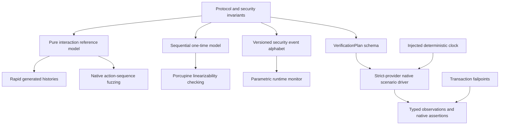

# Model Checking Research, Analysis, Design, and Implementation Guide

## Executive summary

tiny-idp has a substantial executable state-assurance program but only a narrow
amount of actual model checking. Rapid generates and shrinks interaction-store
histories against a reference model. Porcupine checks two observed concurrent
histories for linearizability against an executable sequential specification. A
native parametric monitor checks authorization event traces against temporal
rules. Typed verification plans execute scenarios against the strict provider.
Failpoints, deterministic clocks, fuzzing, and committed replay histories make
the state vocabulary concrete.

Only Porcupine is properly described as a model checker in the current code, and
even then its scope is specialized: it decides whether a finite observed history
is linearizable. Rapid samples histories rather than exhaustively enumerating the
transition system. The runtime monitor judges emitted traces but does not search
unexecuted behaviors. No TLA+/PlusCal, TLC, Apalache, Alloy, SPIN, Murphi, Ivy,
SMT, Coq, or Lean specification exists in the repository.

> [!summary]
> - Current formal-model maturity is modest: approximately 3–4/10 for general
>   model checking and about 7/10 for executable state-oriented assurance.
> - The existing models are valuable because they already define actions,
>   observations, temporal obligations, linearization points, and minimized
>   counterexamples.
> - The next professional step is three small bounded specifications:
>   authorization interaction, code redemption, and refresh-token family.

This guide explains every current tool and artifact, reconstructs the research
that influenced them, states exactly what each result supports, and proposes a
model-checking program that feeds counterexamples back into Go regression tests
and runtime monitors.

## Program charter

`TINYIDP-MODEL-001` exists to move tiny-idp from strong executable state-oriented
testing to a disciplined formal-modeling program. The ticket does not begin by
installing a checker or translating production Go line by line. It begins with
theory, literature, attacker assumptions, abstraction design, and explicit claim
boundaries. Formal tools become useful only after the team agrees what state is
authoritative, which transitions are atomic, and which properties are safety,
liveness, refinement, or operational claims.

The program has six outcomes:

1. A shared theoretical vocabulary covering transition systems, traces,
   invariants, temporal logic, fairness, refinement, linearizability, bounded
   checking, symbolic checking, and state-space reduction.
2. Reviewed abstractions for authorization interactions, code redemption, and
   refresh-token families.
3. Executable TLA+/PlusCal specifications checked by TLC, with Apalache evaluated
   after the first models stabilize.
4. A counterexample interchange format that replays model traces through native
   Go VerificationPlan drivers.
5. CI gates that report checker version, constants, state counts, depth,
   invariant IDs, result, and counterexamples without treating timeout as pass.
6. A maintained evidence boundary distinguishing model correctness, checker
   results, implementation tests, runtime monitoring, and production approval.

### Non-goals for the first program increment

- Formally verifying the Go implementation against machine code.
- Rebuilding the full OAuth/OIDC web infrastructure model used by academic
  protocol proofs.
- Modeling cryptographic primitives, RSA, Argon2, TLS, or SQLite internals.
- Introducing multiple formal languages before one model-to-test loop works.
- Generating production authorization code from a formal specification.
- Using a green model-checking badge to replace hosted conformance, recovery
  drills, audit evidence, or human review.

## The design of the model-checking program

The program is not a literature survey followed by an unspecified attempt to
write TLA+. It is an evidence-production system. Its input is a security claim
about tiny-idp; its output is a reviewable evidence bundle that states the
claim, the abstraction under which it was checked, the explored state space,
any counterexample, and the corresponding implementation-level regression.
Literature and tool qualification are one supporting stage in that system.

The central design decision is to keep five artifacts separate and connect them
with explicit mappings:

1. **Product state and transitions.** These are the real Go types, methods, SQL
   transactions, Fosite calls, security events, failpoints, and HTTP-visible
   outcomes.
2. **Formal domain model.** This is a deliberately smaller transition system
   containing only the state needed to decide selected claims.
3. **Properties and assumptions.** Properties state what must hold. Assumptions
   state what the model accepts without proving, such as SQLite transaction
   behavior or a Fosite contract.
4. **Checker evidence.** This includes the exact specification revision,
   constants, bounds, checker version, explored states, depth, outcome, and raw
   counterexample.
5. **Implementation evidence.** A normalized counterexample becomes a native Go
   scenario whose observations are compared with the abstract result and the
   emitted security trace.

```text
                    security claim / historical defect
                                  |
                                  v
             +------------------------------------------+
             | property ID + threat + expected outcome  |
             +------------------------------------------+
                    |                         |
                    v                         v
         +----------------------+   +----------------------+
         | abstraction ledger   |   | assumption ledger    |
         | state/actions/actors |   | Fosite/SQLite/clock  |
         +----------------------+   +----------------------+
                    \                         /
                     \                       /
                      v                     v
                 +-----------------------------+
                 | executable formal model     |
                 | Init / Next / invariants     |
                 +-----------------------------+
                         |              |
              exhaustive/bounded        | counterexample
                    exploration          v
                         |       +---------------------+
                         |       | normalized trace    |
                         |       +---------------------+
                         |                 |
                         v                 v
                 +-------------+   +----------------------+
                 | evidence    |   | VerificationPlan /   |
                 | envelope    |   | native Go regression |
                 +-------------+   +----------------------+
                         \                 /
                          \               /
                           v             v
                    release assurance record
```

This separation prevents four common errors. A model property cannot silently
depend on an undocumented database assumption. A successful bounded run cannot
be reported as an unbounded proof. An abstract counterexample cannot be called a
product defect until it is replayed or the abstraction gap is explained. A Go
test cannot be called exhaustive merely because its steps use the same names as
the formal model.

### The three initial model slices

The program uses three models because tiny-idp has three different atomicity
and temporal boundaries. Combining them immediately would create a large state
space and obscure which subsystem owns a failure.

| Model slice | Authoritative state | Principal concurrency boundary | First claims |
|---|---|---|---|
| Authorization interaction | `InteractionRecord`, session state, client/user/key generations | Multiple tabs and competing approve/deny submissions | persisted reauthentication and consent obligations; one terminal outcome; no artifact before approval |
| Authorization-code redemption | authorization code, SQL transaction, issued-token rows, HTTP response state | concurrent redemption, crash, rollback, retry | at-most-one committed redemption; no partial replacement state; explicit lost-response ambiguity |
| Refresh-token family | family status, generation, replacement tokens, reuse marker | concurrent refreshes, reuse detection, response loss | at-most-one rotation per generation; revoked means inactive; old generations never reactivate |

The authorization slice comes first because it already has the richest native
state model and it contains historical defects that a useful checker must be
able to reproduce. Code redemption comes second because existing failpoints
make the model-to-implementation boundary observable. Refresh comes third
because its family policy is richer than the current boolean Porcupine model
and therefore benefits from lessons learned in the first two slices.

### Formal model shape

Every initial model must expose the same conceptual API even when its concrete
variables differ:

```text
CONSTANTS
    finite actors, identifiers, generations, times, failure choices

VARIABLES
    authoritative abstract state
    durable/transactional state where relevant
    externally observable result
    action history used only for diagnostics

Init ==
    initialize all variables to a valid pre-request state

Next ==
    Begin
  \/ Authenticate
  \/ Consent
  \/ Approve
  \/ Deny
  \/ Expire
  \/ MutatePrincipalOrClient
  \/ CrashOrRecover

TypeOK == state belongs to the declared finite domains
Safety == conjunction of properties selected for this model
Spec == Init /\ [][Next]_vars
```

Actions must be named after domain transitions, not HTTP handler branches or
individual SQL statements. Each action receives a stable ID and maps to one or
more Go operations. Each property also receives a stable ID. This lets a model
change preserve the identity of the claim while its notation evolves.

### Model-to-code boundary

The first increment does not claim machine-checked refinement from Go to TLA+.
Instead it establishes a disciplined conformance loop:

```text
for each formal counterexample C:
    normalize C into ordered domain actions
    execute those actions with the strict-provider VerificationPlan driver
    collect HTTP outcomes, durable rows, and security events
    compare observations with the model's terminal state

    if implementation reproduces violation:
        classify as product defect
        preserve C as a regression
    else if model allowed an impossible implementation behavior:
        tighten abstraction or assumption
    else:
        classify and document the adapter/observability gap
```

This loop is why the task ledger includes a trace schema, exporter, driver
adapter, differential observations, a counterexample corpus, and a timeline
renderer. Those are not auxiliary conveniences. They are the bridge that makes
formal search relevant to the shipping implementation.

### Evidence contract

A checker invocation is a scientific result only when another engineer can
reproduce and interpret it. Every run therefore produces a versioned envelope:

```yaml
schema_version: 1
model_id: AUTH-INTERACTION
model_source_sha256: "..."
property_ids: [AUTH-004, AUTH-012]
checker: {name: TLC, version: "..."}
configuration: {constants: {}, constraints: [], fairness: []}
result: PASS | FAIL | INCONCLUSIVE | TOOL_ERROR
statistics: {states_generated: 0, distinct_states: 0, depth: 0, seconds: 0}
counterexample: {normalized_trace: null, raw_artifact: null}
implementation: {commit: "...", replay_test: null}
```

`PASS` means all states in the declared finite configuration were explored and
the selected properties held. It does not mean the unbounded product is proved.
`FAIL` requires a preserved counterexample. Timeout and state-space exhaustion
are `INCONCLUSIVE`; parser failures and checker crashes are `TOOL_ERROR`. CI must
never convert either outcome into a pass.

### Why the work is ordered in phases

The dependency chain is deliberate:

```text
evidence vocabulary
      -> theory and tool competence
      -> domain abstractions and assumptions
      -> first complete model-to-test vertical slice
      -> transaction/crash model
      -> refresh-family model
      -> optional secondary analyses
      -> reusable counterexample tooling
      -> CI/release governance
      -> later refinement and expansion
```

The first three phases control semantics. Phases 3–5 build the product models.
Phase 6 adds secondary tools only when they answer a question the primary model
does not answer well. Phase 7 industrializes the bridge to Go. Phase 8 makes the
result reproducible and governable. Phase 9 explicitly postpones broader scope
until one complete vertical slice works.

## Where the tasks come from

The task ledger is derived from five inputs, not from the table of contents of
the research packet:

1. **Observed capability gaps.** The repository has executable reference models,
   finite-history linearizability checking, runtime monitors, failpoints, and
   typed scenarios, but no general exhaustive specification or evidence format.
2. **Historical security failures.** Forced reauthentication, request mutation,
   replay, and terminal-race cases provide mutation tests that a useful model
   must rediscover.
3. **Production state boundaries.** Authorization interaction, code redemption,
   and refresh rotation have different state owners and commit points, producing
   the three core model workstreams.
4. **Formal-method validity requirements.** Abstraction, assumptions, bounds,
   fairness, outcome classification, and state-space reductions must be recorded
   or the checker output is easy to overclaim.
5. **Operationalization requirements.** Counterexamples must become Go tests and
   release evidence, so parsers, adapters, CI policy, ownership, and archived
   statistics are required deliverables.

Each phase in `tasks.md` has the following design role:

| Phase | Design question answered | Required exit artifact |
|---|---|---|
| 0. Baseline and evidence contract | What exactly is a result, and how may it be claimed? | identifiers, evidence schema, outcome semantics, approved charter |
| 1. Literature, theory, tool qualification | Can the team use and review the selected semantics and checker correctly? | annotated source map, reproduced tutorials, comparison matrix, tool decision |
| 2. Domain abstraction and assumptions | What product behavior is modeled, assumed, derived, or omitted? | field/action maps and reviewed Fosite, SQLite, clock, actor, mutation ledgers |
| 3. Authorization interaction | Can exhaustive search find known interaction defects and validate the repaired design? | checked model, historical counterexamples, normalized trace, native regression |
| 4. Code redemption and crash | Where is the durable linearization point under failure and retry? | crash model, checked atomicity properties, recovery decision, SQL regressions |
| 5. Refresh family and reuse | Does concurrency preserve both rotation safety and family policy? | family model, Porcupine comparison, policy oracle, operational requirement |
| 6. Relational and symbolic expansion | Do Alloy or Apalache answer a specific unanswered question? | justified secondary model/runs and explicit reduction records, or a no-adopt decision |
| 7. Counterexample integration | Can abstract failures cross into deterministic implementation evidence? | trace schema/exporter/adapter/corpus/differential report |
| 8. CI, governance, release | Can results be reproduced, reviewed, archived, and interpreted correctly? | pinned tools, bounded CI profiles, ownership, release evidence binding |
| 9. Long-term refinement | What becomes safe to expand after the first loop is stable? | measured maintenance plan and prioritized next models |

Within each phase, tasks are acceptance criteria for its exit artifact. For
example, Phase 3 does not merely say “write an authorization model.” It requires
two mutation experiments, checking the corrected model, exporting a trace,
replaying it against Go, and reviewing divergences. A syntactically valid TLA+
file therefore cannot satisfy the phase by itself.

The literature tasks are intentionally confined to Phase 1. They exist because
incorrect fairness, hidden bounds, or misunderstood tool outcomes can produce
misleading assurance. They do not define the rest of the program; the product
state boundaries and evidence loop do.

## How a new intern should use this guide

The intern should work through the document in four passes.

1. **Current implementation pass:** read the interaction types, Rapid model,
   Porcupine histories, monitor, and verification driver. Run every existing
   model-oriented test before writing formal notation.
2. **Theory pass:** study the source packet in the order specified below and
   reproduce small tutorial examples with TLC. Write definitions in tiny-idp
   terms rather than copying generic examples.
3. **Model design pass:** complete the abstraction worksheets for the first
   authorization specification. Review variables, actions, invariants, and
   excluded behavior with a maintainer.
4. **Implementation pass:** create the model, make it reproduce one historical
   defect, check the corrected invariant, and convert the counterexample into a
   Go replay test.

The first deliverable is not a large specification. It is one small reviewed
model whose counterexample can travel into the implementation test suite.

## Literature and theoretical work phase

The literature phase is a required engineering phase with explicit outputs. It
must distinguish definitions adopted directly from sources from abstractions
invented for tiny-idp.

### Reading group A: temporal logic and explicit-state checking

Read the PlusCal tutorial and TLA+ tool overview. The learning objectives are:

- behaviors as sequences of states;
- initial predicates and next-state relations;
- action enabling and stuttering;
- state and action predicates;
- invariants versus temporal properties;
- deadlock;
- fairness assumptions;
- finite model constants;
- TLC counterexample interpretation;
- state explosion and symmetry reduction.

The intern must implement and check a one-time capability model before touching
the identity-provider specification:

```text
state = Active | Consumed
Consume(client) == state = Active /\ state' = Consumed
Replay(client)  == state = Consumed /\ UNCHANGED state
Invariant       == successfulConsumes <= 1
```

### Reading group B: symbolic and bounded checking

Read the Apalache symbolic model-checking tutorial and installation/runtime
documentation. The learning objectives are:

- bounded execution length;
- SMT encoding of `Init`, `Next`, and invariant constraints;
- inductive invariant checking;
- type annotations and supported TLA+ subsets;
- differences between an explicit state count and a symbolic solver result;
- why two bounded tools do not automatically provide independent proofs.

The phase output is a one-page comparison of TLC and Apalache for the proposed
authorization model, including expected state-space shape and unsupported
features.

### Reading group C: relational modeling

Read the Alloy Analyzer overview and Alloy 6 online book sections on signatures,
relations, facts, assertions, scopes, counterexamples, and temporal modeling.
The learning objective is to decide whether a property is primarily relational
or transition-oriented.

Candidate relational questions include:

- every interaction binds exactly one canonical request;
- every approved interaction references one current client generation;
- every refresh token belongs to exactly one family;
- no family crosses client or subject lineage;
- one browser handle maps to one server-owned interaction record.

The phase output is an Alloy suitability memo, not an Alloy model. TLA+ remains
the first implementation language unless the memo identifies a concrete
relational property that is materially clearer in Alloy.

### Reading group D: model-based testing and linearizability

Read the saved model-based security testing material, Porcupine documentation,
and the faster linearizability checking paper. The intern must explain:

- the difference between generating implementation histories and enumerating a
  specification state space;
- the sequential specification used by a linearizability checker;
- call/return intervals and real-time precedence;
- partitioning independent histories;
- why checker correctness depends on model and observation design;
- why a linearizable rotation can be followed by family revocation.

### Reading group E: runtime verification and monitoring

Read the runtime-verification introduction, brief account, monitoring-oriented
programming, and security-automata material. The intern must distinguish:

- event production;
- trace partitioning;
- specification state;
- online or offline verdict;
- finite bad prefixes;
- instrumentation completeness;
- monitorability of safety and liveness properties.

The phase output maps every current `securitytrace.Kind` to the authoritative Go
transition that emits it and lists at least three important unobservable facts.

### Reading group F: concurrency, fault injection, and protocol proofs

Read CHESS, lineage-driven fault injection, and the formal OAuth/OIDC analyses.
These sources establish three different contexts:

- controlled schedule exploration for concurrent programs;
- failures selected from data/control lineage;
- protocol properties proved in an expressive web attacker model.

The intern must state which assumptions the tiny-idp models inherit from Fosite
and which local transitions remain our responsibility. The formal OAuth/OIDC
papers are not implementation proofs for tiny-idp; they shape attacker and
binding vocabulary.

## Theory deliverables

Before Phase 1 implementation, the ticket must contain:

- a glossary with tiny-idp examples;
- a source-by-source annotated bibliography;
- a claim taxonomy: safety, liveness, refinement, relational, concurrent, and
  operational;
- an assumption ledger for browser, Fosite, SQLite, clocks, crashes, and hosts;
- a model-boundary decision record;
- a checker comparison matrix;
- a state/action/invariant vocabulary proposal;
- one tutorial model and recorded TLC output;
- a review sign-off that the first production model is small enough to audit.

## What counts as model checking

Model checking explores a transition system and tests whether its reachable
states or executions satisfy a property. The model includes an initial-state
predicate, a next-state relation, bounded or finite domains, and invariants or
temporal properties. A counterexample is an execution trace from an initial
state to a violation.

That definition separates four activities currently present in tiny-idp:

| Activity | Searches possible executions? | Uses an abstract model? | Exhaustive within a bound? |
|---|---:|---:|---:|
| Rapid state-machine property test | generated sample | yes | no |
| Porcupine linearizability checker | legal serializations of an observed history | yes | yes for that history/model |
| Runtime trace monitor | no; checks one emitted trace | yes | not applicable |
| TLA+/TLC model checking | reachable model states | yes | yes for configured finite model |

The distinction is epistemic. A million generated Rapid steps can reveal strong
counterexamples but does not establish that every bounded interleaving was
visited. A short TLC run can exhaust its configured state space but proves
nothing about values or behaviors outside that abstraction. Both are useful when
their bounds are explicit.

## Current capability map



The components share concepts but not one formal specification. The same
required-login obligation appears in the interaction record, Rapid model,
security event monitor, provider test driver, and textbook pseudocode. A future
formal model should become the reviewed vocabulary source without attempting to
generate all production code from the specification.

## Why state is the unit of reasoning

Input validation answers whether one message is well formed. A temporal
invariant answers whether a sequence of messages and mutations is legal. Forced
reauthentication, one-time interaction consumption, consent-before-issuance, and
refresh rotation are temporal properties. No regular expression or handler-local
boolean can express their full meaning.

An interaction has this abstract state:

```text
Absent --create--> Pending --approve--> Approved
                       |       |
                       |       +--> authorization artifacts committed
                       +--deny--> Denied
                       +--time--> Expired

Approved, Denied, Expired --consume/replay--> rejected
```

Required actions refine `Pending`. They are obligations that must be discharged
by later events, not hints for rendering:

```text
required = {fresh_login, consent}
satisfied = {}

AuthenticationSatisfied -> satisfied += fresh_login
ConsentApproved          -> satisfied += consent

approve is legal iff required subset-of satisfied
```

## Safety and liveness

A safety property states that a bad event never occurs. “At most one terminal
outcome” and “no artifacts before approval” are safety properties. A finite
counterexample can falsify them.

A liveness property states that a desired event eventually occurs. “Every valid
approved request eventually receives a response” is liveness. Timeouts, crashes,
and client abandonment complicate liveness, so tiny-idp's current monitor focuses
primarily on safety and records operational availability separately.

This distinction prevents an availability failure from being mislabeled as an
authorization bypass, and prevents a secure rejection from being mislabeled as
successful protocol progress.

## Linear-time properties used by tiny-idp

For one interaction identifier `i`:

```text
Created(i) occurs at most once.
Terminal(i, outcome) occurs at most once.
Artifacts(i) implies a prior Terminal(i, approved).
Terminal(i, approved) with require_login implies prior Authenticated(i).
Terminal(i, approved) with require_consent implies prior ConsentApproved(i).
Denied(i) excludes Artifacts(i).
Expired(i) excludes later successful terminal consumption.
```

These are implemented as a parametric monitor: one state machine is instantiated
per opaque interaction identifier. The event stream is versioned and secret-free.
Partitioning is essential; events from two browser tabs must not satisfy each
other's obligations.

## Why the opaque record matters

The stored interaction is a materialized protocol state. It makes required
actions, expiry, canonical request data, and terminal status observable to one
atomic store operation. Without it, the POST handler would have to infer past
facts from browser fields and current session state. That reconstruction is
weaker because required actions can disappear and mutable configuration cannot
be compared with the original generation.

## Executable models

`state_model_test.go` defines a smaller model than the provider. Its purpose is
not to reproduce HTTP or Fosite. It predicts the legal results of create, get,
approve, deny, expire, replay, and returned-copy mutation.

```text
model.Apply(action) -> expected observation
store.Execute(action) -> actual observation
assert relation(expected, actual)
```

Rapid generates action sequences and shrinks failures. Committed minimized
histories make important counterexamples readable without a random generator:
create/approve/approve, create/deny/approve, create/expire/approve, and approve
without create.

## Metamorphic relations

Some protocol outputs contain random codes and signatures, so exact equality is
the wrong oracle. A metamorphic test defines how a controlled input transform
may affect observations. The current `ui_locales` relation states that changing
presentation locale must not change successful issuance or returned server-owned
`state`.

Security-relevant transforms need explicit non-equivalence rules. Duplicating
`redirect_uri`, changing PKCE challenge, or changing the opaque interaction is
not an irrelevant transformation and must fail closed.

## Exercises

1. Draw the history for forced login with an old session and blank POST. Mark the
   precise missing event that made the old implementation unsafe.
2. Explain why two concurrent tabs require separate monitor partitions.
3. Add a proposed `step_up` action to the abstract state without writing code.
   Define its obligation and terminal rule.
4. Classify each property above as safety or liveness.
5. Design one valid and one invalid metamorphic relation for authorization.

## Retrospective case study: how the temporal model emerged

The temporal model was not selected before the code review. It was derived from
a concrete discrepancy between two requests in one authorization interaction.
Diary Step 17 records the original trace. The GET request evaluated
`prompt=login` or `max_age`, rendered a credential form, and then discarded the
reason that made credentials mandatory. The POST request saw an existing
session, an empty login, and enough reconstructed fields to call
`finishAuthorize`. Each handler branch appeared locally plausible. The combined
history violated freshness.

The first useful abstraction was not “password must be non-empty.” That rule
would couple protocol semantics to one UI field and would not generalize to
passkeys, step-up authentication, or future challenge methods. The useful
abstraction was an obligation:

```text
interaction created with fresh-authentication required
    -> authentication event after creation is mandatory
    -> approval is illegal before that event
```

This is why `InteractionRequiredAction` is a bit set in
`pkg/idpstore/types.go`. The record stores obligations independently from the
mechanism used to satisfy them. `InteractionRequireLogin` describes the absence
of an authenticated session. `InteractionRequireFreshLogin` describes a request
whose semantics reject reuse of an otherwise valid session.

The distinction is visible in `Provider.resumeAuthorize`. The handler computes
`requiresLogin` from the stored record, not from the current POST. If login is
required and the normalized login is empty, the handler emits a stable audit
reason and rejects the request before session fallback. When authentication
succeeds, the handler updates `authTime` from `p.now()` and emits
`AuthenticationSatisfied` for the same interaction trace identifier.

### Research influence

The formal OAuth and OpenID Connect analyses in the source packet treat session
integrity as a protocol security goal. That framing changed the review question.
Instead of checking only whether an attacker can steal a token, the analysis
checks whether the authorization response corresponds to the user's intended
session and action. The local forced-login defect is a session-integrity defect:
the response is cryptographically valid but represents the wrong authentication
event.

The typestate paper supplied useful API vocabulary. A pending interaction and a
consumed interaction should not accept the same operations. Go does not encode
the full state in separate compile-time types here because the state is durable
and loaded dynamically. The store contract implements the same discipline at
runtime: `ConsumeInteraction` accepts only a pending, unexpired record and
returns typed errors for absent, expired, or already-consumed state.

The runtime-verification literature supplied the separation between
instrumentation and verdict. `recordSecurity` emits a fact after the native
transition. `Monitor.Observe` owns the temporal rule. The provider does not ask
the monitor for permission to authorize. This keeps request correctness from
depending on optional evidence delivery while making trace violations
independently testable.

## Concrete state representation

`InteractionRecord` is the durable representation of the abstract state. Each
field supports a specific invariant.

### `IDHash`

The browser receives a random handle. The store indexes its cryptographic hash.
Database disclosure therefore does not directly reveal a live browser handle.
The raw handle remains a bearer continuation and must be protected by TLS,
expiry, CSRF, and browser binding.

### `CanonicalRequest`

This map holds the protocol continuation reconstructed from the validated
Fosite requester. It is not copied from the POST. Values are deep-copied by
store implementations so a caller cannot mutate durable state through a map or
slice alias. The Rapid model includes a returned-copy mutation operation because
copy isolation is part of the store contract.

### `RequestDigest`

The digest makes the canonical request comparable without logging its full
contents. It is evidence of equality, not authenticity by itself. Authenticity
comes from server ownership of record creation and lookup.

### `ClientID` and `RedirectURI`

These fields identify the principal and response destination that were accepted
at creation. Resume loads the current client and verifies that redirect and
scope remain allowed. The stored values prevent browser substitution; current
lookup prevents stale configuration from remaining authorized indefinitely.

### `RequiredActions`

This is the obligation set. It survives the request boundary and is included in
the `InteractionCreated` security event. The monitor therefore knows which
later events are prerequisites for approval.

### `BrowserBindingHash`

The binding ties resume to browser context without storing raw browser material.
It narrows theft and cross-browser replay. It does not replace CSRF or handle
entropy, and it must not be described as device identity.

### `SessionIDHash`

This field is present only when creation observed an active session that is
relevant to the interaction. The implementation deliberately stopped binding a
stale cookie when no active session existed; otherwise an invalid cookie could
become accidental continuation authority.

### `GenerationHash`

The client generation hash covers security-relevant client configuration:
redirects, allowed scopes, PKCE requirement, disabled state, and update time.
Resume rejects a changed generation. This is stricter than checking only client
ID and protects a pending interaction from configuration changes.

### `CreatedAt` and `ExpiresAt`

These timestamps use the injected provider clock. Expiry is evaluated by the
atomic store transition. A deterministic clock lets tests advance beyond the
interaction TTL without sleeping and removes scheduler timing from the result.

### `ConsumedAt` and `Outcome`

These fields represent the terminal transition. They are written atomically and
are never inferred from the existence of downstream artifacts. This permits
clear replay errors and operations inspection.

## Concrete transition: begin authorization

`Provider.beginAuthorize` is the first transition coordinator.

Its input is a raw HTTP request. Its first security boundary is
`p.oauth2.NewAuthorizeRequest`, which validates client and protocol parameters.
No interaction exists before this succeeds.

The handler then parses `max_age` strictly. The parser returns value, presence,
and error separately. Negative, non-decimal, and overflow values are rejected.
The former fail-open behavior treated malformed input as if the constraint were
absent; the custom `tinyidpstrictparse` analyzer now searches for this family of
mistake in boolean security predicates.

The handler reads the browser session with a four-state result rather than a
user-or-empty shortcut:

```text
missing
active
inactive or expired
storage error
```

Storage error returns service unavailable and never renders credentials. This
prevents an availability failure from being interpreted as ordinary absence.

The handler derives required actions from session state and request semantics.
If `prompt=none` conflicts with any required action, it returns the appropriate
OAuth error and creates no interactive form. Otherwise it creates the durable
interaction before rendering.

The ordering matters:

```text
validate -> derive obligations -> persist -> render
```

Rendering before persistence would show a form that cannot be resumed safely.
Persisting before validation would store attacker-selected invalid protocol
state.

## Concrete transition: resume authorization

`Provider.resumeAuthorize` accepts only POST. It parses the form, verifies CSRF,
loads the opaque interaction, and reconstructs the Fosite request from
`CanonicalRequest`.

The `tinyidpinteractioncontinuation` analyzer exists because this boundary is
easy to regress. It reports reads of browser POST protocol fields from
`resumeAuthorize`. The rule intentionally permits native user-input fields such
as login, password, action, interaction, and CSRF. It is a local structural
guard, not interprocedural proof.

Resume revalidates the client generation, redirect, scopes, active signing key,
session, and user. Revalidation is a second temporal obligation:

```text
valid_at_creation does not imply valid_at_issuance
```

An administrator can disable a client or user while the browser form is open.
Tests mutate each state between begin and submit and assert that no code is
issued.

Denial consumes the interaction with a denied outcome before writing the OAuth
`access_denied` response. Approval requires satisfaction of stored login and
consent obligations. The terminal consume and authorization persistence share
the appropriate lifecycle boundary in the SQL path.

## Case file: forced `prompt=login`

Initial conditions:

- the browser has an active session;
- the new request contains `prompt=login`;
- client, redirect, scope, nonce, and PKCE are valid.

Expected history:

```text
InteractionCreated(required=fresh_login)
AuthenticationSatisfied
InteractionTerminal(approved)
AuthorizationArtifactsDone
```

Invalid history formerly possible:

```text
InteractionCreated(required=fresh_login)
InteractionTerminal(approved)
AuthorizationArtifactsDone
```

`TestForcedPromptLoginCannotReuseExistingSession` submits the opaque form
without login. Its oracle is absence of an authorization code, not merely a
particular status. This is important because an error page and a redirect can
both vary while capability non-issuance remains the invariant.

## Case file: expired `max_age`

`max_age` compares the current security clock with session `AuthTime`. A present
zero value requires authentication unless the timestamp is effectively current.
The parser rejects negative, malformed, and overflowing decimal values before
rendering credentials.

`TestExpiredMaxAgeCannotReuseExistingSession` proves that an existing session
does not satisfy a zero-age request after time has advanced. The injected clock
test proves interaction expiry independently from authentication age.

The two clocks are conceptually related but distinct:

- authentication age constrains which session event may satisfy the request;
- interaction TTL constrains how long a pending decision remains actionable.

## Case file: `prompt=none`

Non-interactive authorization permits no login or consent UI. If either action
is required, the server returns `login_required` or `consent_required` through a
validated redirect. It must not create a form and wait for later user input.

This is a transition exclusion:

```text
prompt_none AND required_actions != empty
    -> terminal protocol error
    -> no Pending interactive state
```

## Case file: explicit consent

Consent is represented as an obligation separate from authentication. The form
displays the bound client and requested scopes but does not return them as
authoritative inputs. Approval and denial are explicit action values.

An omitted decision does not satisfy consent. Denial creates a terminal denied
outcome. Stored prior consent can remove the obligation before interaction
creation, but only through the native consent policy.

The event model distinguishes `ConsentApproved` and `ConsentDenied`. Approval is
required before approved terminal state when the corresponding bit is set.
Denial cannot be followed by artifacts.

## Case file: sequential replay

The first valid submit atomically consumes the interaction. A second submit with
the same handle reaches an already-consumed record and cannot issue another
code.

The minimal history is committed in model tests:

```text
create -> approve(accepted) -> approve(already_consumed)
```

Sequential replay tests store the exact browser form and submit it twice. This
tests the HTTP boundary, CSRF state, store behavior, and artifact absence
together.

## Case file: concurrent replay

Two goroutines submit the same interaction with the same browser cookies. The
store's atomic consume permits exactly one terminal success. Mutex protection in
memory and conditional SQL update in SQLite implement the same abstract object.

The test counts issued codes and requires exactly one. The Porcupine history
records invocation and return intervals for sixteen concurrent consumers and
checks that the results admit a legal sequential order.

Race detection would answer whether memory was unsafely accessed. It would not
answer whether two synchronized consumers both succeeded. Porcupine answers the
second question relative to the supplied model.

## Case file: concurrent tabs

Two tabs share a browser cookie jar but receive different random interaction
handles and state values. Each can complete independently. This case prevents an
overcorrection in which CSRF or session binding permits only one outstanding
interaction per browser.

The relevant property is isolation, not global serialization:

```text
events(i1) satisfy only obligations(i1)
events(i2) satisfy only obligations(i2)
```

Parametric monitor state keyed by interaction trace ID implements the same
partitioning.

## Case file: request mutation

The test adds attacker-controlled `state` values to the POST. Resume ignores
them and returns the original stored state. Equivalent tests can target client,
redirect, scope, nonce, and PKCE fields. The form itself contains none of these
hidden protocol inputs.

Mutation resistance has two layers:

1. authority reduction: protocol fields are absent from the browser form and
   are never read on resume;
2. integrity verification: canonical request digest and client generation are
   checked inside server-owned state.

## Case file: expiry

The test creates an interaction at a deterministic time, advances the clock by
eleven minutes, and submits the original form. Atomic consume observes expiry
and issues no code.

Expiry must be checked at transition time, not only when loading. Otherwise two
operations could load a pending record before expiry and both act after expiry.
The store method receives `now` as an explicit argument for this reason.

## Case file: disabled client or user

Client generation and current user status are reloaded on resume. Disabling
either principal between begin and submit causes rejection. This case shows why
the canonical record is necessary but not sufficient: immutable request binding
must be combined with current mutable security state.

## Case file: signing-key unavailability

Authorization must not collect credentials or consume the interaction if no
active signing key can support the eventual ID token. The provider checks the
key before irreversible terminal progress. Error handling must preserve a
retryable state where appropriate and must not claim artifact commit.

## From model to monitor

The pure model predicts store operation results. The runtime monitor checks
provider event histories. They overlap but observe different abstractions.

| Layer | Input | State | Verdict |
|---|---|---|---|
| Pure model | action enum | created/consumed/expired | accepted + reason |
| Store contract test | method calls | concrete memory/SQLite | typed error/result |
| Strict driver | HTTP steps | cookies/form/clock | typed observations |
| Security monitor | events | obligations and terminal state | violations |

A defect can appear in only one layer. For example, a provider might fail to
emit an event even though store state is correct. Cross-feeding real-provider and
failpoint traces into the monitor reduces this gap but does not eliminate the
need to review instrumentation completeness.

## The monitor implementation

`Monitor.Observe` first rejects unsupported schema versions. Events without an
interaction identifier are ignored by the interaction monitor; token lifecycle
events currently belong to a different future partition.

`InteractionCreated` allocates state and records the required-action bit set.
A second create for the same key is a violation.

Authentication and consent events require existing state. An event before
creation is a violation because it could otherwise satisfy a later interaction.

Terminal processing checks duplicate outcomes and required prerequisites.
Artifact processing requires approved terminal state and rejects duplicates.

The monitor returns all accumulated violations so offline analysis can report
more than the first failure. It does not mutate provider behavior.

## Event timing rules

An event must be emitted after the authoritative transition it claims.

- `InteractionCreated` follows successful durable create.
- `AuthenticationSatisfied` follows authenticator success and session creation.
- consent events follow explicit native policy/user decisions.
- `InteractionTerminal` follows successful atomic consume.
- `AuthorizationArtifactsDone` follows lifecycle commit.
- `TokenLifecycleDone` follows Fosite token transaction commit.

Emitting before commit would create false evidence on rollback. Emitting only
after HTTP response write could miss a committed transition when client delivery
fails. The chosen event position describes durable authority, while delivery
failure is counted separately.

## Generated valid traces

The property test chooses required authentication and consent bits, then
constructs a history that satisfies exactly those obligations before terminal
approval. Denied histories contain consent denial and no artifacts. The monitor
must accept every generated valid trace.

This is a positive property. The fuzz target supplies arbitrary event sequences,
versions, outcomes, and partition identifiers to test total handling and discover
unexpected monitor states. Hand-authored negative tests assert specific
violations. All three are necessary:

- examples document intended diagnostics;
- generated valid traces protect against false positives;
- fuzzing protects parser/state handling under malformed sequences.

## Typed verification-plan driver

`verification_scenario_test.go` connects data-only Goja plans to the real strict
provider. The driver owns cookies, forms, and clock. JavaScript selects only
named actions and native assertion IDs.

The initial actions are `session.login`, `authorize.begin`,
`interaction.submit`, and `clock.advance`. Parameter decoding rejects unknown
fields and trailing JSON. Observations report code presence rather than code
values, preserving evidence usefulness without recording bearer artifacts.

The forced-login plan establishes a session, begins with `prompt=login`, submits
blank input, and invokes native assertions for credential-form display and no
authorization code. This is the executable form of the temporal case study.

## Review heuristics for new transitions

When adding a transition, answer these questions in order:

1. What durable object owns the state?
2. What are the legal predecessor states?
3. Is the transition terminal, repeatable, or idempotent?
4. Which obligations must already be satisfied?
5. Which mutable state must be revalidated?
6. What is the atomic linearization point?
7. Which event is emitted, and after which authoritative mutation?
8. What happens on retry, timeout, cancellation, and duplicate delivery?
9. Can two browser tabs proceed independently?
10. Which counterexample should be committed as a minimized history?

## Common incorrect models

### “A valid cookie means login is satisfied”

This ignores freshness requests and session revocation. The correct predicate
depends on request obligations, session state, authentication time, and current
user status.

### “CSRF makes hidden fields safe”

CSRF authenticates browser context for the form submission. It does not prove
that protocol fields are unchanged from the validated client request.

### “A 400 response proves no capability was issued”

Persistence may have committed before response construction failed. Negative
tests must inspect durable artifacts and events.

### “One mutex proves exactly-once semantics”

A mutex can remove data races while the protected logic still accepts two
semantic transitions. Exactly-once must be stated and tested at the object
model.

### “A complete event trace proves implementation correctness”

The monitor proves only its properties over emitted facts. Incorrect or missing
instrumentation can make the trace incomplete.

## Decision records

### TI-1: Persist obligations

- **Context:** required login and consent vanished between GET and POST.
- **Decision:** store required actions in the interaction record.
- **Consequence:** resume cannot weaken requirements by recomputation.

### TI-2: One atomic terminal transition

- **Context:** replay and concurrent submit must not issue multiple codes.
- **Decision:** expose `ConsumeInteraction(now, outcome)` as an atomic store
  method with typed terminal errors.
- **Consequence:** memory and SQLite implementations share one abstract model.

### TI-3: Native event verdicts

- **Context:** programmable scenarios are useful, but script-defined verdicts
  would not be independent assurance.
- **Decision:** native code emits events and owns monitor/assertion verdicts.
- **Consequence:** scripts select experiments without gaining protocol authority.

### TI-4: Deterministic security time

- **Context:** freshness and expiry tests were otherwise scheduler-dependent.
- **Decision:** inject the provider clock and pass transition time explicitly to
  stores.
- **Consequence:** tests advance time without sleeping; the clock analyzer guards
  direct wall-clock regression in named security code.

## Extended exercises

1. Write the event trace for stored-consent skip and explain why no
   `ConsentApproved` event is required for a newly absent obligation.
2. Decide whether authentication failure should consume the interaction. State
   the retry and brute-force consequences of each choice.
3. Extend the monitor model with `InteractionExpired`. Decide whether expiry is
   an event, an observed rejection, or both.
4. Design a token-family parametric monitor keyed without logging token values.
5. Define the legal history for password-change-required authentication.
6. Explain where a WebAuthn challenge would live and what binds its response.
7. Add a hypothetical administrator client-disable event to the history. Explain
   why issuance must still query current state.
8. Compare terminal denial with protocol validation error before interaction
   creation.
9. Determine whether artifact delivery failure is safety, liveness, or both.
10. Review `Monitor.Observe` for a property it intentionally does not express.

## Chapter review checklist

- Can the reader distinguish validation from temporal legality?
- Can the reader name every `InteractionRecord` field's invariant?
- Can the reader reconstruct begin and resume from authoritative sources?
- Can the reader state forced-login and consent properties as histories?
- Can the reader explain sequential and concurrent replay?
- Can the reader distinguish model, store, driver, and monitor evidence?
- Can the reader locate event emission after authoritative transitions?
- Can the reader state the monitor's observability limitation?
- Can the reader design a new action without exposing provider authority to JS?
- Can the reader identify the remaining token-family monitoring gap?

## Temporal property catalog for the current tree

This catalog is a review index. Each entry names the property, authoritative
state, enforcement point, evidence, and known gap.

### Property T-01: validation precedes credentials

- **Statement:** invalid authorization requests never render login/password.
- **State:** no interaction record exists before Fosite validation.
- **Enforcement:** `beginAuthorize` returns protocol/local error first.
- **Evidence:** invalid client/redirect/scope/max-age tests.
- **Gap:** every newly supported early parameter needs the same review.

### Property T-02: canonical request is server-owned

- **Statement:** resume uses the validated stored request, not POST protocol data.
- **State:** `InteractionRecord.CanonicalRequest` and digest.
- **Enforcement:** `reconstructAuthorizeRequest` plus analyzer.
- **Evidence:** form absence and state mutation tests.
- **Gap:** analyzer is intraprocedural.

### Property T-03: client generation remains valid

- **Statement:** pending interaction cannot survive security-relevant client
  mutation.
- **State:** `GenerationHash` plus current client.
- **Enforcement:** resume comparison and scope/redirect checks.
- **Evidence:** disabled/mutated client regression.
- **Gap:** generation field set must evolve with client policy.

### Property T-04: required login persists

- **Statement:** an unauthenticated interaction cannot skip login on submit.
- **State:** `InteractionRequireLogin`.
- **Enforcement:** stored `requiresLogin` check.
- **Evidence:** blank submit and no-session tests.
- **Gap:** future authentication methods need a generalized satisfaction event.

### Property T-05: required fresh login persists

- **Statement:** old session cannot satisfy prompt login or exceeded max age.
- **State:** `InteractionRequireFreshLogin` and session auth time.
- **Enforcement:** post-creation authenticator success required.
- **Evidence:** forced prompt/max-age tests and verification plan.
- **Gap:** ACR/step-up semantics not implemented.

### Property T-06: prompt none excludes interaction

- **Statement:** no interactive UI when client requests no prompt.
- **State:** validated prompt plus derived obligations.
- **Enforcement:** authorization error before render.
- **Evidence:** login/consent required prompt-none regressions.
- **Gap:** other prompt combinations require explicit semantics.

### Property T-07: malformed age is not absence

- **Statement:** invalid `max_age` fails request.
- **State:** parser value/presence/error.
- **Enforcement:** strict parse branch before session decision.
- **Evidence:** examples, fuzz, analyzer.
- **Gap:** duplicate scalar semantics need continued audit.

### Property T-08: storage error is not missing session

- **Statement:** session-store failure does not collect credentials or authorize.
- **State:** explicit browser-session state and error.
- **Enforcement:** service unavailable branch.
- **Evidence:** injected fault store.
- **Gap:** audit/readiness policy for transient errors can be refined.

### Property T-09: current user remains enabled

- **Statement:** disabled user cannot complete pending or use session for issue.
- **State:** current `User.Disabled`.
- **Enforcement:** reload before issuance/UserInfo.
- **Evidence:** mutation tests.
- **Gap:** group/role changes and token claims have policy-specific semantics.

### Property T-10: active signing capability exists

- **Statement:** authorization does not complete without active signing key.
- **State:** current key store.
- **Enforcement:** `ActiveSigningKey` before terminal progress.
- **Evidence:** missing-key failure tests/readiness.
- **Gap:** key change between check and signing is store/adapter review surface.

### Property T-11: explicit consent satisfies obligation

- **Statement:** required consent needs explicit approval or valid prior policy.
- **State:** required bit, action, consent store.
- **Enforcement:** consent policy and action check.
- **Evidence:** approve/deny/omit/prompt-none tests.
- **Gap:** consent persistence transaction coupling remains open.

### Property T-12: denial is terminal

- **Statement:** denied interaction cannot later approve or issue artifacts.
- **State:** `OutcomeDenied` and consumed timestamp.
- **Enforcement:** atomic consume.
- **Evidence:** denial and replay histories, monitor.
- **Gap:** delivery failure of access-denied response is an availability issue.

### Property T-13: approval is terminal once

- **Statement:** at most one approved consume for one handle.
- **State:** pending/consumed row.
- **Enforcement:** memory lock or conditional SQL transition.
- **Evidence:** sequential/concurrent replay and Porcupine.
- **Gap:** model covers one object, bounded histories.

### Property T-14: expiry excludes completion

- **Statement:** expired interaction cannot transition to approved/denied
  success.
- **State:** expiry time and explicit transition time.
- **Enforcement:** consume compares `now` atomically.
- **Evidence:** injected-clock and model tests.
- **Gap:** clock rollback/skew policy remains host assumption.

### Property T-15: browser tabs are isolated

- **Statement:** one tab's events do not consume/satisfy another interaction.
- **State:** distinct random handle/hash and monitor partition.
- **Enforcement:** per-record store key.
- **Evidence:** concurrent tabs test.
- **Gap:** browser cookie policy still applies shared session semantics.

### Property T-16: authentication precedes approved terminal

- **Statement:** required authentication event occurs before approval.
- **State:** monitor `authed` flag per interaction.
- **Enforcement:** provider plus offline verdict.
- **Evidence:** real trace, generated traces, negative monitor tests.
- **Gap:** missing event instrumentation can hide facts.

### Property T-17: consent precedes approved terminal

- **Statement:** required explicit consent event occurs before approval.
- **State:** monitor consent flag.
- **Enforcement:** provider plus monitor.
- **Evidence:** generated/negative traces.
- **Gap:** prior stored-consent skip is represented by absent obligation, not
  event.

### Property T-18: approval precedes artifacts

- **Statement:** committed artifacts never precede approved terminal outcome.
- **State:** monitor terminal/artifact flags and SQL transaction.
- **Enforcement:** lifecycle completion ordering.
- **Evidence:** failpoints and monitor.
- **Gap:** memory development path is separate.

### Property T-19: artifacts commit once

- **Statement:** one interaction emits at most one artifact commit.
- **State:** monitor artifact flag and one-time terminal store.
- **Enforcement:** transaction and monitor diagnostic.
- **Evidence:** duplicate-event negative test.
- **Gap:** monitor is offline and does not block production.

### Property T-20: token lifecycle event follows commit

- **Statement:** rollback never claims token commit.
- **State:** Fosite transaction outcome.
- **Enforcement:** event emitted after token response construction/commit.
- **Evidence:** code/refresh failpoint event counts.
- **Gap:** token-family temporal monitor is future work.

## Security-event review table

| Event | Producer point | Required predecessor | Sensitive data excluded |
|---|---|---|---|
| interaction.created | after durable create | validated request | raw handle/request |
| authentication.satisfied | after auth/session success | created interaction | login/password/hash |
| consent.approved | after explicit decision | created interaction | raw form/scopes copy |
| consent.denied | after denied consume path | created interaction | raw form |
| interaction.terminal | after atomic consume | obligations satisfied or denial | handle/token |
| authorization.artifacts_committed | after SQL lifecycle commit | approved terminal | code/nonce/token |
| token.lifecycle_committed | after Fosite token commit | valid grant | code/access/refresh |

## Model-review worksheet

When comparing model and implementation, fill these rows:

```text
Abstract state:
Concrete state fields:
Action precondition:
Implementation call:
Expected observation:
Concrete error mapping:
Transition time source:
Copy/isolation rule:
Concurrent linearization point:
Emitted event:
Model omission:
```

For interaction consume, the largest deliberate omissions are browser binding,
Fosite request reconstruction, client/user mutation, CSRF, and SQL artifact
transaction. Those belong to higher harness layers.

## Future temporal extensions

### Password change

A password-authenticated result can enter `PasswordChangeRequired` rather than
`AuthenticationSatisfied`. The continuation must be server-owned, one-time,
short-lived, and bound to subject/session/request. Only successful change may
satisfy the original authentication obligation.

### Step-up authentication

Required ACR/AMR becomes an obligation with a minimum accepted context. A session
can be active yet insufficient. Events must include a non-secret method/context
identifier and auth time.

### Logout and session revocation

Revocation introduces terminal session state and token implications. Pending
interactions bound to the session require explicit invalidation semantics.

### Token-family monitor

Events need stable secret-free family and generation identifiers. Properties
include one active generation, rotation predecessor, reuse-driven revocation,
and no commit event on rollback.

### Administrative mutation

Client/user/key changes can be represented as external state changes observed at
resume. A unified trace could explain rejection, but administrative audit and
protocol monitor must remain separate privacy schemas.

## Final temporal competence test

The reader passes this chapter when given a new multi-request feature and can:

1. define durable state and obligations;
2. enumerate legal/illegal histories;
3. choose one-time/idempotent semantics;
4. define expiry and clock source;
5. define concurrent winner;
6. identify mutable revalidation;
7. place event after authoritative mutation;
8. build example/model/fuzz/monitor evidence;
9. state observability and liveness gaps;
10. connect the design to a saved research concept without overstating it.

## Compact temporal glossary

- **State:** information needed to decide which future operations are legal.
- **Transition:** one atomic change from a legal predecessor to successor.
- **Guard:** predicate that must hold before transition.
- **Obligation:** event that must occur before a later transition is legal.
- **Terminal:** state with no later successful consume transition.
- **Replay:** repeated presentation of a previously used message/capability.
- **Freshness:** bound on age or requirement for a new event.
- **Safety:** bad event never occurs; finite counterexample can falsify it.
- **Liveness:** desired event eventually occurs under stated progress assumptions.
- **Trace:** ordered observation sequence from one or more executions.
- **Partition:** events grouped by the object whose property is checked.
- **Monitor:** executable consumer that maps traces to verdicts/violations.
- **Instrumentation:** code that emits facts; it is not the property itself.
- **Bad prefix:** finite trace after which a safety property is already violated.
- **Typestate:** operation legality depends on current state.
- **Model:** smaller transition system used as an oracle for implementation.
- **Action:** generated/requested operation applied to model and system.
- **Observation:** redacted result compared with expected behavior.
- **Shrink:** reduction of a failing generated sequence to a smaller case.
- **Metamorphic relation:** expected relationship between transformed executions.

The intern should be able to define every term using a tiny-idp example and name
one limitation of the corresponding evidence.

## Final reading prompts

Before leaving this chapter, answer in writing:

1. Which temporal fact did the original forced-login POST lose?
2. Which field now preserves that fact?
3. Which event demonstrates satisfaction?
4. Which atomic operation establishes terminal state?
5. Which monitor rule rejects artifact-before-approval?
6. Which test demonstrates independent partitions?
7. Which property remains unmonitored for token families?
8. Which liveness question is intentionally outside the current monitor?

Answers must cite a current symbol and one supporting test or trace.

## Inventory of current model-oriented artifacts

### The pure interaction model

`internal/fositeadapter/state_model_test.go` contains the smallest explicit
transition model. Its state is three booleans:

```go
type interactionReferenceState struct {
    created  bool
    consumed bool
    expired  bool
}
```

Its action alphabet has six values: create, get, approve, deny, advance past
expiry, and mutate a returned copy. `Apply` produces a typed observation with
the action, acceptance result, and reason. The state is intentionally smaller
than `InteractionRecord`; it models legal lifecycle results, not canonical OAuth
parameters, CSRF, client generation, subject identity, or persistence layout.

Rapid generates between one and eighty operations per property case and applies
them to both the memory store and reference state. The oracle distinguishes
duplicate creation, absent lookup, absent consume, already-consumed replay,
expiry, and successful terminal consumption. A returned-copy mutation operation
tests an isolation property: modifying a value returned by `GetInteraction` must
not mutate stored canonical request data.

Four minimized histories are committed as named tests and fuzz seeds:

```text
create, approve, approve        -> one accepted terminal
create, deny, approve           -> one accepted terminal
create, expire, approve         -> zero accepted terminals
approve                         -> absent consume rejected
```

This is executable model-based testing. Rapid chooses histories randomly and
shrinks failures; it does not enumerate all histories of length eighty.

### The Porcupine sequential model

`internal/fositeadapter/linearizability_test.go` defines
`oneTimeConsumeModel`. Its abstract state is one boolean indicating whether the
capability has been consumed. The transition accepts the first successful
operation and requires every later operation to fail.

Porcupine receives:

- a client identifier;
- an input;
- invocation time;
- output;
- return time;
- the executable sequential model.

For each observed concurrent history, the checker searches for a sequential
ordering consistent with real-time precedence and the model. This is model
checking, but the checked state space is the possible linearizations of that
finite history, not every implementation execution.

Two histories exist:

1. Sixteen clients concurrently consume one memory interaction. Exactly one
   succeeds and the history must be linearizable.
2. Eight clients concurrently use one SQLite refresh token. Exactly one rotation
   returns success, while later reuse detection revokes the family. The rotation
   history must be linearizable and the final durable family state is checked
   separately.

The second test discovered a critical modeling distinction. “One rotation
succeeds” does not imply “the replacement family remains active.” A losing
request that validates after the winner commits sees reuse and causes Fosite to
revoke the family. The model covers the one-time rotation object; a complete
refresh-family model must also include reuse detection and revocation.

### The parametric runtime monitor

`internal/securitytrace/trace.go` defines a versioned event alphabet and one
monitor state per interaction ID. Each partition records required actions,
authentication satisfaction, consent satisfaction, terminal outcome, and
artifact commitment.

The monitor rejects finite bad prefixes:

- duplicate creation;
- events before creation;
- multiple terminal outcomes;
- approved terminal without required authentication;
- approved terminal without required consent;
- artifacts before approved terminal;
- duplicate artifact commit;
- unsupported event schema.

Deterministic provider traces, Rapid-generated valid traces, arbitrary fuzzed
event sequences, and persistence failpoint traces feed the same monitor. This is
runtime verification. It does not search for traces the implementation never
emits, and omitted instrumentation is invisible.

### The typed VerificationPlan layer

`pkg/verifyplan` defines suites, scenarios, steps, assertion references,
observations, source hashes, size limits, a native driver, and native assertion
functions. Goja compiles JavaScript into plain plan data. JavaScript cannot
access the provider or define verdicts.

The strict-provider driver currently understands four action kinds: establish a
session, begin authorization, submit an interaction, and advance the injected
clock. It rejects unknown fields and emits redacted observations such as whether
a credential form appeared or an authorization code was issued.

This layer is a scenario language and execution harness, not a model checker. It
becomes useful to formal modeling when model-generated counterexamples can be
serialized as plans and replayed against the real provider.

## Research and tool landscape

### TLA+, PlusCal, and TLC

TLA+ specifies behaviors as state variables, an initial predicate, and actions
that relate old and new states. PlusCal provides an algorithm-like notation that
translates to TLA+. TLC enumerates reachable states for finite model
configurations, checks invariants, detects deadlocks, and can evaluate temporal
properties under configured fairness assumptions.

This matches tiny-idp's primary need: concurrency and temporal obligations over
small abstract domains. The implementation language and cryptography do not need
to be represented. A model can use finite sets such as two interactions, two
browser tabs, one user, one client generation, and a small clock domain while
exhaustively checking the resulting transition combinations.

The appropriate first use is design-level safety, not source-code verification.
TLC counterexamples should become Go replay tests; passing TLC should not be
described as proving the Go implementation refines the model.

### Apalache

Apalache translates supported TLA+ constructs into formulas for SMT solvers such
as Z3. It can check bounded executions and inductive invariants for fixed or
bounded parameters. Symbolic checking can explore some spaces differently from
explicit-state TLC, but introduces a supported-language subset and solver-based
workflow.

The project should begin with TLC because explicit counterexample traces and
small finite domains are sufficient for the three proposed models. Apalache is a
second engine once specifications stabilize, especially for bounded safety or
inductive invariant experiments. Using both engines without understanding their
different bounds would produce duplicated green badges rather than stronger
evidence.

### Alloy 6

Alloy models sets, relations, facts, predicates, and assertions. Its analyzer
finds satisfying structures and bounded counterexamples. Alloy 6 includes
temporal modeling. It is especially effective for structural relationships such
as clients, redirects, interactions, sessions, scopes, token families, and
generation bindings.

Alloy would be a strong choice for validating relational invariants—for example,
that every approved interaction refers to one canonical request and every token
family belongs to one client/subject/request lineage. TLA+ is the better first
choice for transition ordering, crash boundaries, retries, and concurrent
operations. The tools are complementary, but introducing both in Phase 1 would
divide review attention.

### SPIN, Murphi, and Ivy

SPIN checks Promela process models and temporal properties. Murphi provides an
explicit-state language widely used for protocols. Ivy combines modeling and
proof-oriented techniques for distributed protocols. Each could express parts
of tiny-idp, but none aligns as directly with the existing temporal-action
vocabulary and saved TLA+ learning resources. Tool selection should optimize
maintainer comprehension and counterexample integration, not maximize the number
of formal methods named in the repository.

### Formal OAuth/OIDC research

The saved OAuth and OpenID Connect analyses use expressive web attacker models
to establish authorization, authentication, and session-integrity results under
specified assumptions and protocol corrections. tiny-idp does not reproduce
those proofs. The papers influence the local attacker vocabulary and binding
invariants: browser control, redirect integrity, cross-message correlation,
client mix-up, session integrity, and artifact leakage.

The local models should not attempt to rebuild the complete web infrastructure
model. They should assume Fosite's message-level validation where appropriate and
focus on tiny-idp-owned state: interaction obligations, persistence atomicity,
refresh reuse, mutable-state revalidation, and audit/event ordering.

## Proposed Model 1: authorization interaction

### State

```text
phase[i]              in {Absent, Pending, Approved, Denied, Expired}
requiredLogin[i]      boolean
requiredConsent[i]    boolean
authenticated[i]      boolean
consented[i]          boolean
artifacts[i]          boolean
sessionGeneration[i]  finite generation
clientGeneration[i]   finite generation
currentClientGen      finite generation
now                   bounded integer
expiresAt[i]          bounded integer
```

### Actions

```text
Create(i, requirements, bindings)
Authenticate(i)
ApproveConsent(i)
Deny(i)
AdvanceTime
MutateClientGeneration
ConsumeApproved(i)
CommitArtifacts(i)
Replay(i)
```

### Safety invariants

```text
ArtifactsOnlyAfterApproval
ApprovalRequiresAuthenticationWhenRequired
ApprovalRequiresConsentWhenRequired
AtMostOneTerminalOutcome
ExpiredCannotApprove
DeniedCannotIssue
ClientGenerationMustMatchAtApproval
IndependentInteractionsDoNotSatisfyEachOther
```

### Behaviors to explore

- two tabs sharing one browser session;
- forced login in one tab and ordinary authorization in another;
- expiry between authentication and consent;
- client disable/generation change while form is open;
- approval and denial racing;
- artifact failure after terminal consume;
- replay before and after terminal completion.

The model should initially omit raw OAuth parameter syntax, RSA keys, password
hashing, and HTTP response serialization. Those do not affect the chosen state
properties.

## Proposed Model 2: authorization-code redemption

### State

```text
code        in {Absent, Active, Inactive}
access      in {Absent, Active}
refresh     in {Absent, Active}
tx          in {None, Open, Committed, RolledBack}
response    in {NotSent, SuccessSent, ErrorSent}
crashed     boolean
```

### Actions

```text
BeginRedemption
InvalidateCode
CreateAccess
CreateRefresh
Commit
Rollback
Crash
Recover
SendSuccess
RetryCode
```

### Safety invariants

```text
SuccessResponseImpliesCommittedTokens
ActiveReplacementTokensImplyInactiveCode
RolledBackTransactionPreservesActiveCode
NoPartialReplacementAfterRecovery
AtMostOneCommittedRedemption
```

The central modeling issue is the boundary between database commit and HTTP
response delivery. A crash after commit but before response can leave the client
uncertain. Retrying the code must not create another token family, yet treating
the first response as definitely received would be false. The current failpoint
tests cover failures before commit; the model can make post-commit ambiguity
explicit and drive an operational decision.

## Proposed Model 3: refresh-token family

### State

```text
familyStatus     in {Active, Revoked}
activeGeneration bounded integer
presented[c]     generation or None
validated[c]     boolean
response[c]      in {None, Success, Rejected}
replacementSeen  boolean
```

### Actions

```text
Present(client, generation)
Validate(client)
Rotate(client)
DetectReuse(client)
RevokeFamily
DeliverResponse(client)
LoseResponse(client)
Retry(client)
```

### Safety invariants

```text
AtMostOneRotationPerGeneration
RevokedFamilyHasNoActiveTokens
OldGenerationNeverBecomesActiveAgain
SuccessRequiresPriorAtomicRotation
ReuseEventuallyRevokesUnderModeledProgress
```

This model must distinguish linearizable rotation from family policy. The
current Porcupine boolean model checks the former. The TLA+ model should include
the latter and expose the availability result of legitimate concurrent refresh.

## Trace-to-test integration

A formal model becomes operationally useful when its counterexamples cross the
boundary into implementation tests.

```text
TLC/Apalache counterexample
    -> normalized action sequence
    -> VerificationPlan JSON
    -> native strict-provider driver
    -> observations + security events
    -> model/monitor comparison
    -> committed regression seed
```

The translation must preserve action identity and ordering without exposing
secrets. Each artifact should record specification version, model constants,
checker version, invariant, counterexample, source commit, driver version, and
result. A manual transcription is acceptable for the first models; automation
should follow only after vocabulary stabilizes.

## Implementation program and phase gates

The authoritative detailed checklist is `tasks.md`. Its ten phases correspond
exactly to the architecture and derivation table above. This section defines
their gates so that progress is measured by evidence, not by files created.

### Phase 0 gate: evidence semantics are approved

No checker result can be used in a release claim until stable identifiers, the
evidence envelope, and outcome semantics exist. The phase exits when a reviewer
can distinguish a finite exhaustive pass, an invariant failure, an inconclusive
search, and a tool failure solely from the preserved artifact.

### Phase 1 gate: the team can defend its tool choice

The source packet, tutorial reproductions, and comparison matrix must establish
that the initial TLA+/TLC selection is understood rather than fashionable. The
phase exits with a reviewed tool decision and an annotated boundary between
source-derived concepts and tiny-idp-specific inferences.

### Phase 2 gate: the abstraction can be reviewed against Go

Every retained, derived, abstracted, and omitted field must be visible. Every
action must map to relevant Go methods, tests, failpoints, and events. Fosite,
SQLite, clocks, actors, and administrative mutation must have explicit
assumptions. The phase exits only after maintainers accept what the first model
will and will not represent.

### Phase 3 gate: one complete vertical slice works

The authorization model must reproduce historical forced-reauthentication and
terminal-race failures when the relevant protection is intentionally removed.
The corrected model must pass its declared finite state space, and at least one
counterexample must become a committed native Go regression. This is the most
important program milestone.

### Phase 4 gate: redemption atomicity includes failure boundaries

The code-redemption model must cover concurrent requests, rollback, commit,
crash, recovery, response delivery, and retry. It must establish what is safe
and expose the unavoidable post-commit/lost-response ambiguity. The phase exits
with an explicit product recovery decision and deterministic regressions for
any implementation discrepancy.

### Phase 5 gate: rotation safety and family policy are both represented

The refresh model must go beyond a boolean sequential oracle. It must capture
generations, family revocation, reuse detection, response loss, and the
legitimate concurrent-refresh case. Its traces must be compared with existing
Porcupine histories and database end-state assertions.

### Phase 6 gate: secondary tools have a specific purpose

Alloy is adopted only for a relational question that remains awkward in TLA+.
Apalache is run only against stable supported specifications. Any symmetry,
constraint, view, or decomposition must disclose which behaviors it merges or
excludes. A documented no-adopt decision is a successful result.

### Phase 7 gate: counterexamples are durable implementation inputs

The normalized trace schema, exporter, native adapter, evidence metadata,
differential observations, corpus, and renderer must preserve enough identity
to reproduce and review an abstract failure. Reduction is allowed only when it
preserves the violated property.

### Phase 8 gate: model checking is a governed release input

Tools and checksums are pinned; fast and release configurations have explicit
budgets; invariant failures and tool failures fail CI; inconclusive searches are
reported honestly; artifacts are archived; ownership is assigned; and model
source hashes are bound into the release packet. The gate is not approved until
the system has rediscovered historical defects and emitted implementation
regressions.

### Phase 9 gate: expansion is evidence-led

Only after the vertical loop is stable should the team consider refinement,
logout, forced password change, signing-key lifecycle, administrative mutation,
or production shadow verification. State-space growth and maintenance cost are
tracked so formal artifacts do not silently become stale ceremonial files.

## What the formal models still will not prove

- The Go code refines the TLA+ or Alloy specification.
- Fosite implements every assumed OAuth/OIDC behavior correctly.
- Cryptographic primitives or key handling are secure.
- SQL drivers and filesystems meet all failure assumptions.
- Event instrumentation is complete.
- The deployed reverse proxy, audit sink, and host match local models.
- Liveness holds without explicit fairness and environment assumptions.
- Production release is approved.

These limitations do not weaken the project. They define where model checking
fits in the assurance portfolio and prevent a new formal artifact from
overwriting evidence supplied by tests, monitors, conformance, operations, and
review.

## Resource guide

| Resource | Use in this project |
|---|---|
| Lamport PlusCal tutorial | First specification and TLC workflow |
| TLA+ tools and examples repositories | Models, configuration, trace patterns |
| Apalache manual and symbolic tutorial | Later bounded symbolic checking |
| Alloy 6 online book | Relational and bounded temporal modeling option |
| Porcupine README/API | Executable sequential models and finite histories |
| Faster linearizability checking paper | Checker algorithm and claim boundary |
| Model-based security testing paper | Abstract models as test-generation oracles |
| Runtime verification tutorial/source | Trace/specification/verdict separation |
| CHESS paper | Systematic schedule exploration context |
| Formal OAuth/OIDC analyses | Web attacker model and protocol security goals |

## Professional assessment

The current program is already beyond ordinary example testing. It has explicit
models, generated histories, shrinking, bounded action fuzzing, deterministic
time, concurrency histories, a real linearizability checker, versioned temporal
events, a parametric monitor, and a data-only scenario language. These artifacts
make formal model checking substantially easier to introduce because the domain
vocabulary and historical counterexamples already exist.

The missing component is exhaustive exploration of an abstract transition
system independent of observed implementation runs. Three bounded TLA+/PlusCal
models provide that component without attempting a complete formalization of the
web, OAuth, cryptography, Go, and SQLite at once. The program should remain
counterexample-driven: every model must reproduce a known defect or clarify a
current design question before its green result is accepted as useful evidence.

## Research map

- Security automata motivate explicit permitted transition histories.
- Typestate motivates making legal operations depend on the current state.
- Model-based testing connects an abstract transition system to real execution.
- Runtime verification checks emitted histories against executable temporal
  properties.
- See `sources/paper-enforceable-security-policies.md`,
  `paper-typestate.md`, `paper-model-based-security-testing.md`, and
  `paper-runtime-verification-brief-account.md`.

## Source packet index

### Primary checker and language documentation

| Local source | Purpose |
|---|---|
| `sources/tla-pluscal-tutorial.md` | PlusCal algorithm notation and TLC workflow |
| `sources/tla-tools-overview.md` | TLC, Toolbox, and TLAPS ecosystem orientation |
| `sources/apalache-symbolic-model-checking.md` | SMT encoding and bounded symbolic checking |
| `sources/apalache-installation.md` | Reproducible runtime/tool requirements |
| `sources/alloy-analyzer-overview.md` | Relational model finding and counterexamples |
| `sources/alloy-online-book.md` | Alloy 6 language, scopes, and temporal modeling |
| `sources/porcupine-github.md` | Executable sequential model and history API |
| `sources/quint-documentation.md` | Alternative TLA+-family authoring/simulation surface |

### Academic and engineering foundations

| Local source | Concept used by this program |
|---|---|
| `sources/paper-faster-linearizability-checking.pdf` | Efficient finite-history linearizability checking |
| `sources/paper-model-based-security-testing.pdf` | Abstract security models as test oracles |
| `sources/introduction-to-runtime-verification.md` | Instrumentation, specification, and verdict separation |
| `sources/paper-runtime-verification-brief-account.md` | Runtime-verification scope and monitorability |
| `sources/paper-chess-systematic-concurrency-testing.pdf` | Controlled schedule exploration |
| `sources/paper-lineage-driven-fault-injection.pdf` | Dependency-guided failure selection |
| `sources/paper-typestate.md` | State-dependent operation legality |
| `sources/paper-stateful-greybox-fuzzing.pdf` | Feedback-guided stateful sequence exploration |
| `sources/paper-metamorphic-testing-cybersecurity.md` | Relational oracles when exact outputs vary |
| `sources/paper-monitoring-oriented-programming.md` | Monitor placement and explicit property modules |

### Protocol security foundations

| Local source | Concept used by this program |
|---|---|
| `sources/paper-formal-security-analysis-oauth2.pdf` | Web attacker model and OAuth security goals |
| `sources/paper-formal-security-analysis-openid-connect.pdf` | Authentication and session-integrity goals |

The copied Markdown companions make papers searchable; PDFs remain the primary
archival source when both are present.

## Current code and API reference atlas

| File or symbol | Why the formal program needs it |
|---|---|
| `pkg/idpstore/types.go` — `InteractionRecord` | Concrete state from which the authorization abstraction is derived |
| `pkg/idpstore/interfaces.go` — interaction methods | Public mutation and lookup contracts |
| `internal/fositeadapter/interaction.go` | Canonical request reconstruction and binding checks |
| `internal/fositeadapter/provider.go` | Actual authorization, token, consent, session, and event ordering |
| `internal/fositeadapter/state_model_test.go` | Existing pure model and generated action vocabulary |
| `internal/fositeadapter/linearizability_test.go` | Existing sequential model and concurrent histories |
| `internal/fositeadapter/sqlstore.go` | Transaction boundaries and rotation linearization point |
| `internal/fositeadapter/sqlstore_test.go` | Named failpoints and durable-state oracles |
| `internal/securitytrace/trace.go` | Event alphabet and native temporal monitor |
| `pkg/verifyplan/plan.go` | Proposed normalized counterexample replay target |
| `internal/gojaverify/compiler.go` | Data-only plan compilation and capability boundary |
| `internal/fositeadapter/verification_scenario_test.go` | Strict HTTP driver, clock, observations, and assertions |

Every formal action must link to at least one row in this atlas or be marked as
an environment action with an explicit assumption.
