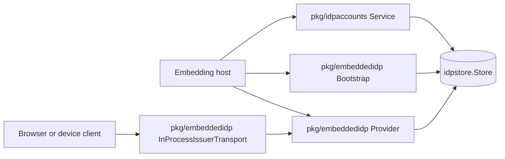
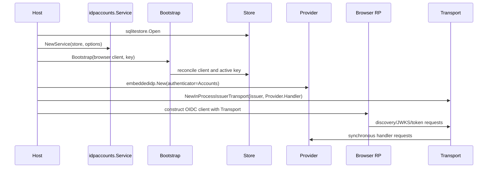
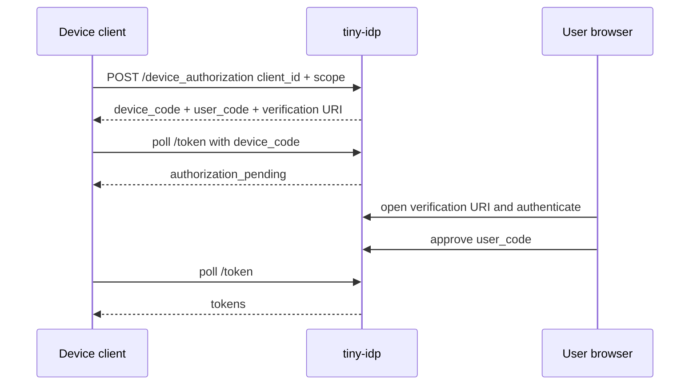

# Public Embedding Foundations for Browser and Device Applications

## Analysis, Design, and Implementation Guide

## 1. Executive summary

`tiny-idp` already exposes a production-oriented embedded provider and a durable SQLite store. A host can construct `embeddedidp.Provider`, mount its `http.Handler`, and customize its login page. That public surface is not yet sufficient to build a complete application without importing internal packages or depending on an unrelated application framework.

Three planned examples expose the missing layer:

1. The existing xapp combines tiny-idp with xgoja, a browser OIDC client, and durable objects.
2. `TINYIDP-MSGAPP-001` proposes a conventional Go and SQLite message application with self-service accounts.
3. A later example will demonstrate OAuth Device Authorization Grant behavior for a client without a normal browser callback.

The common requirements are not message-board features and are not xgoja features. They belong to tiny-idp's public embedding foundation:

- a host-supported account service that creates and authenticates credentials through one policy implementation;
- a conservative bootstrap operation that reconciles clients and ensures an active signing key;
- client specifications that support browser and device shapes without assuming every client has a redirect URI;
- an exact-origin, exact-path in-process HTTP transport for OIDC discovery, JWKS, token exchange, and future device back-channel requests;
- package documentation and tests that make these APIs safe to use outside this repository.

This ticket implements those foundations. It does not build the message application or the future device application. It makes both possible without copying internal code.

The implementation makes deliberate breaking internal changes. Password authentication moves from `internal/authn` to `pkg/idpaccounts`. User creation and password replacement move out of `internal/admin`. Existing consumers are updated directly. No compatibility package or forwarding adapter is retained.

The accepted architecture is:



Each public component owns one kind of responsibility:

| Component | Responsibility |
|---|---|
| `idpaccounts.Service` | Account creation, password establishment, password authentication, lockout, and password work metrics |
| `embeddedidp.Bootstrap` | Idempotent reconciliation of configured clients and initial active signing key |
| `embeddedidp.ClientSpec` | Declared client shape and profile-specific validation |
| `embeddedidp.InProcessIssuerTransport` | Back-channel HTTP delivery to the exact embedded issuer without public network startup dependencies |
| `embeddedidp.Provider` | OAuth/OIDC protocol, browser interaction, tokens, sessions, discovery, readiness, and maintenance |

## 2. Problem statement

The current public provider API begins too late in the host lifecycle. `embeddedidp.New` expects a store that already contains valid clients and a signing key. It also expects a password authenticator if strict credential login is desired. An external host can satisfy the interfaces only by reimplementing internal policy or manipulating low-level records.

This creates four failure modes.

### 2.1 Policy duplication

A host that implements account creation independently can normalize passwords differently from authentication, use different Argon2 parameters, skip the blocklist, fail to share the work semaphore, or commit the user separately from the credential.

### 2.2 Internal-package dependence

The xapp works because it lives inside the tiny-idp module and can import `internal/authn`, `internal/admin`, and `internal/keys`. That is not a supported path for an external application.

### 2.3 Bootstrap by representation

`idpstore.Store` exposes `PutClient` and `CreateSigningKey`, but the host should not need to create private-key PEM records. The public API should expose the outcome “ensure a usable active signing key,” not the internal representation required to achieve it.

### 2.4 Browser-only assumptions

The xapp bootstrap code constructs one public browser client with one callback. A later device client may have no callback URI. A reusable bootstrap API must therefore accept a generic client specification and validate its intended profile rather than derive all client state from a web application's base URL.

## 3. Goals

The ticket has six implementation goals.

1. Make correct password-backed account creation available through a supported public package.
2. Ensure creation and authentication share one service instance and one password-work bound.
3. Make provider bootstrap idempotent, conflict-detecting, and safe for browser and device client shapes.
4. Hide signing private-key construction behind a narrow provisioning operation.
5. Make same-process OIDC back-channel HTTP available without importing go-go-goja.
6. Update all current consumers and remove obsolete internal implementations.

## 4. Non-goals

This ticket does not implement:

- the message application;
- a new account-registration HTTP endpoint;
- email verification or password recovery;
- a public administrative HTTP API;
- dynamic client registration;
- OAuth Device Authorization Grant endpoints in the strict Fosite adapter;
- a device polling client;
- application session storage;
- a general-purpose in-process HTTP router;
- remote network fallback from the issuer transport;
- compatibility aliases for removed internal Go packages.

The future device example is a design consumer, not an implementation deliverable here. This ticket ensures the client bootstrap and transport APIs do not prevent it.

## 5. Current-state evidence

### 5.1 Embedded provider contract

`pkg/embeddedidp/options.go:50-65` defines the public `Options` input. It includes issuer, mode, store, cookie configuration, token secret, audit, consent, rate limiting, client-address resolution, password authenticator, password policy, password work, maintenance, and UI renderer.

`pkg/embeddedidp/provider.go:40-74` validates those inputs and constructs the internal Fosite adapter. `Provider.Handler` at lines 77-93 exposes the provider as a normal `http.Handler`.

The missing operations occur before `embeddedidp.New`: accounts, clients, keys, and same-process OIDC client construction.

### 5.2 Password service

`internal/authn/password.go:21-40` defines authentication errors, lockout policy, and service options. `NewPasswordService` at lines 70-108 builds the Argon2 hasher, dummy verifier, work semaphore, policy, clock, and audit sink.

`AuthenticatePassword` at lines 111-197 performs:

- login and password normalization;
- unknown-user dummy verification;
- account-state checks;
- bounded Argon2 work;
- failed-login recording;
- rehash-on-login;
- successful-login reset;
- generic authentication errors and fixed audit reasons.

`HashCredential` at lines 199-218 applies the public password-acceptance policy and the same bounded hasher.

The code is already the correct shared core. Its package visibility is the gap.

### 5.3 Account creation

`internal/admin/users.go:54-113` defines the current create request and implementation. It normalizes login, checks duplicate login and user ID, generates an opaque ID, constructs profile state, hashes the password through `PasswordService`, atomically calls `Store.CreateUserWithCredential`, and emits a post-commit audit event.

`SetPassword` at lines 115-141 hashes a replacement credential and calls `ReplacePasswordAndSecurityState`, which revokes existing security artifacts.

These are domain operations. Their core belongs with account authentication rather than with CLI administration.

### 5.4 Client creation and reconciliation

`internal/admin/clients.go:22-80` creates clients and hashes confidential-client secrets. It is an administrative create-only operation. It rejects duplicates rather than reconciling declarative desired state.

`cmd/tinyidp-xapp/state.go:167-203` contains a separate reconcile operation for one browser client. It compares public status, PKCE, disabled status, redirect URIs, post-logout URIs, and scopes.

The xapp operation is closer to host bootstrap semantics, but it is tied to one client ID and one browser callback.

### 5.5 Signing-key bootstrap

`cmd/tinyidp-xapp/state.go:228-239` checks for an active key and calls `internal/keys.GenerateRSA` if none exists.

`internal/keys/keys.go:19-25` generates a 2048-bit RSA private key and serializes it into `idpstore.SigningKey`. `internal/admin/keys.go` provides richer key lifecycle commands.

An embedding host needs only initial provisioning. Rotation and emergency purge remain administrative operations.

### 5.6 Same-process transport

`cmd/tinyidp-xapp/development_app.go:145-170` and `production_app.go:90-123` use `oidcauth.NewInProcessIssuerTransport` from go-go-goja. That transport routes discovery, JWKS, and token requests into the provider handler before the public listener is available.

The implementation in `go-go-goja/pkg/gojahttp/auth/oidcauth/inprocess_transport.go` already enforces exact scheme, host, and issuer-path matching. It uses `httptest.ResponseRecorder`, which buffers without a size bound. The tiny-idp version will preserve the exact-match design and add canonical-path validation and a hard response limit.

### 5.7 Device-client shape

`pkg/idpstore.Client` contains public/confidential state, redirect and post-logout URIs, allowed scopes, PKCE, token lifetimes, timestamps, and disabled status. `Client.Validate` does not require at least one redirect URI.

The mock engine's native device implementation under `internal/server/device.go` identifies a client by ID and checks scopes. A device client therefore can be represented without a redirect URI today.

The strict Fosite adapter currently hardcodes authorization-code and refresh grant types when adapting stored clients. Device endpoint support in that adapter is not implemented in this ticket. The bootstrap API nevertheless must allow a device-shaped client so a later device ticket does not need a browser-only bootstrap redesign.

## 6. Gap matrix

| Capability | Existing code | Public/reusable? | Ticket action |
|---|---|---:|---|
| Password verification | `internal/authn` | No | Move to `pkg/idpaccounts` |
| Password establishment | `internal/authn.HashCredential` | No | Include in public service |
| Atomic account creation | `internal/admin/users.go` | No | Move to public service |
| Password replacement | `internal/admin/users.go` | No | Move to public service |
| Admin disable/get | `internal/admin/users.go` | Internal by design | Keep administrative |
| Client create | `internal/admin/clients.go` | Internal by design | Keep administrative |
| Declarative reconcile | xapp-specific | No | Add public bootstrap |
| Initial signing key | xapp + internal keys | No | Add public bootstrap |
| Browser client profile | xapp hard-coded | No | Add public constructor |
| Device client profile | none | No | Add public constructor |
| Same-process issuer HTTP | go-go-goja | Wrong owner | Add to `embeddedidp` |
| Device strict adapter | absent | No | Later ticket, explicitly preserved |

## 7. Accepted architectural decisions

### Decision: public account service owns creation and authentication

- **Context:** Password establishment and verification must not drift.
- **Options considered:** Export raw password hasher; keep authentication internal and expose a creation wrapper; make one public account service own both.
- **Decision:** Create `pkg/idpaccounts.Service` implementing `idp.PasswordAuthenticator` and account mutations.
- **Rationale:** One constructed service shares policy, hashing configuration, work bounds, clock, store, and audit.
- **Consequences:** Existing provider, admin, xapp, tests, and ticket scripts must migrate. `internal/authn` is removed.
- **Status:** accepted.

### Decision: no public hasher injection

- **Context:** Existing internal tests inject a low-cost hasher through an internal interface.
- **Options considered:** Export the internal hasher interface; expose Argon2 parameters publicly; use an unexported test constructor.
- **Decision:** Public `Options` exposes policy and work controls but not a hasher. Package-internal tests use an unexported dependency constructor.
- **Rationale:** External callers should not replace password hashing with an unsafe implementation through the production API.
- **Consequences:** Tests that need cheap parameters move into the `idpaccounts` package rather than an external test package.
- **Status:** accepted.

### Decision: administrative facade does not preserve removed user methods

- **Context:** `internal/admin.Service` currently combines account, client, and key operations.
- **Options considered:** Embed or forward to `idpaccounts.Service`; retain aliases; update callers directly.
- **Decision:** Remove account creation and password replacement from `internal/admin`; update CLI and xapp to construct the public account service explicitly.
- **Rationale:** This avoids a compatibility adapter and makes ownership visible.
- **Consequences:** Internal call sites change. User disable/get may remain administrative because they do not establish credentials.
- **Status:** accepted.

### Decision: bootstrap accepts generic client specifications

- **Context:** Browser clients need callbacks and PKCE; device clients do not need callbacks.
- **Options considered:** Bootstrap one browser client from a public base URL; accept raw `idpstore.Client`; define typed client specifications and profiles.
- **Decision:** Bootstrap accepts `[]ClientSpec`, with browser and device constructors plus validation.
- **Rationale:** The API communicates intended client use while retaining a common stored representation.
- **Consequences:** The device profile is preparatory. Grant-type enforcement remains future work.
- **Status:** accepted.

### Decision: device profile retains current public-client PKCE invariant

- **Context:** `idpstore.Client.Validate` requires every public client to set `RequirePKCE`, although device grant does not use PKCE.
- **Options considered:** Redesign client grant capabilities now; weaken public-client validation; set PKCE on device profiles as a dormant protection if authorization code is attempted.
- **Decision:** Device client specifications are public and set `RequirePKCE=true`; they have no redirect URIs.
- **Rationale:** This preserves current production validation without prematurely adding grant-type persistence.
- **Consequences:** A later device ticket should introduce explicit allowed grant types if strict least-privilege client capabilities are required.
- **Status:** accepted.

### Decision: bootstrap is idempotent and conflict-detecting

- **Context:** Hosts run initialization more than once and must not silently replace security configuration.
- **Options considered:** Create-only operation; upsert desired state; validate existing exact semantic equivalence.
- **Decision:** Create missing objects, accept equivalent existing objects, and return a typed conflict for security-relevant differences.
- **Rationale:** Repeatable startup does not erase operator changes or broaden clients.
- **Consequences:** Planned changes require an explicit administrative migration rather than silent bootstrap replacement.
- **Status:** accepted.

### Decision: bootstrap may partially commit and is retryable

- **Context:** The store does not expose one atomic operation spanning multiple clients and key generation.
- **Options considered:** Add a large store transaction; require empty stores; perform ordered idempotent reconciliation.
- **Decision:** Reconcile clients in stable order, then ensure the key; report committed work and return errors.
- **Rationale:** Existing named operations remain sufficient, and retry converges safely.
- **Consequences:** Audit and error contracts must state whether a mutation committed before an error.
- **Status:** accepted.

### Decision: issuer transport fails closed without fallback

- **Context:** A fallback transport could turn configuration mistakes into external network calls.
- **Options considered:** Accept fallback; use `http.DefaultTransport`; reject every non-issuer request.
- **Decision:** The public transport routes one exact issuer and rejects all other requests.
- **Rationale:** OIDC clients should receive an explicit error rather than silently leaving the process.
- **Consequences:** A caller needing mixed origins must build an explicit outer router.
- **Status:** accepted.

## 8. Public `pkg/idpaccounts` API

### 8.1 Package role

`pkg/idpaccounts` owns password-backed identity accounts. It is not an HTTP registration service and not a general administration API.

Proposed public types:

```go
package idpaccounts

var (
    ErrInvalidCredentials       = errors.New("invalid credentials")
    ErrAccountDisabled          = errors.New("account disabled")
    ErrAccountLocked            = errors.New("account locked")
    ErrAuthenticationUnavailable = errors.New("authentication unavailable")
    ErrPasswordWorkRejected     = errors.New("password work rejected")
)

type LoginPolicy struct {
    LockoutThreshold  int
    LockoutWindow     time.Duration
    LockoutDuration   time.Duration
    AllowPasswordless bool
    DummyHash         []byte
}

func DefaultLoginPolicy() LoginPolicy

type Options struct {
    LoginPolicy    LoginPolicy
    PasswordPolicy idp.PasswordAcceptancePolicy
    PasswordWork   idp.PasswordWorkConfig
    Clock          func() time.Time
    Audit          idp.Sink
}

type Service struct { /* unexported fields */ }

func NewService(store idpstore.Store, opts Options) (*Service, error)
```

### 8.2 Provisioning request

```go
type CreateRequest struct {
    Login             string
    Password          []byte
    ID                string
    Subject           string
    Email             string
    EmailVerified     bool
    Name              string
    PreferredUsername string
    Groups            []string
    Roles             []string
    Tenant            string
    Locale            string
}

func (s *Service) Create(ctx context.Context, req CreateRequest) (idpstore.User, error)
```

This is a privileged Go API. An HTTP registration handler must construct the request from an allowlisted subset and must not accept roles, groups, subject, or tenant directly from an untrusted browser.

### 8.3 Password replacement

```go
type SetPasswordRequest struct {
    Login    string
    Password []byte
}

func (s *Service) SetPassword(ctx context.Context, req SetPasswordRequest) error
```

Replacement uses `Store.ReplacePasswordAndSecurityState`, resetting lockout state and revoking security artifacts as already documented.

### 8.4 Authentication and metrics

```go
func (s *Service) AuthenticatePassword(
    ctx context.Context,
    login string,
    password string,
    meta idp.LoginMetadata,
) (idp.AuthResult, error)

func (s *Service) PasswordWorkStats() idp.PasswordWorkStats
func (s *Service) ProductionReady() bool
```

Compile-time assertions:

```go
var _ idp.PasswordAuthenticator = (*Service)(nil)
var _ idp.PasswordWorkReporter = (*Service)(nil)
var _ idp.ProductionReadyReporter = (*Service)(nil)
```

### 8.5 Creation pseudocode

```text
require nonnil context and service
normalize login through internal canonical user normalizer
require login and password
check login uniqueness; storage errors fail closed

select or generate opaque user ID
check ID uniqueness
select subject: explicit subject or generated user ID
construct and validate idpstore.User

credential = hashCredential(
    user ID,
    normalized login,
    password,
    clock.UTC())

store.CreateUserWithCredential(login, user, credential)
emit identity.account.created audit after commit
return committed user and any audit-delivery error
```

### 8.6 Audit contract

Events become domain-oriented:

```text
identity.account.created
identity.account.password_changed
login.accepted
login.rejected
```

If the store commit succeeds and durable audit delivery fails, the method returns the committed result plus an error wrapping `idp.ErrAuditDelivery`. Callers must not blindly retry account creation on that error; they should reconcile by login or ID.

## 9. Administrative service after the move

`internal/admin.Service` retains:

- client creation, rotation, list, disable, and lookup;
- signing-key lifecycle;
- doctor checks;
- user lookup and enable/disable;
- export and backup operations.

It no longer owns:

- password hashing;
- account creation;
- password replacement;
- password-work metrics.

The CLI service bundle becomes:

```go
type adminServices struct {
    Admin    *admin.Service
    Accounts *idpaccounts.Service
    close    func()
}
```

User create and set-password commands call `Accounts`. User get and enable/disable commands call `Admin`.

## 10. Bootstrap API

### 10.1 Public types

```go
package embeddedidp

type ClientProfile string

const (
    ClientProfileBrowser ClientProfile = "browser"
    ClientProfileDevice  ClientProfile = "device"
    ClientProfileGeneric ClientProfile = "generic"
)

type ClientSpec struct {
    Profile ClientProfile
    Client  idpstore.Client
}

func BrowserClient(
    id string,
    redirectURIs []string,
    postLogoutRedirectURIs []string,
    scopes []string,
) ClientSpec

func DeviceClient(id string, scopes []string) ClientSpec

type BootstrapConfig struct {
    Mode         idpstore.Mode
    Clients      []ClientSpec
    SigningKeyID string
    Clock        func() time.Time
    Audit        idp.Sink
}

type BootstrapReport struct {
    ClientsCreated    []string
    ClientsValidated  []string
    SigningKeyCreated bool
    ActiveSigningKey  string
}

func Bootstrap(
    ctx context.Context,
    store idpstore.Store,
    cfg BootstrapConfig,
) (BootstrapReport, error)
```

### 10.2 Browser constructor

`BrowserClient` returns a public PKCE client with exact redirect and logout URIs. Defaults:

```text
Public = true
RequirePKCE = true
AccessTokenTTL = 1 hour
IDTokenTTL = 1 hour
RefreshTokenTTL = 24 hours
```

It requires at least one redirect URI and `openid` scope.

### 10.3 Device constructor

`DeviceClient` returns:

```text
Public = true
RequirePKCE = true
RedirectURIs = empty
PostLogoutRedirectURIs = empty
AllowedScopes = caller scopes
AccessTokenTTL = 1 hour
IDTokenTTL = 1 hour
RefreshTokenTTL = 24 hours
```

The PKCE field preserves the current public-client invariant. It has no effect on a pure device grant. A future grant-capability model may refine this.

### 10.4 Generic specification

`ClientProfileGeneric` accepts an explicitly populated `idpstore.Client` and applies ordinary production or development validation. It exists for confidential hosts and advanced tests.

Generic does not bypass security checks. A public generic client still requires PKCE under the current domain rule.

### 10.5 Normalization

Bootstrap canonicalizes declaration-only variation before comparison:

- trim client ID;
- remove empty scope and URI strings;
- deduplicate lists;
- sort lists;
- apply default TTLs only when zero;
- set timestamps for newly created rows;
- never copy an existing secret into logs or reports.

It does not normalize URI semantics beyond `idpstore.ValidateRedirectURI`. Redirect URI matching remains exact.

### 10.6 Semantic conflict detection

The comparison includes:

```text
ID
Public
SecretHash presence and bytes for generic confidential specifications
RedirectURIs as normalized sets
PostLogoutRedirectURIs as normalized sets
AllowedScopes as normalized sets
RequirePKCE
AccessTokenTTL
IDTokenTTL
RefreshTokenTTL
Disabled
```

It ignores `CreatedAt` and `UpdatedAt` when determining equivalence.

Typed error:

```go
var ErrBootstrapConflict = errors.New("embedding bootstrap conflict")

type ClientConflictError struct {
    ClientID string
    Fields   []string
}

func (e *ClientConflictError) Error() string
func (e *ClientConflictError) Unwrap() error { return ErrBootstrapConflict }
```

The error reports field names, not secret contents.

## 11. Signing-key provisioning

Bootstrap handles one case: no active key exists.

Pseudocode:

```text
active, err = store.ActiveSigningKey()

if err == nil:
    validate active key metadata and RSA private key
    report existing key ID
    return

if err != ErrNotFound:
    fail

check context
kid = configured ID or generated timestamp/random suffix
key = internal RSA generator(kid, clock.UTC())
check context again
store.CreateSigningKey(key)
emit identity.bootstrap.signing_key_created
report created key ID
```

Bootstrap does not rotate an existing key, repair a corrupt key, or choose among multiple active keys. Those conditions fail and require the administrative key commands.

The report never contains PEM bytes or the complete `SigningKey` record.

## 12. Bootstrap ordering and retry

Client specifications are sorted by ID. Bootstrap first validates every specification in memory. It then checks duplicate requested IDs before any write.

Execution order:

```text
validate all config
normalize all client specs
reject duplicate IDs

for each client ordered by ID:
    load existing
    if absent:
        put desired
        append report.ClientsCreated
        emit audit
    else:
        compare semantic fields
        if conflict: return report + conflict error
        append report.ClientsValidated

ensure active signing key
return report
```

If a later step fails, the report describes earlier committed mutations. A retry sees those objects as equivalent and continues.

## 13. In-process issuer transport API

### 13.1 Constructor

```go
const DefaultInProcessResponseLimit = 1 << 20 // 1 MiB

type InProcessTransportOptions struct {
    MaxResponseBytes int64
    RemoteAddr       string
}

type InProcessIssuerTransport struct { /* normalized issuer and handler */ }

func NewInProcessIssuerTransport(
    issuer string,
    handler http.Handler,
    opts InProcessTransportOptions,
) (*InProcessIssuerTransport, error)
```

The zero option selects a 1 MiB response limit and `127.0.0.1:0` server peer metadata.

### 13.2 Issuer validation

The constructor requires:

- `http` or `https` scheme;
- absolute URL;
- non-empty host;
- no user information;
- no query;
- no fragment;
- canonical clean path;
- no backslash;
- no encoded slash, backslash, or dot-segment ambiguity;
- no trailing slash except root.

The normalized match key is exact lowercase scheme plus lowercase host plus canonical decoded path prefix.

### 13.3 Request validation

`RoundTrip` requires:

- nonnil absolute request URL;
- exact scheme and host;
- no user information;
- canonical request path;
- path equal to issuer prefix or a child separated by `/`;
- no path traversal after decoding;
- live request context;
- no upgrade or CONNECT semantics.

Requests to any other origin fail. There is no fallback.

### 13.4 Handler conversion

The transport clones the request context and converts the client request into a valid server request:

```text
serverRequest = req.Clone(ctx)
serverRequest.RequestURI = req.URL.RequestURI()
serverRequest.RemoteAddr = configured loopback address
serverRequest.Close = false
```

It executes the handler synchronously. A bounded response writer records status, cloned headers, body bytes, and overflow state.

If the handler exceeds the response limit, `RoundTrip` returns an error even if the handler ignored a short-write error.

The returned `http.Response` contains:

- status and status code;
- cloned headers;
- bounded independent body reader;
- content length;
- original client request;
- no trailer unless explicitly supported later.

### 13.5 Why no `httptest.ResponseRecorder`

`httptest.ResponseRecorder` is convenient but its body buffer is unbounded. Discovery, JWKS, token, and future device responses should be small. A hard bound turns that assumption into enforcement.

## 14. Browser composition flow



The application browser still reaches authorization and interaction routes through the public server. The in-process transport is for relying-party back-channel requests.

## 15. Future device composition flow

The future device example will use the same bootstrap surface:

```go
spec := embeddedidp.DeviceClient(
    "tinyidp-device-example",
    []string{"openid", "profile"},
)
```

Expected future flow:



This ticket establishes only the durable client declaration and shared account/bootstrap primitives. It records two later requirements:

- the strict embedded provider must support and advertise the device grant;
- the stored client model may need explicit allowed grant types to enforce device-only versus browser-only capability.

## 16. Migration plan

### 16.1 Move authentication code

Files:

```text
internal/authn/password.go
  -> pkg/idpaccounts/password.go

internal/authn/password_test.go
  -> pkg/idpaccounts/password_test.go
```

Package names and public identifiers change. No `internal/authn` forwarding package remains.

### 16.2 Move account mutations

Creation and password replacement move from `internal/admin/users.go` into:

```text
pkg/idpaccounts/accounts.go
pkg/idpaccounts/accounts_test.go
```

Administrative get/disable functions remain in a reduced `internal/admin/users.go`.

### 16.3 Update provider

`internal/fositeadapter/provider.go` imports `pkg/idpaccounts` for its default authenticator construction.

The public `embeddedidp.Options.Authenticator` interface remains unchanged. Hosts may supply another production-ready authenticator.

### 16.4 Update xapp

Development and production constructors create `idpaccounts.Service`. Development seeding calls `Create` rather than manually hashing and writing records.

Xapp state initialization uses `embeddedidp.Bootstrap` for client and key. It uses `idpaccounts.Service` for the first user.

Xapp OIDC construction uses `embeddedidp.NewInProcessIssuerTransport` rather than go-go-goja's helper.

### 16.5 Update admin CLI

The open helper returns both administrative and account services. Commands route to the correct owner explicitly.

### 16.6 Update ticket tooling

Tracked production probes under `ttmp` are compiled by `go test ./...` only when they contain Go packages. Imports must migrate so assurance tools continue to build.

## 17. Test strategy

### 17.1 Account service

Tests cover:

- default construction and interface assertions;
- login normalization;
- password NFC normalization;
- acceptance policy rejection;
- duplicate login and duplicate ID;
- opaque ID and subject generation;
- atomic user-plus-credential rollback;
- unknown-user dummy verification;
- invalid credential and lockout transitions;
- account disabled and credential disabled;
- storage failures fail closed;
- rehash-on-login;
- successful-login reset;
- password replacement and security artifact revocation;
- bounded concurrent password work;
- context cancellation;
- committed account result with audit-delivery error;
- no password in errors, audit, metrics, or formatted request values.

### 17.2 Bootstrap

Tests cover:

- empty store creates clients and key;
- second call validates without mutation;
- stable report ordering;
- duplicate specs rejected before writes;
- browser profile requires redirects and `openid`;
- browser profile forces public PKCE;
- device profile has no redirects and validates;
- generic confidential client validation;
- client field conflicts identify only field names;
- list ordering differences compare equivalent;
- existing valid key is retained;
- corrupt or expired active key fails;
- key generation checks canceled context before persistence;
- audit failure returns committed report;
- no private key appears in report or errors.

### 17.3 Transport

Tests cover:

- discovery GET;
- JWKS GET;
- form-encoded token POST;
- request body reaches handler exactly;
- response status, headers, and body round-trip;
- default and custom response bounds;
- handler ignores short-write error but overflow still fails;
- exact scheme and host;
- explicit port mismatch;
- sibling and prefix-confusion paths;
- encoded traversal, slash, backslash, and dot segments;
- relative URLs;
- userinfo;
- query and fragment issuer rejection;
- canceled context;
- nil handler and nil request;
- server `RemoteAddr` and `RequestURI` metadata;
- concurrent use.

### 17.4 Consumer migration

Focused packages:

```bash
go test ./pkg/idpaccounts ./pkg/embeddedidp
go test ./internal/admin ./internal/fositeadapter ./internal/cmds
go test ./cmd/tinyidp-xapp
```

Selected race run:

```bash
go test -race ./pkg/idpaccounts ./pkg/embeddedidp ./internal/fositeadapter
```

Full checks:

```bash
go fmt ./...
go test ./...
go build ./...
make lint
```

## 18. Static and architectural checks

A repository test scans future examples and rejects imports below:

```text
github.com/manuel/tinyidp/internal/
```

The public packages themselves may import internal implementation packages because Go's internal rule permits their module. Their exported API must not mention an internal type. A compile test in an external test package exercises every exported constructor using only public types.

Suggested static check:

```text
go list -deps -json ./examples/...
inspect direct imports in example packages
reject tiny-idp/internal prefix
```

## 19. Security review checklist

### Account service

- Does public construction use production Argon2 parameters?
- Can an external caller inject a weak hasher?
- Do creation and authentication share the same service?
- Is password length bounded before Argon2?
- Are unknown accounts dummy-verified?
- Do storage failures fail closed?
- Does password replacement revoke prior artifacts?
- Are audit-after-commit semantics documented?

### Bootstrap

- Are all specs validated before the first write?
- Are duplicate client IDs rejected?
- Does equivalence ignore only timestamps and list ordering?
- Can bootstrap silently broaden scopes or callbacks?
- Can any report expose secret hashes or PEM?
- Does an active-key problem fail instead of replacing evidence?
- Does device profile avoid a fake browser callback?

### Transport

- Is origin comparison exact?
- Is issuer path comparison segment-aware?
- Are decoded traversal and encoded separators rejected?
- Is response buffering bounded?
- Does overflow fail even if the handler ignores `Write` errors?
- Can a non-issuer request reach the network?
- Does request cancellation propagate?

## 20. Observability

The account service retains low-cardinality password-work metrics. Bootstrap returns an explicit report and emits fixed audit events:

```text
identity.bootstrap.client_created
identity.bootstrap.signing_key_created
```

Fields may include client ID and key ID because these are configuration identifiers, not credentials. They must not include:

- client secret or hash;
- signing private key;
- password or password hash;
- bearer tokens;
- arbitrary rendered error strings.

Transport does not log request URLs or bodies. The host may instrument aggregate request counts using endpoint-class labels after redacting query values.

## 21. Failure semantics

### Account create

| Failure point | Mutation committed? | Result |
|---|---:|---|
| validation | No | validation error |
| password hashing | No | password/work error |
| atomic store operation | No on proper store | store error |
| audit after store | Yes | committed user plus `ErrAuditDelivery` |

### Bootstrap

| Failure point | Mutation committed? | Result |
|---|---:|---|
| config validation | No | validation error |
| existing client conflict | Earlier ordered clients may be committed | report plus conflict |
| client store failure | Earlier clients may be committed | report plus store error |
| key generation | Clients may be committed | report plus generation error |
| key audit failure | Key committed | report plus `ErrAuditDelivery` |

### Transport

Transport has no persistent mutation of its own. The target handler may mutate provider state before producing an oversized response. The response limit is primarily a memory and protocol-output guard; callers must not assume failure implies the target handler rolled back.

## 22. Phase plan

### Phase 0: contract and evidence

Tasks:

1. Map current browser, device, admin, account, key, store, and transport code.
2. Accept the decisions in Section 7.
3. Write this guide and the implementation diary.
4. Add task and changelog structure.
5. Commit the design before code movement.

Exit criteria:

- public API signatures are reviewable;
- device profile semantics are explicit;
- no implementation begins from an undocumented ownership assumption.

### Phase 1: public account service

Tasks:

1. Add `pkg/idpaccounts` package documentation.
2. Move password service and errors.
3. Add public `Create` and `SetPassword`.
4. Move and expand tests.
5. Remove account mutation methods from internal admin.
6. Update admin CLI service composition.
7. Update Fosite adapter default construction.
8. Update xapp and tracked scripts.
9. Run focused and full tests.
10. Commit code, then diary and ticket state.

Exit criteria:

- no Go file imports `internal/authn`;
- no account creation implementation remains in `internal/admin`;
- public service implements all required provider reporter interfaces;
- full repository builds and tests.

### Phase 2: generic bootstrap

Tasks:

1. Add profile and configuration types.
2. Add normalization and semantic comparison.
3. Add typed conflict errors.
4. Add signing-key provisioning.
5. Add reports and audit events.
6. Add browser, device, generic, idempotency, conflict, and failure tests.
7. Migrate xapp state initialization.
8. Run focused and full tests.
9. Commit code, then diary and ticket state.

Exit criteria:

- browser and device specs both reconcile safely;
- second bootstrap makes no writes;
- xapp no longer generates its own initial key or manually reconciles its client.

### Phase 3: in-process issuer transport

Tasks:

1. Add canonical issuer parser.
2. Add bounded response writer.
3. Implement `RoundTrip`.
4. Add adversarial URL and overflow tests.
5. Add concurrency and cancellation tests.
6. Migrate xapp from go-go-goja transport.
7. Run focused and full tests.
8. Commit code, then diary and ticket state.

Exit criteria:

- xapp OIDC behavior uses only tiny-idp for issuer transport;
- non-issuer URLs fail without network access;
- oversized handler output fails deterministically.

### Phase 4: documentation and assurance

Tasks:

1. Publish package and integration documentation.
2. Add browser and device bootstrap examples.
3. Add public-import architecture test.
4. Run formatting, unit, race, build, lint, and analyzer checks.
5. Update ticket relationships, tasks, changelog, and diary.
6. Run docmgr doctor.
7. Upload the final ticket bundle to reMarkable.

Exit criteria:

- a new intern can compose store, accounts, bootstrap, provider, and transport from public packages;
- documentation states the later device-provider gap;
- all ticket validation and delivery tasks pass.

## 23. Intern implementation order

Read these files in order:

1. `pkg/idp/password.go` for public acceptance and work policies.
2. `pkg/idpstore/types.go` and `interfaces.go` for account, client, key, and atomic store state.
3. `internal/authn/password.go` for the code being moved.
4. `internal/admin/users.go` for account mutations being moved.
5. `pkg/embeddedidp/options.go` and `provider.go` for the host boundary.
6. `cmd/tinyidp-xapp/state.go` for existing bootstrap behavior.
7. `cmd/tinyidp-xapp/development_app.go` and `production_app.go` for same-process OIDC composition.
8. `go-go-goja/pkg/gojahttp/auth/oidcauth/inprocess_transport.go` for prior transport evidence.
9. `internal/server/device.go` for the existing mock device-client shape.
10. This guide's decisions and phase exit criteria.

Do not begin by changing xapp. Build and test the reusable public unit first, then migrate xapp as a consumer.

## 24. API usage examples

### Browser application

```go
store, err := sqlitestore.Open(ctx, sqlitestore.DefaultConfig(identityDB))
if err != nil {
    return err
}

accounts, err := idpaccounts.NewService(store, idpaccounts.Options{
    Audit: auditSink,
})
if err != nil {
    return err
}

report, err := embeddedidp.Bootstrap(ctx, store, embeddedidp.BootstrapConfig{
    Mode: embeddedidp.ProductionMode,
    Clients: []embeddedidp.ClientSpec{
        embeddedidp.BrowserClient(
            "message-app",
            []string{"https://messages.example.test/auth/callback"},
            []string{"https://messages.example.test/"},
            []string{"openid", "profile"},
        ),
    },
    SigningKeyID: "initial-rs256",
    Audit: auditSink,
})
if err != nil {
    return fmt.Errorf("bootstrap identity provider: %w", err)
}
_ = report

provider, err := embeddedidp.New(ctx, embeddedidp.Options{
    Issuer:        "https://messages.example.test/idp",
    Mode:          embeddedidp.ProductionMode,
    Store:         store,
    Authenticator: accounts,
    Audit:         auditSink,
    // remaining production controls
})
```

### Device client bootstrap

```go
_, err := embeddedidp.Bootstrap(ctx, store, embeddedidp.BootstrapConfig{
    Mode: embeddedidp.ProductionMode,
    Clients: []embeddedidp.ClientSpec{
        embeddedidp.DeviceClient(
            "example-cli",
            []string{"openid", "profile"},
        ),
    },
    SigningKeyID: "initial-rs256",
    Audit: auditSink,
})
```

### Same-process OIDC client

```go
transport, err := embeddedidp.NewInProcessIssuerTransport(
    issuer,
    provider.Handler(),
    embeddedidp.InProcessTransportOptions{},
)
if err != nil {
    return err
}

oidcHTTPClient := &http.Client{
    Transport: transport,
    Timeout:   10 * time.Second,
}

oidcContext := context.WithValue(
    ctx,
    oauth2.HTTPClient,
    oidcHTTPClient,
)
```

## 25. Alternatives rejected

### Export `internal/authn` unchanged under a public path

Rejected because its exported options expose an internal hasher interface and its name describes only authentication, not account provisioning.

### Let examples write `idpstore.PasswordCredential`

Rejected because this exposes hashing representation and makes policy drift likely.

### Bootstrap raw `idpstore.Client` only

Rejected as the sole API because it does not state whether a no-redirect public client is intentional. `ClientSpec.Profile` adds that context.

### Add grant types to persistent clients in this ticket

Deferred. It is desirable for least privilege, but it expands protocol adapter and migration scope beyond the three immediate foundation gaps. The future strict-device ticket should own it.

### Copy the transport into each example

Rejected because URL confinement and response bounds are security-sensitive and should have one test suite.

### Use public network self-calls

Rejected as the only supported composition because initialization may occur before the listener starts and production DNS/TLS may not route back into the process.

## 26. Risks

| Risk | Mitigation |
|---|---|
| Moving authentication breaks many tests | Mechanical import migration followed by focused and full tests |
| Public account API is used directly from unsafe HTTP input | Package documentation identifies it as privileged; example registration allowlists fields |
| Audit failure causes duplicate retry | Return committed result and document reconciliation |
| Bootstrap hides operator drift | Fail with typed field conflict; never overwrite |
| Device profile implies unsupported strict grant | Documentation explicitly separates client readiness from endpoint support |
| Transport path parser accepts encoded escape | Canonical decoded-path validation and fuzz/adversarial tests |
| Handler response consumes unbounded memory | Hard bounded response writer and overflow flag |
| RSA generation cannot be interrupted mid-operation | Check context before and after generation, before store write |

## 27. Definition of done

The ticket is complete when:

- `pkg/idpaccounts` exists and has public package documentation;
- `internal/authn` no longer exists;
- account creation and password replacement are absent from `internal/admin`;
- current consumers compile against the public service;
- `embeddedidp.Bootstrap` reconciles browser and device specs;
- bootstrap safely creates or validates one active signing key;
- xapp uses bootstrap rather than local client/key reconciliation;
- `embeddedidp.NewInProcessIssuerTransport` is bounded and fail-closed;
- xapp no longer imports the go-go-goja transport helper;
- public external-package compile tests pass;
- focused, full, race-selected, build, lint, and static checks pass;
- public documentation includes browser and future device examples;
- every phase has a diary entry and focused commit;
- docmgr doctor passes;
- the final design and implementation bundle is uploaded to reMarkable.

## 28. Primary file references

- `pkg/embeddedidp/options.go:50-217` — public provider configuration and production validation.
- `pkg/embeddedidp/provider.go:40-93` — provider construction and handler boundary.
- `pkg/idpstore/types.go:14-29` — persistent client representation.
- `pkg/idpstore/interfaces.go:154-172` — named atomic identity transitions.
- `pkg/idpstore/validate.go:9-34` — current public-client and redirect validation.
- `internal/authn/password.go:21-326` — password service moving public.
- `internal/admin/users.go:19-174` — current account mutation and audit behavior.
- `internal/admin/clients.go:22-80` — administrative client creation.
- `internal/keys/keys.go:19-33` — RSA key representation and parsing.
- `cmd/tinyidp-xapp/state.go:65-239` — current application bootstrap.
- `cmd/tinyidp-xapp/development_app.go:62-178` — browser client composition.
- `cmd/tinyidp-xapp/production_app.go:47-129` — production composition.
- `go-go-goja/pkg/gojahttp/auth/oidcauth/inprocess_transport.go:12-88` — current transport evidence.
- `internal/server/device.go:15-114` — current mock device grant and client use.

## 29. Closing assessment

The requested foundation is not a new abstraction over an already complete public API. It is a relocation of existing security-critical behavior into the correct ownership boundary, plus two small composition facilities that current applications have implemented locally.

The account service ensures that provisioning and authentication cannot diverge. Bootstrap ensures that client and signing-key prerequisites are declarative and conflict-detecting. The issuer transport preserves standard HTTP and OIDC behavior inside one process while failing closed outside one exact issuer.

Designing client specifications for both browser and device shapes now prevents the next example from inheriting a callback-oriented bootstrap contract. It does not claim that strict device authorization is complete. It gives that future work a correct public client and composition foundation.
