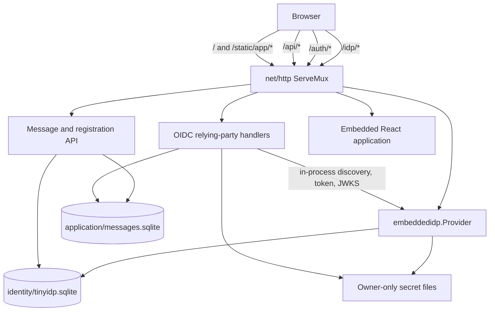

# Embedded Tiny-IDP SQLite Message Application

## Analysis, Design, and Implementation Guide

## 1. Executive summary

This ticket proposes a small, complete Go web application that demonstrates how an application embeds `tiny-idp` and then consumes that provider through ordinary OpenID Connect. The application presents a public message feed. Visitors may create a local account, sign in, post a bounded text message, and sign out. Identity state, OAuth/OIDC protocol state, application sessions, login attempts, and messages survive process restarts through SQLite.

The example is deliberately a real relying party rather than a handler that reads the IdP's session cookie. The embedded provider issues an ID token through the authorization-code flow. The application validates that token and establishes a separate application session. This is the same separation required when an identity provider and application are deployed as separate services, even though this showcase composes them into one process and one public origin.

The current repository already contains most of the required provider machinery:

- `pkg/embeddedidp` exposes provider construction and an `http.Handler`;
- `pkg/sqlitestore` supplies the durable identity and protocol store;
- `pkg/idpui` allows the host to style login and consent interactions;
- `cmd/tinyidp-xapp` proves that an IdP and OIDC client can share one process;
- `internal/admin` contains correct atomic user-plus-credential creation;
- production validation, maintenance, auditing, rate limiting, and password work controls already exist.

The inspection also found three public API gaps that a genuine external example must not hide:

1. User creation is implemented in `internal/admin`, which cannot be imported by an application outside the tiny-idp module.
2. Signing-key generation and bootstrap reconciliation rely on `internal/keys` and xapp-specific code.
3. The existing in-process OIDC transport is imported from the go-go-goja host-auth stack rather than exposed as a tiny-idp embedding facility.

The design therefore includes small public APIs for account provisioning, provider bootstrap, and in-process issuer transport. The example must import only public tiny-idp packages. A static test will enforce that property so the showcase remains copyable.

The recommended deliverable is:

```text
examples/tinyidp-message-app/
```

It uses the repository's top-level `go.mod`, provides Glazed `init`, `serve`, and `doctor` commands, embeds a React/TypeScript frontend, uses Redux Toolkit and RTK Query for browser state and HTTP calls, and serves generated assets only below `/static/app/`.

## 2. What the example teaches

The application is not primarily a message-board product. Its purpose is to make the integration boundary visible in runnable code.

An intern should be able to answer these questions after reading and running it:

- How is a durable tiny-idp store opened and migrated?
- How are a signing key and OIDC client registered without importing internal packages?
- How is an `embeddedidp.Provider` configured and mounted?
- Why does the application still perform an OIDC authorization-code flow when the provider is in the same process?
- How are state, nonce, and PKCE generated, stored, checked, and consumed?
- Why is the IdP session distinct from the application session?
- How does a self-registration request create a user and password credential atomically?
- Which database owns messages, and why is it separate from the identity database?
- How does the application bind message authorship to the stable OIDC `sub` claim?
- Where are CSRF, body-size, rate, and output-encoding controls enforced?
- Which checks must pass before the example is considered production-shaped rather than production-certified?

## 3. Scope

### 3.1 Included behavior

The first implementation includes:

- one Go process;
- one HTTPS public origin in production and loopback HTTP in development;
- an embedded issuer at `/idp`;
- an application OIDC client with authorization code plus PKCE S256;
- public discovery and JWKS served by tiny-idp;
- an application login route and callback;
- a durable application session stored by opaque hashed token;
- self-service registration with username, display name, and password;
- public reading of recent messages;
- authenticated creation of messages;
- authenticated deletion of one's own messages as an optional final task;
- separate SQLite files for identity and application data;
- embedded React/TypeScript assets;
- a styled tiny-idp interaction renderer;
- health, readiness, doctor, and smoke-test paths;
- explicit initialization and restart behavior;
- backup documentation for both databases and secret material.

### 3.2 Intentionally excluded

The first implementation does not include:

- email delivery or email verification;
- password reset;
- multi-factor authentication;
- moderation roles or administrator UI;
- message editing, threading, attachments, or rich text;
- WebSockets or live updates;
- multiple active application replicas;
- remote or social identity providers;
- federation between issuers;
- refresh-token use by the application;
- a general account-management portal;
- automatic production certificate acquisition;
- compatibility adapters for older internal APIs.

These exclusions keep the integration example bounded. They must not be represented as complete account-lifecycle support.

## 4. User stories and acceptance criteria

### 4.1 Anonymous visitor

An anonymous visitor can load `/`, see recent messages, and see controls for registration and sign-in. The page does not receive an application session until OIDC login completes.

Acceptance criteria:

- `GET /api/messages` succeeds without authentication;
- message bodies are returned as data and rendered as text, not HTML;
- the response is paginated and bounded;
- the UI clearly identifies the visitor as signed out;
- state-changing routes reject the anonymous request.

### 4.2 Account creation

A visitor can request a registration CSRF token, submit a username, display name, password, and confirmation, and receive a result that directs them to sign in.

Acceptance criteria:

- the request is same-origin and CSRF-protected;
- the JSON body has a strict maximum size;
- username normalization is owned by tiny-idp account logic;
- password policy and Argon2 work limits match login policy;
- user and credential commit atomically;
- plaintext password bytes are not logged or stored;
- duplicate, invalid, rate-limited, and unavailable outcomes do not leak internal errors;
- successful registration does not synthesize an IdP or app session;
- the browser follows the normal OIDC login flow afterward.

### 4.3 Sign-in

A registered visitor can click Sign in. The app starts an OIDC authorization-code flow, tiny-idp authenticates the user, and the app validates the returned ID token before creating an app session.

Acceptance criteria:

- `state`, `nonce`, and PKCE verifier are cryptographically random;
- only hashes or bounded temporary values are stored where appropriate;
- the login attempt is one-time and expires;
- the authorization code is exchanged once;
- ID token signature, issuer, audience, expiry, and nonce are verified;
- the app session is a new random token, not the IdP cookie;
- the callback redirects with 303 to a normalized local path.

### 4.4 Authenticated author

An authenticated user can post a message. The server derives authorship from the application session; the client cannot select a subject.

Acceptance criteria:

- message creation requires a valid app session;
- message creation requires a session-bound CSRF token;
- body length is checked in Unicode code points and bytes;
- empty or whitespace-only messages are rejected;
- the stored author identifier is the verified OIDC `sub`;
- display name is a presentation snapshot, never an authorization key;
- insertion is transactional and returns the committed record;
- response encoding does not interpret the message as HTML.

### 4.5 Sign-out

An authenticated user can sign out of the application. The app session is revoked server-side and its cookie is expired. A separate optional control can initiate IdP end-session behavior.

Acceptance criteria:

- logout is POST and CSRF-protected;
- local session deletion is atomic and idempotent;
- the app does not claim the IdP session ended unless the end-session flow completed;
- signing in again follows a documented prompt policy.

## 5. Current-state architecture

This section distinguishes observed repository behavior from proposed work.

### 5.1 Public provider construction

Observed in `pkg/embeddedidp/options.go:50-65`, `embeddedidp.Options` accepts an issuer, mode, `idpstore.Store`, cookie configuration, token secret, audit sink, consent policy, rate limiter, client-address resolver, password authenticator, password policy, password work configuration, maintenance policy, and UI renderer.

Observed in `pkg/embeddedidp/provider.go:40-74`, `embeddedidp.New` validates options and constructs the internal Fosite adapter. `Provider.Handler` at lines 77-93 exposes discovery, authorization, token, userinfo, logout, liveness, and readiness through a normal `http.Handler`.

This is a suitable host boundary. The message application does not need access to Fosite or `internal/fositeadapter`.

### 5.2 Durable identity storage

Observed in `pkg/sqlitestore/store.go:57-140`, `sqlitestore.DefaultConfig` selects WAL, synchronous `FULL`, foreign keys, a five-second busy timeout, and exactly one open connection. `Open` creates owner-only files, applies embedded migrations, and enforces the supported configuration.

Observed in `pkg/idpstore/interfaces.go:154-172`, the public store contract provides callback-scoped transactions and named atomic operations, including `CreateUserWithCredential`, password replacement, login-state transitions, artifact revocation, and signing-key rotation.

The identity database is therefore ready for the example. The app must not add message tables to the tiny-idp migration ledger.

### 5.3 Account creation exists but is internal

Observed in `internal/admin/users.go:54-113`, `CreateUserRequest` accepts login, password, subject/profile fields, groups, roles, tenant, and locale. `Service.CreateUser` normalizes login, checks duplicates, generates an opaque user ID, hashes the credential through the password service, commits the user and credential with `CreateUserWithCredential`, and emits an audit event.

This is the correct core operation, but its package path makes it unavailable to an external embedding application. Copying the logic into the example would create policy drift. Importing `internal/admin` would make the example compile only inside this repository and teach the wrong integration.

### 5.4 Bootstrap logic exists but is xapp-specific

Observed in `cmd/tinyidp-xapp/state.go:65-150`, xapp initialization creates state directories, opens the identity database, initializes an audit sink, creates secrets, reconciles a client, creates the first user, generates a signing key, and writes a manifest atomically.

Observed at `cmd/tinyidp-xapp/state.go:228-239`, signing-key generation imports `internal/keys`. Observed at lines 167-203, client reconciliation uses `internal/admin`.

The behavior is useful, but the API is not reusable by an external Go host.

### 5.5 Same-process OIDC is proven by xapp

Observed in `cmd/tinyidp-xapp/development_app.go:76-178`, xapp constructs an issuer at `<public-base>/idp`, registers a public PKCE client, constructs the embedded provider, creates an in-process issuer transport, and builds application auth services as an OIDC relying party.

Observed at lines 269-276, the host mounts:

```text
/idp/                embedded provider
/static/tinyidp/     interaction stylesheet
/auth/*              application OIDC handlers
/                     application handler
```

Observed in `cmd/tinyidp-xapp/production_app.go:90-127`, initialized production uses the same OIDC separation and a distinct SQLite database for application authentication state.

The message app should preserve these boundaries while removing xgoja, durable-object, and go-go-goja-specific concerns.

## 6. Gap analysis

| Requirement | Current support | Gap |
|---|---|---|
| Mount embedded issuer | Public `embeddedidp.Provider.Handler` | None |
| Durable identity state | Public `sqlitestore` | None |
| Styled interaction | Public `idpui.InteractionRenderer` | Example renderer needed |
| Create local account | Correct internal service | Public account API needed |
| Initialize signing key | Internal key generator | Public bootstrap API needed |
| Reconcile OIDC client | Public raw store, internal service | Safer public bootstrap API needed |
| Same-process OIDC client | Proven through go-go-goja helper | Tiny-idp-owned helper needed |
| App session persistence | xapp host-auth implementation | Small example-specific store needed |
| Message persistence | Not present | New application schema and repository |
| Registration UI and API | Not present | New anonymous CSRF and rate-limited flow |
| React/RTK Query frontend | Not present for this app | New embedded frontend |
| Copyable example | Current xapp imports internals and siblings | Public-import enforcement needed |

## 7. Proposed system architecture

The application runs one HTTP server and exposes one origin.



The crucial ownership rule is:

```text
identity database:
    users, credentials, IdP sessions, clients, keys, grants, tokens, consent

application database:
    OIDC login attempts, app sessions, CSRF state, messages, app migrations
```

The application learns identity through verified claims. It does not join message rows against tiny-idp tables.

## 8. Repository layout

The proposed file structure is:

```text
pkg/
  idpaccounts/
    accounts.go
    accounts_test.go
  embeddedidp/
    bootstrap.go
    bootstrap_test.go
    inprocess_transport.go
    inprocess_transport_test.go

examples/
  tinyidp-message-app/
    main.go
    command.go
    config.go
    state.go
    app.go
    routes.go
    security.go
    oidc_client.go
    sessions.go
    registration.go
    messages.go
    doctor.go
    migrations/
      001_application.sql
    templates/
      index.html
      interaction.html
    static/
      tinyidp.css
    web/
      package.json
      pnpm-lock.yaml
      vite.config.ts
      src/
        main.tsx
        app.tsx
        store.ts
        api.ts
        features/session.tsx
        features/messages.tsx
        features/register.tsx
        styles.css
    webdist/
      .gitkeep
    app_test.go
    oidc_flow_test.go
    registration_test.go
    messages_test.go
    browser_test.go
    public_imports_test.go
```

Generated web output is embedded by Go and served below `/static/app/`. The repository must not serve asset files directly below functional routes.

## 9. Public account provisioning API

### 9.1 Objective

The public API must expose the atomic user-plus-credential operation without exposing password hashes, internal hashers, or admin HTTP handlers.

Proposed package:

```go
package idpaccounts

type Options struct {
    PasswordPolicy idp.PasswordAcceptancePolicy
    PasswordWork   idp.PasswordWorkConfig
    Clock          func() time.Time
    Audit          idp.Sink
}

type Service struct {
    // unexported dependencies
}

func NewService(store idpstore.Store, opts Options) (*Service, error)

type CreateRequest struct {
    Login             string
    Password          []byte
    Name              string
    PreferredUsername string
    Email             string
    EmailVerified     bool
    Locale            string
}

type CreateResult struct {
    User idpstore.User
}

func (s *Service) Create(ctx context.Context, req CreateRequest) (CreateResult, error)
func (s *Service) AuthenticatePassword(
    ctx context.Context,
    login string,
    password string,
    meta idp.LoginMetadata,
) (idp.AuthResult, error)
func (s *Service) PasswordWorkStats() idp.PasswordWorkStats
func (s *Service) ProductionReady() bool
```

The same service is supplied to `embeddedidp.Options.Authenticator` and called by the registration endpoint. This guarantees that password creation and verification use the same normalization, acceptance policy, Argon2 parameters, semaphore, clock, audit sink, and store.

### 9.2 Relocation strategy

The core logic from `internal/authn` and the user operations from `internal/admin/users.go` should move into `pkg/idpaccounts`. Internal admin commands and xapp initialization should import the public package directly. No compatibility wrapper is required because `internal` packages are not a public compatibility surface.

Admin-only operations such as groups, roles, disablement, and password reset may remain in `internal/admin` and depend on the public core service. Self-registration receives only the limited `CreateRequest` fields needed by the application.

### Decision: expose a public account service

- **Context:** The example needs to create durable credentials, but the only correct implementation is internal.
- **Options considered:** Import internal code from the in-repository example; copy creation logic; expose raw hashing primitives; expose a public account service.
- **Decision:** Introduce `pkg/idpaccounts` and use it for both provider authentication and account creation.
- **Rationale:** This prevents policy drift and gives external embedders a supported operation without exposing password hashes.
- **Consequences:** Existing internal consumers must move to the public core. The API becomes security-sensitive and needs focused compatibility review before release.
- **Status:** proposed.

## 10. Public bootstrap API

An embedding application should not construct `idpstore.SigningKey.PrivateKeyPEM` or import an internal RSA helper. It also should not open-code reconciliation of an OIDC client on every startup.

Proposed API:

```go
package embeddedidp

type BootstrapConfig struct {
    Clients      []idpstore.Client
    SigningKeyID string
    Clock        func() time.Time
    Audit        idp.Sink
}

type BootstrapReport struct {
    ClientsCreated    int
    ClientsValidated  int
    SigningKeyCreated bool
    ActiveKeyID       string
}

func Bootstrap(
    ctx context.Context,
    store idpstore.Store,
    cfg BootstrapConfig,
) (BootstrapReport, error)
```

`Bootstrap` is idempotent but not permissive. If an existing client with the requested ID differs in redirect URIs, public/confidential mode, PKCE requirement, or allowed scopes, startup fails instead of silently replacing it.

Pseudocode:

```text
validate context and config

for each desired client:
    validate client for selected mode
    existing = store.GetClient(id)
    if not found:
        store.PutClient(desired)
        audit bootstrap.client.created
    else if security contract differs:
        fail with conflict
    else:
        count validated

active = store.ActiveSigningKey()
if found:
    validate usable RS256 key
else if not found:
    generate RSA-2048 or stronger key internally
    store.CreateSigningKey(key)
    audit bootstrap.signing_key.created
else:
    fail
```

The API should generate the key internally and return only its identifier. It must not return private key material.

### Decision: bootstrap through a narrow reconciler

- **Context:** External hosts need a client and signing key before provider construction.
- **Options considered:** Document direct store mutations; export key-generation helpers; require the admin CLI; add a narrow reconciler.
- **Decision:** Add an idempotent `embeddedidp.Bootstrap` operation.
- **Rationale:** It exposes the required outcome rather than private-key representation and centralizes conflict validation.
- **Consequences:** The API must remain conservative and must not become a general configuration-management system.
- **Status:** proposed.

## 11. In-process issuer transport

The relying party must use discovery, token exchange, and JWKS verification. Calling the public issuer over the network from the same process creates startup ordering, DNS, reverse-proxy, and TLS dependencies that do not add security to this composition.

Proposed API:

```go
func NewInProcessTransport(
    issuer string,
    handler http.Handler,
    fallback http.RoundTripper,
) (http.RoundTripper, error)
```

The transport intercepts only requests whose normalized scheme, host, and issuer path match the configured issuer. Other origins use `fallback`, or fail if fallback is nil. It creates an internal request, invokes the handler, and converts the recorded response into `http.Response` with a readable body.

Security properties:

- exact issuer-origin matching;
- no wildcard host matching;
- no forwarding of caller-controlled requests to arbitrary local handlers;
- bounded response capture;
- context cancellation propagation;
- cloned headers and request body ownership;
- tests for near-match hosts, userinfo, encoded paths, queries, and fallback behavior.

The `http.Client` configured with this transport is passed through context to `oidc.NewProvider` and used by `oauth2.Config.Exchange`.

### Decision: preserve standard OIDC semantics in process

- **Context:** Direct access to provider stores or signing keys would avoid HTTP, but would no longer demonstrate a relying party.
- **Options considered:** Read identity state directly; call the external public URL; depend on go-go-goja host auth; expose a tiny-idp in-process transport.
- **Decision:** Use standard OIDC discovery and token verification over an exact-match in-process HTTP transport.
- **Rationale:** The application still exercises the public protocol while avoiding a self-network dependency and unrelated go-go-goja packages.
- **Consequences:** The transport itself becomes security-sensitive and needs parser and routing tests.
- **Status:** proposed.

## 12. Identity provider configuration

The application creates one public client:

```go
client := idpstore.Client{
    ID:           "tinyidp-message-app",
    Public:       true,
    RequirePKCE:  true,
    RedirectURIs: []string{publicBaseURL + "/auth/callback"},
    PostLogoutRedirectURIs: []string{publicBaseURL + "/"},
    AllowedScopes: []string{"openid", "profile"},
    AccessTokenTTL:  15 * time.Minute,
    IDTokenTTL:      15 * time.Minute,
    RefreshTokenTTL: 0,
}
```

The application needs no email claim in phase one because registration does not verify email. Omitting `email` avoids presenting unverified contact data as a trusted application claim.

Production provider construction includes:

```go
accounts, err := idpaccounts.NewService(store, idpaccounts.Options{
    Audit: durableAudit,
})

provider, err := embeddedidp.New(ctx, embeddedidp.Options{
    Issuer:        publicBaseURL + "/idp",
    Mode:          embeddedidp.ProductionMode,
    Store:         store,
    Authenticator: accounts,
    Audit:         durableAudit,
    RateLimiter:   idp.NewFixedWindowRateLimiter(30, time.Minute),
    ClientAddress: trustedAddressResolver,
    Cookie: embeddedidp.CookieConfig{
        Secure:      true,
        SameSite:    http.SameSiteLaxMode,
        SessionName: "tinymsg_idp_session",
        CSRFName:    "tinymsg_idp_csrf",
        Path:        "/idp",
    },
    Token: embeddedidp.TokenConfig{SecretKey: tokenSecret},
    UI: embeddedidp.UIConfig{Renderer: interactionRenderer},
})
```

Development mode may allow loopback HTTP and ephemeral audit behavior, but it should still use SQLite so restart behavior remains part of the demonstration.

## 13. Application SQLite schema

The application database has its own migration ledger.

```sql
CREATE TABLE app_schema_migrations (
    version     INTEGER PRIMARY KEY,
    filename    TEXT NOT NULL,
    checksum    TEXT NOT NULL,
    applied_at  TEXT NOT NULL
);

CREATE TABLE oidc_login_attempts (
    state_hash      BLOB PRIMARY KEY CHECK(length(state_hash) = 32),
    nonce           TEXT NOT NULL,
    pkce_verifier   TEXT NOT NULL,
    return_to       TEXT NOT NULL,
    created_at      TEXT NOT NULL,
    expires_at      TEXT NOT NULL,
    consumed_at     TEXT
);

CREATE INDEX oidc_login_attempts_expiry
    ON oidc_login_attempts(expires_at);

CREATE TABLE app_sessions (
    token_hash      BLOB PRIMARY KEY CHECK(length(token_hash) = 32),
    subject         TEXT NOT NULL,
    display_name    TEXT NOT NULL,
    csrf_secret     BLOB NOT NULL CHECK(length(csrf_secret) = 32),
    created_at      TEXT NOT NULL,
    last_seen_at    TEXT NOT NULL,
    expires_at      TEXT NOT NULL,
    revoked_at      TEXT
);

CREATE INDEX app_sessions_subject ON app_sessions(subject);
CREATE INDEX app_sessions_expiry ON app_sessions(expires_at);

CREATE TABLE registration_attempts (
    token_hash      BLOB PRIMARY KEY CHECK(length(token_hash) = 32),
    csrf_secret     BLOB NOT NULL CHECK(length(csrf_secret) = 32),
    created_at      TEXT NOT NULL,
    expires_at      TEXT NOT NULL,
    consumed_at     TEXT
);

CREATE INDEX registration_attempts_expiry
    ON registration_attempts(expires_at);

CREATE TABLE messages (
    id              INTEGER PRIMARY KEY AUTOINCREMENT,
    author_subject  TEXT NOT NULL,
    author_name     TEXT NOT NULL,
    body            TEXT NOT NULL,
    created_at      TEXT NOT NULL,
    deleted_at      TEXT,
    CHECK(length(body) BETWEEN 1 AND 4096),
    CHECK(length(author_subject) BETWEEN 1 AND 512),
    CHECK(length(author_name) BETWEEN 1 AND 256)
);

CREATE INDEX messages_feed
    ON messages(created_at DESC, id DESC)
    WHERE deleted_at IS NULL;
```

### 13.1 Why identity and application data are separate

The application database is separate for four reasons:

- tiny-idp migrations remain owned by tiny-idp;
- application code cannot accidentally query password, token, or key tables;
- backup and restore procedures can reason about two explicit consistency domains;
- the example demonstrates that OIDC `sub` is the boundary between provider and relying party.

SQLite cannot enforce a foreign key from `messages.author_subject` into another database's identity table. That is desirable here: the relying party does not own or depend on the provider's internal user primary key.

### 13.2 Message identity

`author_subject` is the authorization identity. `author_name` is a display snapshot captured from a verified token or current application session. If a name changes later, old messages may retain the old label. Ownership checks always compare `author_subject`.

### 13.3 Application store configuration

The app store uses:

```text
busy_timeout = 5 seconds
journal_mode = WAL
synchronous = FULL
foreign_keys = ON
bounded open connections
```

All SQL uses `QueryContext`, `ExecContext`, or `BeginTx`. Rows are closed and checked. The application never interpolates values into SQL text.

### Decision: use two SQLite files

- **Context:** The whole product is self-contained, but identity and message data have different owners and threat surfaces.
- **Options considered:** Put message tables in tiny-idp SQLite; use one SQLite file with a second schema ledger; use two files.
- **Decision:** Use `identity/tinyidp.sqlite` and `application/messages.sqlite`.
- **Rationale:** This preserves provider encapsulation and makes the OIDC boundary real.
- **Consequences:** Backups must capture both files and secret files as a coordinated set for full-product restore.
- **Status:** proposed.

## 14. OIDC relying-party flow

The application uses `github.com/coreos/go-oidc/v3/oidc` for discovery and ID-token verification and `golang.org/x/oauth2` for authorization URL construction and code exchange.

### 14.1 Start login

```text
GET /auth/login?return_to=/
    validate return_to as a local absolute path
    generate 32 random bytes for state
    generate nonce
    generate PKCE verifier
    store SHA-256(state), nonce, verifier, return_to, expiry
    build oauth2 authorization URL with:
        state
        nonce
        code_challenge=S256(verifier)
        code_challenge_method=S256
        scopes=openid profile
    redirect 303 to /idp/authorize
```

No login attempt is stored only in a browser cookie. Server-side storage enables one-time consumption and bounded cleanup.

### 14.2 Callback

```text
GET /auth/callback?code=...&state=...
    reject missing or oversized parameters
    hash state
    atomically load unexpired, unconsumed attempt and mark consumed
    exchange code with stored PKCE verifier
    extract id_token from token response
    verifier.Verify(rawIDToken)
    decode claims
    require claims.nonce == stored nonce
    require nonempty sub
    generate random app session token and CSRF secret
    store SHA-256(session token), subject, display name, expiry
    set app session cookie
    redirect 303 to normalized return_to
```

The verifier checks issuer, audience, signature, and time claims. The callback performs the nonce comparison because nonce is per login attempt.

### 14.3 Session cookie

The browser stores only the opaque application token:

```http
Set-Cookie: tinymsg_app_session=<random>; Path=/; HttpOnly; Secure; SameSite=Lax
```

Development loopback may omit `Secure` only behind an explicit `--allow-insecure-http` mode. Production construction refuses that setting.

The database stores only `SHA-256(token)`. A database disclosure therefore does not directly reveal live bearer cookies, although the database remains sensitive.

### 14.4 Session lookup

Middleware performs:

```text
read exact cookie
reject malformed or oversized value
hash value
load session
reject revoked or expired
attach Principal{Subject, DisplayName, CSRFSecret} to request context
optionally update last_seen_at with bounded frequency
```

Handlers never accept a subject from a request body or query string.

### 14.5 Logout

`POST /auth/logout` validates session CSRF, marks the session revoked, expires the cookie, and redirects with 303. IdP logout is a separate route because local logout and single sign-out have different semantics.

### Decision: separate IdP and app sessions

- **Context:** The browser already has a tiny-idp cookie after login.
- **Options considered:** Read the IdP cookie directly; share a cookie name; validate an ID token on every request; create a distinct app session after OIDC callback.
- **Decision:** Use a separate opaque application session.
- **Rationale:** The relying party must not depend on provider-private cookie format or session storage. Revocation and lifetime are application-owned.
- **Consequences:** Two cookies can coexist. Local logout does not automatically end the IdP session.
- **Status:** proposed.

## 15. Self-service registration

Registration is an unauthenticated state-changing operation. It needs its own pre-session, CSRF token, rate limits, and bounded password work.

### 15.1 Browser API

```text
GET  /api/registration
POST /api/accounts
```

The GET endpoint creates a short-lived registration attempt, sets an opaque `HttpOnly`, `SameSite=Lax` cookie, and returns a CSRF token. The POST endpoint requires both the cookie and `X-CSRF-Token` header.

The request is:

```json
{
  "login": "alice",
  "displayName": "Alice",
  "password": "a long user-selected passphrase",
  "passwordConfirmation": "a long user-selected passphrase"
}
```

The server uses `http.MaxBytesReader`, requires `application/json`, disallows unknown fields, and permits exactly one JSON value.

### 15.2 Registration algorithm

```text
verify method, content type, origin, and fetch metadata
consume registration CSRF attempt
apply address and normalized-login rate limits
decode bounded JSON
compare password and confirmation
copy password into mutable byte slice
defer zero password buffers

result = accounts.Create(ctx, request)

on success:
    return 201 with next=/auth/login
on invalid or duplicate:
    return stable 422 response
on rate limit:
    return 429 with Retry-After
on storage or audit failure:
    return generic 503
```

Successful registration does not create an IdP browser session and does not auto-submit the password to the authorize endpoint. The user enters credentials on the provider-owned login page.

### 15.3 Enumeration tradeoff

Without email verification, a chosen username must be rejected when already used. A generic response and consistent status reduce direct disclosure but cannot eliminate the fact that a username cannot be registered twice.

The example documents this limitation. A production consumer that requires stronger enumeration resistance should use an email-verification workflow with a generic acceptance response. That workflow is outside this ticket.

### 15.4 Registration abuse controls

At minimum:

- fixed-window limits by resolved client address;
- limits by hash of normalized login;
- the same bounded Argon2 semaphore used for authentication;
- maximum request body and password byte length before Argon2;
- generic public errors;
- durable audit events with no login or password in labels;
- metrics for accepted, rejected, duplicate, saturated, and unavailable outcomes.

## 16. Message API

### 16.1 Routes

```text
GET    /api/session
GET    /api/messages?before=<cursor>&limit=<n>
POST   /api/messages
DELETE /api/messages/{id}       optional phase
```

### 16.2 Response types

```go
type SessionResponse struct {
    Authenticated bool   `json:"authenticated"`
    Subject       string `json:"subject,omitempty"`
    DisplayName   string `json:"displayName,omitempty"`
    CSRFToken     string `json:"csrfToken,omitempty"`
}

type Message struct {
    ID            int64     `json:"id"`
    AuthorSubject string    `json:"authorSubject"`
    AuthorName    string    `json:"authorName"`
    Body          string    `json:"body"`
    CreatedAt     time.Time `json:"createdAt"`
    CanDelete     bool      `json:"canDelete"`
}

type CreateMessageRequest struct {
    Body string `json:"body"`
}
```

`CanDelete` is derived for the current principal. The client does not use display name or a supplied subject to decide authorization.

### 16.3 Create algorithm

```text
principal = requireSession(request.Context)
validate session-bound CSRF header
decode bounded JSON
normalize line endings
reject blank body
require runeCount <= 1000
require byteLength <= 4096
insert(author_subject=principal.Subject,
       author_name=principal.DisplayName,
       body=body,
       created_at=clock.UTC())
return 201 committed row
```

Message content is plain text. The React component renders `{message.body}` and never uses `dangerouslySetInnerHTML`.

## 17. CSRF design

The application uses cookies for app sessions, so every state-changing application endpoint requires CSRF protection.

Two contexts exist:

| Context | Session material | Protected operations |
|---|---|---|
| anonymous registration | short-lived registration attempt | create account |
| authenticated app | app session with CSRF secret | create/delete message, logout |

The token can be computed as an HMAC over the session or attempt identifier and a purpose string, or stored as random secret state. The token is returned in JSON and sent in `X-CSRF-Token`. It is never placed in a URL.

The server also validates `Origin` for unsafe methods and may reject cross-site Fetch Metadata (`Sec-Fetch-Site: cross-site`). These are additional checks, not replacements for the token.

The IdP continues to use its own interaction CSRF mechanism. Application CSRF and IdP CSRF are independent.

## 18. React and RTK Query frontend

The frontend is intentionally small but follows repository conventions:

- pnpm manages packages;
- React renders the interface;
- Redux Toolkit stores client-side session/UI state;
- RTK Query owns API calls and cache invalidation;
- TypeScript defines API types;
- Bootstrap supplies layout and accessible controls;
- application-specific CSS adjusts the theme;
- Vite builds hashed assets;
- Go embeds the output.

The main component states are:

```text
loading session
signed out feed
registration form
signed in feed with composer
API error
empty feed
```

RTK Query endpoints:

```ts
getSession: builder.query<SessionResponse, void>(...)
getMessages: builder.query<MessagePage, CursorArgs>(...)
getRegistration: builder.query<RegistrationContext, void>(...)
createAccount: builder.mutation<CreateAccountResponse, CreateAccountRequest>(...)
createMessage: builder.mutation<Message, CreateMessageRequest>(...)
logout: builder.mutation<void, void>(...)
```

Mutations read the CSRF value from the relevant query result and place it in a request header. Successful message creation invalidates the message-list tag. Successful logout invalidates session and message authorization state.

### 18.1 Static serving

Generated JS, CSS, and assets are served under:

```text
/static/app/
```

`GET /` serves a small embedded HTML shell that references those paths. Unknown functional paths return 404; the server does not use an unrestricted SPA fallback that masks `/api`, `/auth`, or `/idp` errors.

### 18.2 Content Security Policy

The application page can use:

```text
default-src 'none';
script-src 'self';
style-src 'self';
connect-src 'self';
img-src 'self';
font-src 'self';
frame-ancestors 'none';
base-uri 'none';
form-action 'self'
```

No inline script is needed. The tiny-idp interaction page retains its stricter provider-owned CSP.

## 19. Route composition

Use Go 1.22 `http.ServeMux` patterns and mount specific handlers before the root page.

```go
mux := http.NewServeMux()

mux.Handle("/idp/", provider.Handler())
mux.Handle("GET /static/tinyidp/", interactionUI.AssetsHandler())
mux.Handle("GET /static/app/", appAssets)

mux.HandleFunc("GET /auth/login", oidcClient.BeginLogin)
mux.HandleFunc("GET /auth/callback", oidcClient.Callback)
mux.HandleFunc("POST /auth/logout", oidcClient.Logout)

mux.HandleFunc("GET /api/session", api.GetSession)
mux.HandleFunc("GET /api/registration", api.GetRegistration)
mux.HandleFunc("POST /api/accounts", api.CreateAccount)
mux.HandleFunc("GET /api/messages", api.ListMessages)
mux.HandleFunc("POST /api/messages", api.CreateMessage)

mux.HandleFunc("GET /healthz", app.Health)
mux.HandleFunc("GET /readyz", app.Readiness)
mux.HandleFunc("GET /", app.Index)
```

The outer handler stack applies:

```text
request ID
recoverer with generic response
trusted client-address resolution
structured access logging with query redaction
security headers
request timeout
maximum body size on API routes
route handler
```

Authentication middleware is applied per route rather than to `/api/` as a whole because the feed and registration endpoints are public.

## 20. State-root layout

Initialization creates:

```text
state/
  state.json                         0600
  identity/
    tinyidp.sqlite                   0600
    tinyidp.sqlite-wal               0600 when present
    tinyidp.sqlite-shm               0600 when present
  application/
    messages.sqlite                  0600
    messages.sqlite-wal              0600 when present
    messages.sqlite-shm              0600 when present
  audit/
    tinyidp.jsonl                    0600
    application.jsonl                0600
  secrets/
    token.key                        0600
    app-session.key                  0600
```

Directories are `0700`. Initialization writes the manifest only after database migrations, client/key bootstrap, secret creation, and validation succeed.

The manifest records non-secret configuration:

```json
{
  "version": 1,
  "publicBaseUrl": "https://messages.example.test",
  "issuer": "https://messages.example.test/idp",
  "clientId": "tinyidp-message-app",
  "createdAt": "2026-07-13T20:00:00Z"
}
```

## 21. Command-line interface

The example uses Glazed commands and zerolog.

```text
tinyidp-message-app init
    --state-root ./state
    --public-base-url https://messages.example.test
    --log-level info

tinyidp-message-app serve
    --state-root ./state
    --listen 127.0.0.1:8787
    --log-level info

tinyidp-message-app doctor
    --state-root ./state
    --log-level info
```

No configuration uses `os.Getenv`. Secret material is generated during `init` and read from owner-only files. Development shortcuts are explicit flags, not implicit environment behavior.

The server runs in tmux during manual testing. Shutdown uses context cancellation, `http.Server.Shutdown`, and an `errgroup` for server, maintenance, and cleanup loops.

## 22. Lifecycle and maintenance

Startup order:

```text
parse and validate command settings
read and validate manifest
open durable audit sinks
open identity SQLite store
open application SQLite store
apply application migrations
construct account service
construct and validate embedded provider
run initial tiny-idp maintenance
construct in-process OIDC provider and verifier
construct repositories and handlers
start maintenance goroutine
start HTTP server
```

Shutdown order reverses ownership:

```text
stop accepting HTTP requests
wait for handlers within deadline
cancel maintenance
close provider
close app database
close identity store
close audit sinks
zero in-memory secret byte slices where practical
```

The maintenance goroutine uses `errgroup` and context-aware timers. It calls provider maintenance and application cleanup for expired login attempts, registration attempts, revoked sessions, and expired sessions.

## 23. Error model

Public APIs use stable error codes rather than raw Go messages.

```json
{
  "error": {
    "code": "message_invalid",
    "message": "The message must contain between 1 and 1000 characters."
  }
}
```

Representative codes:

```text
authentication_required
csrf_invalid
registration_invalid
registration_unavailable
registration_rate_limited
message_invalid
message_not_found
message_forbidden
service_unavailable
```

Internal logs contain fixed reason codes and request IDs. They do not contain passwords, cookies, authorization codes, state, nonce, PKCE verifier, CSRF token, or message body by default.

## 24. Security invariants

The implementation must make these invariants executable in tests.

### Identity boundary

- The example imports only public tiny-idp packages.
- The application never reads tiny-idp session cookies.
- The application never queries identity tables directly.
- The application derives subject only from a verified ID token and stored app session.
- Account creation uses the same password service as authentication.

### OIDC flow

- Every authorization request has unique state, nonce, and PKCE verifier.
- Login attempts expire and are consumed exactly once.
- Callback rejects state mismatch, nonce mismatch, issuer mismatch, audience mismatch, expiry, and signature failure.
- Authorization codes are never logged.
- Return paths cannot become external redirects.

### Session

- Raw app session tokens exist only in the browser cookie and transient memory.
- Database storage uses a fixed-length hash.
- Session cookies are HttpOnly, SameSite, Path-bound, and Secure in production.
- Logout revokes server-side state before expiring the browser cookie.
- Application and IdP cookie names are distinct.

### Registration

- Account creation requires anonymous CSRF and rate-limit checks.
- User and credential are atomic.
- Password is bounded before Argon2 and cleared from mutable buffers.
- Duplicate and invalid outcomes do not reveal internal store errors.
- Registration never creates an authenticated session directly.

### Messages

- Only authenticated sessions create messages.
- Subject is server-derived.
- Message body is bounded and plain text.
- Ownership checks use subject, not display name.
- SQL uses parameters and context-aware methods.

## 25. Test strategy

### 25.1 Public API unit tests

`pkg/idpaccounts` tests:

- create normalizes login;
- create rejects blank and duplicate login;
- create applies password acceptance policy;
- user and credential roll back together on failure;
- authentication recognizes newly created account;
- audit failure is surfaced after committed creation with documented semantics;
- password work remains bounded;
- no plaintext appears in formatted errors.

`pkg/embeddedidp` bootstrap tests:

- empty store gets one valid active key and desired client;
- repeated bootstrap is idempotent;
- conflicting client fails;
- malformed existing key fails;
- returned report has no private key;
- cancellation interrupts generation or store work where possible.

Transport tests:

- discovery, JWKS, and token POST reach the embedded handler;
- exact origin and prefix match;
- `issuer.example.evil` does not match `issuer.example`;
- encoded path confusion is rejected;
- fallback behavior is explicit;
- response body and headers are copied safely;
- context cancellation propagates.

### 25.2 Application repository tests

- migrations are ordered and checksummed;
- modified applied migration fails startup;
- message insert/list pagination is deterministic;
- whitespace-only and oversized message bodies fail;
- expired sessions fail;
- revoked sessions fail;
- login-attempt consume is one-time under concurrency;
- registration-attempt consume is one-time under concurrency;
- cleanup deletes only expired terminal state.

### 25.3 HTTP tests

- anonymous feed works;
- message create without session is 401;
- message create without CSRF is rejected;
- subject supplied in JSON is rejected as unknown field;
- account create rejects wrong origin, missing token, bad content type, duplicate JSON, and oversized body;
- callback rejects missing and replayed state;
- return-to validation rejects `//host`, absolute URL, backslash, and encoded ambiguity;
- logout requires POST and CSRF;
- all sensitive responses have `no-store`;
- static assets are served only below `/static/`.

### 25.4 End-to-end OIDC test

Use `httptest.Server` with the full mux:

```text
register account
begin login
follow authorize redirect
submit tiny-idp login form with interaction and CSRF
follow callback
observe app session
create message
restart stores and application
load feed and session
logout
verify message remains and session is revoked
```

The test must parse HTML forms rather than hard-code hidden values.

### 25.5 Browser test

Playwright or Chromium verifies:

- registration form keyboard use and validation;
- tiny-idp styled login screen;
- successful callback and session UI;
- message creation and literal rendering of `<script>` text;
- logout and re-login behavior;
- no cross-origin network requests;
- CSP console remains clean;
- 320-pixel reflow and 200-percent zoom;
- visible focus and accessible names.

### 25.6 Fuzz targets

Recommended fuzzing:

- return-to path normalization;
- in-process transport issuer matching;
- session-cookie parser;
- strict JSON request decoder;
- message normalization and bounds;
- migration filename parser;
- OIDC callback parameter parser;
- registration login and display-name normalization.

### 25.7 Static checks

Add an analyzer or repository test that rejects imports matching:

```text
github.com/manuel/tinyidp/internal/
```

from `examples/tinyidp-message-app`. Also run the existing IdP UI analyzer against the example interaction renderer.

## 26. Observability

Metrics remain low-cardinality:

```text
registration_attempts_total{result}
oidc_login_starts_total
oidc_callbacks_total{result}
app_sessions_active
message_creates_total{result}
http_requests_total{route,method,status_class}
app_db_operation_seconds{operation}
```

Allowed result values are closed enums such as `accepted`, `invalid`, `duplicate`, `rate_limited`, `unavailable`, and `csrf_rejected`.

Audit events include:

```text
account.self_registration.accepted
account.self_registration.rejected
app.login.accepted
app.login.rejected
app.logout.accepted
message.created
message.deleted
```

No label or audit field contains a password, raw login token, cookie, CSRF value, state, nonce, verifier, authorization code, token, or full message body.

## 27. Doctor command

The doctor performs read-only checks where possible:

- state-root ownership and permissions;
- manifest schema and origin consistency;
- identity SQLite schema and migration checksums;
- application SQLite schema and migration checksums;
- active signing key readiness;
- OIDC client contract;
- provider discovery and JWKS through the in-process transport;
- application session secret length;
- interaction renderer and stylesheet response;
- readiness of audit, limiter, store, and maintenance components.

It outputs structured rows or JSON through Glazed. It never prints private key material, token secret, cookies, login attempts, or message bodies.

## 28. Backup and restore

A full product backup consists of:

```text
identity database online backup
application database online backup
state manifest
token and app-session secret files
audit logs according to retention policy
```

The two databases cannot be captured in one SQLite transaction. The app can either pause writes briefly for a coordinated snapshot or record a backup manifest with timestamps and database integrity metadata. The message feed tolerates a small cross-database time skew because messages reference immutable subject strings rather than provider rows.

Restore remains offline:

1. Stop the process.
2. Verify no WAL/SHM sidecars remain open.
3. Preserve existing state as rollback material.
4. Restore identity, application, manifest, and secrets.
5. Run doctor.
6. Start the process.
7. Execute registration-disabled smoke login and message read/write tests.

## 29. Phased implementation plan

### Phase 0: lock the contract

Tasks:

1. Confirm the example path and binary name.
2. Freeze the route table and state-root layout.
3. Add compile-time/public-import guardrails.
4. Convert the security invariants in Section 24 into named test placeholders.
5. Record accepted decision records in the ticket changelog.

Exit criteria:

- no unresolved boundary question blocks public API work;
- example is explicitly copyable outside the repository;
- non-goals are reviewed.

### Phase 1: public account service

Tasks:

1. Create `pkg/idpaccounts`.
2. Move password-service core behind public types.
3. Move atomic create-account behavior into the package.
4. Update provider, internal admin commands, tests, and xapp initialization.
5. Delete obsolete internal implementation rather than retaining an adapter.
6. Add race, rollback, policy, audit, and work-bound tests.
7. Update public user/password documentation.

Exit criteria:

- a package outside `internal` can create an account and authenticate it;
- all existing tests pass;
- no duplicated password hashing or user creation remains.

### Phase 2: bootstrap and transport APIs

Tasks:

1. Implement conservative client and signing-key bootstrap.
2. Add conflict and idempotency tests.
3. Implement exact-match in-process issuer transport.
4. Test discovery, JWKS, token exchange, cancellation, and origin confusion.
5. Migrate xapp to the public helpers where doing so reduces duplication.
6. Document direct-network versus in-process behavior.

Exit criteria:

- the example needs no internal import to initialize or perform OIDC;
- xapp and example share the public composition primitives where appropriate.

### Phase 3: application state and repositories

Tasks:

1. Create state path and manifest code.
2. Implement owner-only secret generation and atomic writes.
3. Implement application migration runner with checksums.
4. Add login-attempt, session, registration-attempt, and message repositories.
5. Add transactional one-time consume operations.
6. Add cleanup and restart tests.

Exit criteria:

- stores survive restart;
- one-time transitions remain correct under concurrent tests;
- file permissions and migration history are enforced.

### Phase 4: OIDC relying party

Tasks:

1. Construct discovery and verifier with the in-process transport.
2. Implement begin-login with state, nonce, and PKCE S256.
3. Implement atomic callback consumption and code exchange.
4. Validate token and nonce before creating session.
5. Implement app-session middleware and local logout.
6. Add callback replay, mismatch, expiry, and open-redirect tests.

Exit criteria:

- the full OIDC flow works without reading provider internals;
- app and IdP sessions are distinct and independently revocable.

### Phase 5: self-registration

Tasks:

1. Implement anonymous registration attempts and CSRF.
2. Add strict JSON decoding and request bounds.
3. Add address and login-key rate limiting.
4. Call the public account service and clear password buffers.
5. Add generic public errors and fixed audit reason codes.
6. Test duplicate, failure, saturation, and successful login after registration.

Exit criteria:

- a visitor can create a durable account and then sign in normally;
- registration cannot directly create an authenticated session.

### Phase 6: message API

Tasks:

1. Implement public paginated reads.
2. Implement authenticated, CSRF-protected creation.
3. Add plain-text normalization and bounds.
4. Derive subject and name from session.
5. Optionally implement owner-only soft deletion.
6. Add SQL, authorization, and concurrent insertion tests.

Exit criteria:

- two users can create distinct messages;
- one user cannot act as another by modifying request data.

### Phase 7: frontend and interaction UI

Tasks:

1. Scaffold pnpm, React, TypeScript, Redux Toolkit, and RTK Query.
2. Implement session, registration, feed, composer, and error states.
3. Use Bootstrap with a small application theme.
4. Add a compatible tiny-idp interaction renderer and stylesheet.
5. Build assets and embed them under `/static/app/` and `/static/tinyidp/`.
6. Add component tests and browser accessibility checks.

Exit criteria:

- every user story is usable by keyboard and at narrow width;
- no user text is interpreted as markup;
- CSP has no unexpected violations.

### Phase 8: CLI, operations, and delivery

Tasks:

1. Implement Glazed `init`, `serve`, and `doctor` commands.
2. Add zerolog and `--log-level`.
3. Add errgroup lifecycle and maintenance scheduling.
4. Add health and readiness reports.
5. Write backup, restore, upgrade, and rollback notes.
6. Run full tests, race tests, lint, analyzer, fuzz smoke, and browser canary.
7. Run the application in tmux and capture final evidence.

Exit criteria:

- clean initialization and restart work from documented commands;
- doctor and browser canary pass;
- no secrets appear in logs or committed fixtures.

## 30. Implementation review order for a new intern

Read in this sequence:

1. `pkg/embeddedidp/options.go` to learn what the host supplies.
2. `pkg/embeddedidp/provider.go` to see the handler and lifecycle boundary.
3. `pkg/idpstore/interfaces.go` to understand atomic identity operations.
4. `pkg/sqlitestore/store.go` and `docs/storage.md` for the durable envelope.
5. `internal/admin/users.go` and `internal/authn/password.go` to understand the logic proposed for public relocation.
6. `cmd/tinyidp-xapp/state.go` to study initialization and conflict detection.
7. `cmd/tinyidp-xapp/development_app.go` to study same-process composition.
8. `cmd/tinyidp-xapp/production_app.go` to see separate app auth storage and production options.
9. `pkg/idpui` and `docs/interaction-rendering.md` for the login renderer boundary.
10. The stored `go-oidc`, `oauth2`, SQLite, and OWASP sources in this ticket.

Then implement Phase 1. Do not begin with the React frontend. The frontend depends on account, session, OIDC, and API contracts established in earlier phases.

## 31. Alternatives considered

### Use the IdP cookie as application authentication

Rejected. It couples the app to provider-private session behavior and bypasses OIDC token verification.

### Put messages in the tiny-idp database

Rejected. It contaminates the provider migration and backup boundary and encourages direct joins against identity internals.

### Auto-login immediately after registration

Rejected for phase one. It would require a special session-minting path or replaying credentials outside the provider-owned login screen.

### Import `internal/admin` because the example lives in this repository

Rejected. The result would not be a true integration example for external Go applications.

### Copy the xapp host-auth stack

Rejected. It includes xgoja-specific composition that obscures the minimal standard OIDC client flow.

### Use only server-rendered HTML

Not selected because repository web conventions require pnpm, React, Redux, and RTK Query. The backend remains usable as a JSON API, and the frontend stays deliberately small.

### Use one browser-stored JWT as the application session

Rejected. Server-side opaque sessions provide immediate local revocation, avoid long-lived bearer claims in the browser, and make CSRF binding explicit.

## 32. Risks and controls

| Risk | Control |
|---|---|
| Public account API broadens tiny-idp surface | Narrow request type, public review, reuse across admin/provider, tests |
| Registration enables abuse | CSRF, address/login limits, bounded Argon2, audit, metrics |
| Username enumeration | Generic outcomes; document unavoidable no-email-verification limitation |
| In-process transport routes unintended URLs | Exact issuer origin/prefix match and adversarial tests |
| OIDC callback replay | Atomic one-time state consumption |
| Open redirect | Local-path normalizer and fuzzing |
| Session database disclosure | Store token hashes, short lifetime, owner-only files |
| XSS through messages | Plain text schema/API and React text rendering |
| CSRF on message or logout | Session-bound token plus Origin checks |
| Cross-database backup skew | Separate manifests, documented coordinated backup, immutable subject reference |
| Example silently depends on internals | import guard test |
| Development defaults reach production | mode validation and explicit insecure flag |

## 33. Open questions for review

1. Should `pkg/idpaccounts` expose only creation and authentication, or also password replacement in the first public release?
2. Should bootstrap live in `pkg/embeddedidp` or a separate `pkg/idpbootstrap` package?
3. Should the in-process transport accept a fallback transport, or fail all non-issuer requests by default?
4. Is a public PKCE client the preferred educational profile for a server-rendered Go relying party, or should the example demonstrate a confidential client secret?
5. Should the first version support display-name changes, knowing messages store presentation snapshots?
6. Should username duplication return a single generic 422 response, or should the usability-oriented example acknowledge the unavailable username directly?
7. Should application session lifetime be fixed, sliding, or absolute plus bounded sliding renewal?
8. Should the example include owner-only delete in phase one or leave messages append-only?

The recommended defaults are: creation/authentication plus password replacement; bootstrap in `embeddedidp`; no fallback transport; public PKCE client; no profile editing; generic duplicate response; absolute eight-hour app session with bounded last-seen updates; owner-only soft delete as an optional final task.

## 34. Definition of done

The ticket is implementation-complete when:

- the example contains no tiny-idp internal imports;
- fresh `init` creates owner-only, valid state without an initial user;
- a browser can register two accounts;
- each account can complete OIDC authorization code plus PKCE;
- each receives a distinct application session;
- both can create messages whose authorship is bound to verified `sub`;
- callback, CSRF, replay, ownership, body-limit, and restart tests pass;
- public APIs have package documentation and examples;
- `go test ./...`, race-selected tests, lint, static analyzer, and fuzz smoke pass;
- frontend assets build reproducibly with pnpm and are embedded below `/static/`;
- doctor passes on initialized state;
- a tmux-hosted Chromium canary passes;
- backup and restore instructions cover both databases and secrets;
- the implementation diary records commits, failures, and review instructions.

## 35. API and source references

Repository evidence:

- `pkg/embeddedidp/options.go:50-217` — provider options and production validation.
- `pkg/embeddedidp/provider.go:40-93` — construction and public handler.
- `pkg/idpstore/interfaces.go:100-172` — store and atomic transition contracts.
- `pkg/sqlitestore/store.go:47-140` — SQLite durability configuration and opening.
- `internal/admin/users.go:54-113` — current atomic account creation.
- `internal/authn/password.go:70-218` — authentication, normalization, hashing, and work limits.
- `cmd/tinyidp-xapp/state.go:65-239` — xapp initialization, client reconciliation, and key bootstrap.
- `cmd/tinyidp-xapp/development_app.go:62-178` — same-process development integration.
- `cmd/tinyidp-xapp/development_app.go:269-276` — host route composition.
- `cmd/tinyidp-xapp/production_app.go:47-129` — production provider and relying-party construction.
- `docs/storage.md` — supported SQLite topology, migrations, backup, and restore.
- `docs/users-and-passwords.md` — password policy, Argon2 work, lockout, and audit behavior.
- `docs/interaction-rendering.md` — safe host-supplied login and consent UI.

Stored external sources:

- `sources/01-go-oidc-package.md` — provider discovery and ID-token verifier APIs.
- `sources/02-go-oauth2-package.md` — authorization-code, exchange, state options, and PKCE helpers.
- `sources/03-sqlite-write-ahead-log.md` — WAL behavior and checkpoint constraints.
- `sources/04-sqlite-foreign-key-support.md` — connection-level foreign-key enforcement.
- `sources/05-owasp-authentication-cheat-sheet.md` — registration, password, TLS, and enumeration guidance.
- `sources/06-owasp-csrf-prevention-cheat-sheet.md` — cookie-authenticated mutation and login/registration CSRF guidance.

## 36. Closing assessment

The repository is close to supporting a clear embedded-application example, but a good showcase must not use privileged knowledge of the provider. The current xapp proves the runtime composition while also revealing which pieces are still internal or coupled to go-go-goja. This ticket turns those findings into a small public surface and a conventional OIDC relying party.

The resulting application will demonstrate the complete boundary: tiny-idp owns identity and protocol state; the application owns its sessions and messages; OIDC claims cross between them; SQLite makes both sides durable; and self-registration enters through a constrained public account operation rather than through direct table writes. That is the integration model an intern should learn and an external Go application should be able to copy.
