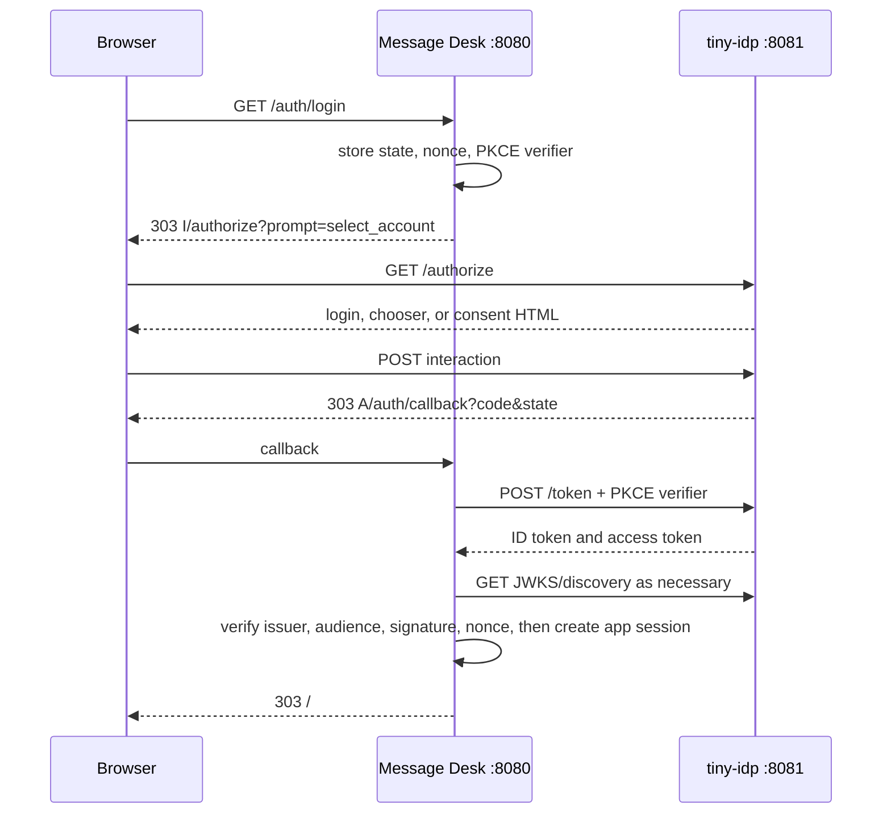
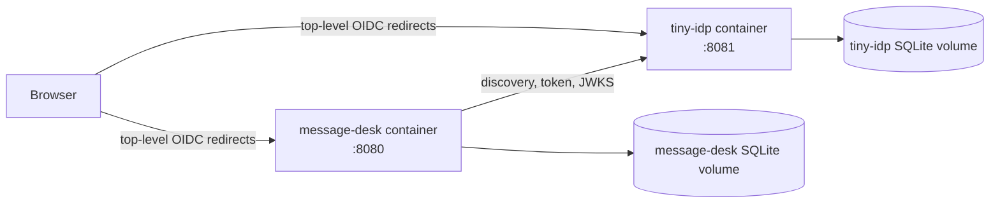

# Standalone tiny-idp and Message Desk Docker demo analysis design and implementation guide

## Executive Summary

This ticket designs a self-contained Docker Compose demonstration with two
independent services: a standalone tiny-idp OpenID Provider and Message Desk,
an ordinary OpenID Connect relying-party application. The demo must show the
actual boundary that production deployments use: browser redirects cross
origins, Message Desk performs discovery, token exchange, and JWKS verification
over HTTPS, and tiny-idp alone owns provider accounts, login, consent,
remembered-account choice, and provider logout.

The existing embedded Message Desk is the starting point, not the target.
Its application store, React UI, PKCE/state/nonce callback logic, application
sessions, CSRF protection, message API, and test fixtures are reusable. Its
embedded provider construction, direct account creation, in-process transport,
provider route mounting, and same-origin logout construction are not. The
result should be a reproducible learning deployment, not a claim that a
development Docker Compose file is a production security boundary.

> [!summary]
> - Build two images and one Compose topology: `idp` owns identity state and `message-desk` owns application state.
> - Seed accounts and the relying-party client before serving; Message Desk never opens or writes the IdP database.
> - Reuse the existing MacOS-1-inspired visual system in a standalone tiny-idp host renderer.
> - Use standard authorization-code flow with PKCE, nonce, exact issuer discovery, JWKS ID-token verification, `openid profile` scopes, and RP-initiated logout.
> - Keep self-service registration out of the first external demo because tiny-idp has no public registration HTTP API yet.

## 1. Problem and scope

The embedded example proves that tiny-idp can be bundled inside a Go
application. It does not teach an operator how to run tiny-idp as an
independent service or teach an application author which APIs remain available
once direct Go references disappear. This demo supplies that missing reference
architecture.

In scope are a standalone provider, seeded accounts, a pre-registered Message
Desk browser client, login, consent, account selection, account removal,
local application logout, provider-wide logout, scope display, durable SQLite
volumes, health checks, and reproducible browser validation. Out of scope are
public self-registration, multi-tenant client administration, email recovery,
social login, and a claim that plain HTTP Compose is production-ready.

## 2. Technology primer

OIDC divides responsibility deliberately. The relying party redirects a
browser to the provider; it does not receive the password. After a successful
authorization response, the relying party exchanges a short-lived code using
its PKCE verifier, validates the ID token against the issuer's JWKS, checks
the nonce it stored before redirecting, and creates its own local session.



The two services do not share cookies or SQLite files. A Message Desk cookie
authenticates Message Desk requests. A tiny-idp cookie authenticates provider
interactions. A top-level redirect carries the appropriate provider cookie;
server-to-server token and JWKS calls use the configured issuer URL.

## 3. Current-state evidence and reusable code

`examples/tinyidp-message-app/oidc_client.go` already has the correct relying
party core. `newOIDCClient` performs discovery, `beginLogin` stores durable
state/nonce/S256 PKCE material and requests `prompt=select_account`, and
`finishLogin` atomically consumes state, exchanges the code, verifies the ID
token and nonce, and creates a hashed Message Desk session. Its only
embedded-specific dependency is the supplied `*http.Client` transport.

`examples/tinyidp-message-app/app_http.go` already separates local Message
Desk logout from provider-wide logout. The external variant retains the former
but must discover or explicitly configure the provider `end_session_endpoint`
instead of deriving `publicOrigin + "/idp/end-session"`.

| Reuse | Replace |
|---|---|
| `app_store.go`, messages, login attempts, CSRF and app sessions | `embeddedidp.Bootstrap`, `embeddedidp.New`, and provider handler mounting in `commands.go` |
| `oidc_client.go` PKCE, nonce, state, token and ID-token checks | `NewInProcessIssuerTransport` with an outbound TLS-configured HTTP client |
| React Message Desk assets under `/static/app/` | Direct `idpaccounts.Service` registration form |
| `loginui` templates/CSS visual language | Co-hosted `/static/tinyidp/` asset mount |

## 4. Proposed system



Compose exposes `http://localhost:8080` and `http://localhost:8081` for the
demonstration. Inside the Compose network, service DNS names are useful for
health checks but must not replace the public issuer in browser redirects or
ID-token `iss` validation. The issuer is `http://localhost:8081` in the
development profile. A production profile terminates TLS and uses public
HTTPS origins; tiny-idp production mode must retain secure cookies and strict
issuer validation.

### Data and configuration contract

The IdP initialization input owns:

```yaml
issuer: http://localhost:8081
client:
  id: message-desk
  redirect_uris: [http://localhost:8080/auth/callback]
  post_logout_redirect_uris: [http://localhost:8080/]
  scopes: [openid, profile]
seed_accounts:
  - login: amelie
    display_name: Amelie
    password_source: operator-secret-or-dev-fixture
```

Seed passwords must be development-only inputs. They are never baked into an
image, emitted in logs, or copied into the Message Desk configuration. The
seeder uses tiny-idp's public account/bootstrap APIs in a one-shot container
or an idempotent `tinyidp init` command. Idempotence must reject credential or
client drift rather than silently changing a running identity system.

Message Desk external-mode configuration owns:

```yaml
public_base_url: http://localhost:8080
issuer: http://localhost:8081
client_id: message-desk
cookie_secure: false # development only
oidc_http_timeout: 10s
```

## 5. Visual and interaction design

The browser sees two origins but one visual language. The provider container
hosts the existing Message Desk-inspired renderer as a tiny-idp host renderer:
the paper background, ink typography, teal selection state, blue links, and
rose destructive action remain, while markup remains constrained by
`pkg/idpui.InteractionRenderer`. The React Message Desk app remains served
only by the relying party.

The renderer must submit only provider contracts: `interaction`, CSRF token,
action, credentials, and opaque `account` values. It must not construct
redirects, mint cookies, decide scopes, or expose account IDs in chooser
values. `pkg/idpui/types.go` and its conformance harness are the API reference.

## 6. Logout and scope contracts

Message Desk exposes two explicit actions. Local logout revokes only its
hashed application session and clears its cookie. Global logout first does
the same then navigates the browser to a validated provider end-session URL.
The provider clears its own session and browser context; the next sign-in
requires credentials rather than showing remembered accounts.

Scope behavior is provider-owned. The seeded client receives exactly
`openid profile`; the provider's consent page displays the requested scopes;
Message Desk requests the same scopes and uses only `sub` and `name` from the
verified ID token. Adding email, groups, or roles requires an explicit client
allowlist, claim policy, consent explanation, and tests.

## 7. Implementation plan

1. Add `examples/tinyidp-external-message-desk/` rather than mutating the
   embedded example. Copy only the relying-party packages and static app.
2. Add `external` configuration fields and validate canonical public origin,
   issuer URL, client ID, and cookie mode at startup.
3. Replace the custom in-process transport with a bounded outbound HTTP
   client. Discovery must fail closed; no fallback issuer is permitted.
4. Add an IdP image entrypoint that opens persistent state, bootstraps the
   client/signing key, reconciles seeded accounts, mounts the renderer, and
   serves health/readiness endpoints.
5. Add a Message Desk image entrypoint with no imports of `embeddedidp`,
   `idpaccounts`, or provider handlers. Hide registration in this first mode
   and provide a clear “accounts are seeded by the demo operator” explanation.
6. Add `compose.yaml`, named volumes, health checks, an init dependency, and
   a Makefile/README runbook.
7. Add two-origin tests before treating the demo as complete.

```go
func runExternalDesk(cfg Config) error {
    httpClient := hardenedOIDCHTTPClient(cfg.Issuer)
    oidc := newOIDCClient(ctx, cfg.Issuer, cfg.PublicBaseURL, httpClient)
    app := newMessageApp(appStore, oidc, nil, nil, cfg.CookieSecure)
    return serve(app)
}
```

## 8. Validation plan

- Unit test external configuration rejects non-canonical issuer URLs, insecure
  production cookies, missing client ID, and invalid local return paths.
- Integration-test discovery, code exchange, nonce mismatch, PKCE mismatch,
  state replay, wrong issuer, wrong audience, expired JWKS response, and
  provider unavailability across real HTTP origins.
- Browser-test login, consent, `prompt=select_account`, use-another, removal,
  local logout, global logout, scope display, and responsive keyboard access.
- Compose smoke: start, wait for both health endpoints, seed accounts, sign in,
  create a message, restart each container independently, and verify durable
  state remains in its own volume.
- Security review: inspect network logs for passwords, authorization codes,
  token bodies, raw cookies, and seed credentials; none may appear.

## 9. Decisions and alternatives

| Decision | Rationale | Consequence |
|---|---|---|
| Separate example directory | Keeps embedded and external deployment lessons independently runnable. | Some code is copied initially; extract a shared RP package only after duplication is proven. |
| Seeded accounts, no registration | No safe public tiny-idp registration HTTP API exists. | Demo explains its boundary honestly. |
| Public localhost issuer in dev | Browser redirects and ID-token issuer validation need one canonical URL. | Service DNS is internal-only. |
| Standard HTTP transport | The services are independent processes. | Network, TLS, timeout, and outage tests are mandatory. |
| Same visual renderer | Demonstrates UI customization without confusing visual discontinuity. | The renderer is deployed with IdP, not Message Desk. |

## 10. Intern checklist

Read `pkg/embeddedidp/example_test.go` for standalone bootstrap, then
`examples/tinyidp-message-app/oidc_client.go` for RP mechanics, then
`pkg/idpui/types.go` for renderer authority limits. Run the existing embedded
Message Desk first, inspect its redirects, then implement external mode one
boundary at a time. Do not introduce shared SQLite volumes, shared cookies,
or direct database access as shortcuts.

## References

- OpenID Connect Core 1.0: https://openid.net/specs/openid-connect-core-1_0.html
- OpenID Connect Discovery 1.0: https://openid.net/specs/openid-connect-discovery-1_0.html
- OpenID Connect RP-Initiated Logout 1.0: https://openid.net/specs/openid-connect-rpinitiated-1_0.html
- OAuth 2.0 Security Best Current Practice (RFC 9700): https://www.rfc-editor.org/rfc/rfc9700
- Local API references: `pkg/embeddedidp`, `pkg/idpaccounts`, `pkg/idpui`, and `examples/tinyidp-message-app`.
