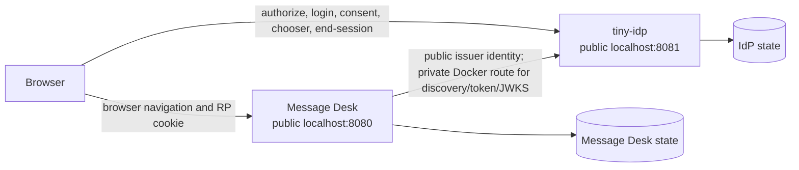

# Standalone external demo security review and handoff

## Executive assessment

`TINYIDP-EXTERNAL-DEMO-001` is complete as a **local development reference
deployment**. It demonstrates a separate tiny-idp issuer and separate Message
Desk relying party on two browser origins with durable independent state. The
implementation is not a production deployment artifact. Its HTTP loopback
configuration, public seeded accounts, development provider mode, local Docker
volumes, and lack of CI-hosted TLS/proxy topology are explicit non-production
boundaries.

The implementation has stronger evidence than an ordinary sample:

- focused Go tests cover provider/UI/RP packages and the private-backchannel
  transport invariant;
- a pinned ticket-local Playwright suite drives actual browser login, consent,
  scopes, callback, CSRF rejection, message creation, chooser, account switch,
  local logout, and global logout against running containers;
- a restart/operational script checks unprivileged PID 1, fixture exposure in
  rendered config/logs, durable provider token secret, durable RP state
  manifest, public message persistence, and readiness recovery;
- the implementation diary records real defects and their fixes, including
  callback CSP behavior and named-volume ownership.

No test suite proves absence of all security defects. The evidence below
states exactly what has been tested and what remains a production-host design
and operations responsibility.

## Scope and tested topology



The important boundary is semantic, not merely topological.

| Boundary | Responsible process | Review rule |
| --- | --- | --- |
| account passwords, IdP browser session, consent, chooser, signing keys | tiny-idp | Message Desk must not open this state or create identities directly in external mode |
| application messages, RP login transaction, RP session, CSRF secret | Message Desk | tiny-idp must not need this state to authenticate an account |
| OIDC issuer identity | canonical browser URL | Docker DNS may route a backchannel request but cannot become `iss` or a browser redirect origin |
| final authorization callback | registered Message Desk origin | interaction CSP may permit only the already validated callback origin |

## Security claims and evidence

### Claim 1: the RP validates an OIDC transaction rather than trusting browser identity input

The RP stores state, nonce, PKCE verifier, return destination, and a five
minute expiry before redirecting the browser. Callback processing consumes the
stored transaction, exchanges the authorization code, verifies the ID token,
checks nonce and subject, then creates a hashed local app session.

Evidence:

- `examples/tinyidp-message-app/oidc_client.go`
- `examples/tinyidp-message-app/login_attempts.go`
- browser assertion in `02-external-demo.spec.mjs` that an unrecognized
  callback state/code receives `502` and cannot establish a session
- existing unit tests for replay/nonce/login-attempt behavior listed in
  `examples/tinyidp-message-app/contracts.go`

Review concern: the browser assertion identifies an invalid callback as a bad
gateway response because the current handler groups callback completion errors
under that response. A future error-model improvement could distinguish local
transaction rejection from temporary token endpoint unavailability without
revealing protocol details to an attacker.

### Claim 2: public issuer identity survives private Docker routing

`issuerRewriteTransport` only changes the target network destination for
requests matching the configured public issuer. It preserves the public Host
and logical issuer identity used by OIDC discovery and validation. The source
test uses a path-mounted issuer and private path-mounted backchannel to prove
the suffix/path behavior and non-mutation of the original request.

Evidence:

```text
logical request: https://issuer.example.test/idp/.well-known/openid-configuration
network target:  http://idp:8081/private-idp/.well-known/openid-configuration
Host header:     issuer.example.test
```

Review concern: any future support for proxy routing, custom transports, or
multiple issuers must preserve the narrow matching rule. Do not turn this into
a generic arbitrary-host rewrite facility.

### Claim 3: login/consent CSP permits completion without opening arbitrary form targets

Real browser testing found that `form-action 'self'` blocked a provider form
submission when its successful POST redirected to the RP callback. The final
renderer model receives `RedirectOrigin` derived from the already
Fosite-validated redirect URI. The interaction policy permits only `self` and
that canonical origin. It does not use untrusted raw request input.

Evidence:

- `internal/fositeadapter/rendering.go`
- `internal/fositeadapter/rendering_test.go`
- `pkg/idpui/types.go`
- successful Playwright callback flow

Review concern: interaction-model extensions must preserve provenance. A
template must never receive a callback origin derived directly from browser
query parameters.

### Claim 4: local and global logout have intentionally different effects

Local logout revokes only the Message Desk session. A later RP login reaches
the provider chooser because the provider browser session remains. Global
logout also navigates to IdP end-session; a later login reaches password
authentication rather than chooser reuse.

Evidence:

- `examples/tinyidp-message-app/app_http.go`
- `02-external-demo.spec.mjs`
- the prior chooser report and tests in `internal/fositeadapter/`

Review concern: preserve distinct labels and routes. Deleting an RP cookie is
not equivalent to ending an issuer session.

### Claim 5: empty named volumes start without a root HTTP server

Docker named volumes are root-owned on first mount. The entrypoint performs
directory ownership setup, then `exec`s `setpriv` to run the actual server as
the service user. The durability script reads `/proc/1/status`, not
`docker compose exec id`, to measure the real server UID.

Evidence:

- `examples/tinyidp-external-message-desk/docker-entrypoint.sh`
- `scripts/03-compose-durability-and-secret-check.sh`

Review concern: adding a sidecar, alternate entrypoint, or Kubernetes
deployment should repeat this PID-1-level privilege assertion. Docker exec
commands often default to root and are not evidence of the server's privilege.

### Claim 6: the committed development fixture is not echoed into deployment configuration or logs

The fixture password is deliberately public and exists only in
`demo-seed.json`. The operational check verifies that the value does not occur
in rendered Compose configuration or accumulated service logs. This is a
development sentinel, not a claim that production secret governance is
complete.

Evidence:

- `scripts/03-compose-durability-and-secret-check.sh`
- passing run recorded in the implementation diary

Review concern: real production secrets require a secret manager, image/SBOM
review, centralized log policy, deployment review, and incident response.

## Reproduction and acceptance procedure

Run from the tiny-idp repository root:

```sh
ttmp/2026/07/14/TINYIDP-EXTERNAL-DEMO-001--standalone-tiny-idp-and-message-desk-docker-oidc-demo/scripts/01-compose-health-smoke.sh
ttmp/2026/07/14/TINYIDP-EXTERNAL-DEMO-001--standalone-tiny-idp-and-message-desk-docker-oidc-demo/scripts/02-run-playwright-browser-smoke.sh
ttmp/2026/07/14/TINYIDP-EXTERNAL-DEMO-001--standalone-tiny-idp-and-message-desk-docker-oidc-demo/scripts/03-compose-durability-and-secret-check.sh

go test ./examples/tinyidp-external-message-desk/... ./examples/tinyidp-message-app ./internal/fositeadapter ./pkg/idpui -count=1
docker compose -f examples/tinyidp-external-message-desk/compose.yaml config
```

Expected result:

1. both Compose services report ready;
2. the browser suite reports one passing scenario;
3. the durability script reports `durability and development-fixture exposure
   checks passed`;
4. the focused Go test command reports all packages passing;
5. Compose configuration validates without errors.

The browser and durability scripts intentionally operate on local development
state. The browser adds a uniquely named demonstration message. The durability
check restarts both services. They must not be pointed at a production system.

## Known limits and release gate

The development reference is complete. A production deployment requires a
separate host/deployment implementation and should not be accepted until every
item in this gate is addressed.

| Production gate | Current status | Required next action |
| --- | --- | --- |
| canonical HTTPS issuer and RP public origin | not implemented by demo | build production host/proxy configuration and browser test it |
| secure explicit cookie policy | only development loopback profile exercised | configure `Secure` and documented `SameSite`, then test redirects/callbacks |
| `embeddedidp.ProductionMode` prerequisites | demo uses DevMode | supply durable audit, production limiter/address resolver, password-work reporter, persistent supported store, usable signing key, and secret management |
| trusted reverse-proxy forwarding policy | documented only | define trusted proxy boundary; never derive issuer from arbitrary forwarded headers |
| operator account lifecycle | public seed only | implement/reuse authorized provisioning, recovery, reset, MFA, and audit processes |
| CI execution | scripts are committed but not wired | run Compose/Playwright/durability suite in a Docker-capable CI runner |
| production secret assurance | fixture sentinel only | implement secret-manager, image scan, deployment review, and log-retention controls |
| backup/restore drill | state persistence only | exercise coherent restore of database plus signing material and document recovery objective |

## Handoff roadmap

### First follow-up: CI without changing application behavior

Create a Docker-capable CI job that:

1. installs the lockfile-pinned Playwright runner and its matching browser;
2. starts the Compose project in an isolated CI environment;
3. runs scripts `01`, `02`, and `03`;
4. uploads Playwright trace/video/screenshot only when the browser suite
   fails;
5. always tears down CI volumes after artifact collection.

This is the lowest-risk next change because it turns current manual evidence
into regression evidence without changing protocol behavior.

### Second follow-up: production standalone host design

Use the production requirements in
`examples/tinyidp-external-message-desk/README.md` and
`pkg/embeddedidp/options.go` as an input checklist. The host must explicitly
choose secret injection, durable audit, rate limiting, client IP provenance,
proxy trust, TLS termination, account management, and backup ownership. It
must fail closed if the public provider readiness prerequisites are absent.

### Third follow-up: device authorization as a separate client

The planned device-auth example should add a distinct device client to the
provider bootstrap manifest rather than changing the browser client. Its test
matrix should share this provider's issuer/signing/account data while proving:

- no browser redirect URI is needed for a device client;
- device user code verification uses the same provider login/consent policy;
- polling, expiry, denial, and token issuance are tested;
- device credentials do not affect Message Desk RP cookies or remembered
  browser accounts unexpectedly.

## Review checklist for the next contributor

- [ ] Read the design doc, implementation diary, and this handoff document in
  that order.
- [ ] Run all three ticket scripts before changing the deployment boundary.
- [ ] Treat public issuer, RP origin, and private backchannel as separate
  configuration values with different validation rules.
- [ ] Do not expose registration in external RP mode without a deliberate
  provider-side provisioning capability and authorization policy.
- [ ] Do not loosen `form-action`, redirect, or cookie policy to solve a
  browser issue without identifying the already validated provenance for every
  new value.
- [ ] Preserve separate local and global logout semantics.
- [ ] Do not commit Playwright outputs, Docker volumes, logs, or real
  credentials.
- [ ] Do not call this demo a production deployment until the release gate is
  complete.

## Final handoff statement

The standalone demo now provides a practical, repeatable reference for
applications that consume tiny-idp as an independent identity provider. It is
usable for local development, architectural study, browser-flow regression
testing, and future device-client experimentation. Its remaining work is not
an unknown defect in the demonstrated OIDC flow; it is the deliberate
transition from a tested HTTP loopback reference to a separately designed and
operated production HTTPS identity service.
