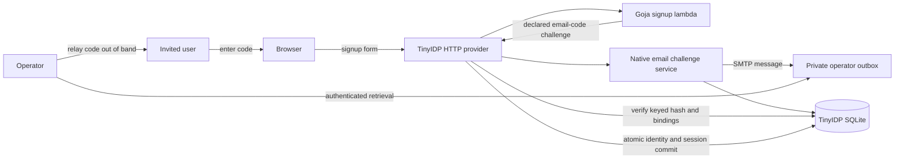
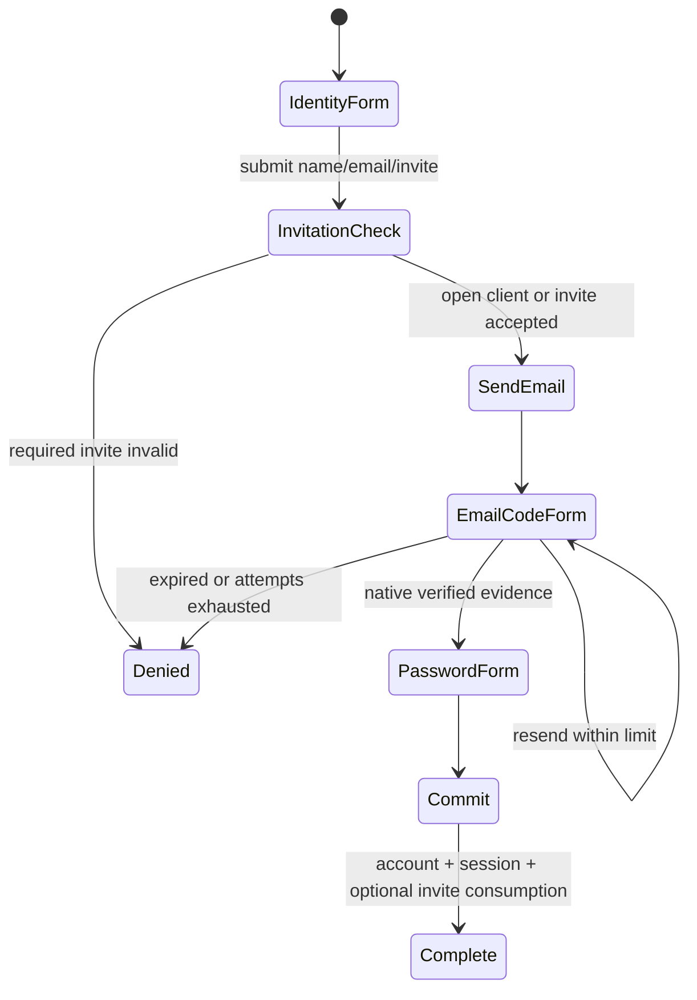
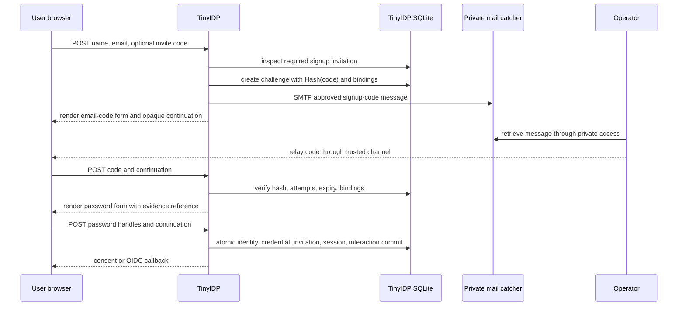

# Verified email signup and first-deploy fake delivery design

## 1. Purpose and scope

This document defines how TinyIDP will create email-verified accounts for the two-application deployment. It is written for an implementer who has not worked on TinyIDP before. By the end, the reader should understand the existing challenge machinery, the missing production wiring, the temporary operator-outbox delivery mode, the combined JavaScript workflow, and the tests that distinguish real verification from a misleading UI shortcut.

The admission policies remain unchanged:

- Message Desk permits open signup. “Open” means no invitation is required; it does not mean that email verification is skipped.
- goja-auth requires a TinyIDP signup invitation before creating an identity.
- Both applications require the user to prove possession of an email challenge code before TinyIDP marks the new identity's email as verified.
- goja-auth separately requires an application organization invitation before creating membership. That invitation is not part of this ticket.

The first deployment will not send directly through the personal email server. It will deliver challenge messages into a private SMTP-catching outbox visible only to operators. The operator relays the code to the intended invited user through an existing trusted channel. This arrangement is deliberately temporary and is appropriate only while signup is operator-assisted.

This ticket does not cover k3s manifests, Argo CD, Vault integration, domain DNS records, production SMTP credentials, organization-invitation delivery, password recovery, or a general notification framework.

## 2. System context

TinyIDP is an OpenID Connect provider. A relying application redirects a browser to TinyIDP's authorization endpoint. TinyIDP authenticates an existing identity or runs a signup workflow, creates a provider browser session, and returns an authorization code to the application.

Signup policy is expressed as a compiled JavaScript program. JavaScript chooses forms and declared outcomes, but it does not own durable workflow state, generate verification codes, send arbitrary mail, mark claims verified, or commit identities. Native Go validates each JavaScript outcome and owns every security-sensitive state transition.

The relevant components are:

| Component | Responsibility |
| --- | --- |
| `pkg/idpsignup` | Compiles the JavaScript signup program and executes one lambda invocation at a time. |
| `pkg/idpemailchallenge` | Generates codes, stores only keyed hashes, enforces expiry/attempt/resend limits, and creates verified evidence. |
| `pkg/idpcontinuation` | Persists explicit browser workflow continuations and binds them to workflow, client, generation, and browser state. |
| `internal/fositeadapter/scripted_signup.go` | Receives browser submissions, starts/verifies challenges, rehydrates evidence, and owns the final signup transaction. |
| `internal/cmds/serve_production.go` | Validates which program capabilities and outcomes production permits and constructs native services. |
| `idpemailchallenge.Mailer` | Narrow native delivery seam receiving an approved recipient, template identifier, code, and expiry. |
| Private mail catcher | First-deploy SMTP destination and operator-only outbox. It does not decide whether a code is valid. |



## 3. What already exists

The durable security core is already implemented. `pkg/idpemailchallenge.Service` generates an eight-character base32 code from cryptographic randomness. It stores an HMAC-SHA-256 lookup value using a dedicated 32-byte key and passes the raw code only to the typed mailer request.

The stored challenge includes:

- opaque challenge ID and record version;
- keyed code hash, never the raw code;
- fixed recipient and template ID;
- workflow ID and resume-handler ID;
- signup-program fingerprint;
- OIDC client ID and client generation;
- browser-binding hash;
- creation, expiry, and last-send times;
- maximum attempts and maximum resends;
- resend delay and lifecycle status.

These bindings prevent a valid code from being moved to another browser continuation, OIDC client, program generation, or workflow handler.

`internal/fositeadapter/scripted_signup.go` already implements the browser sequence:

```text
JavaScript returns challenge.emailCode(...)
  -> native code validates the declared workflow edge
  -> native challenge service creates durable record and sends message
  -> native continuation stores only pending challenge reference
  -> browser displays email_code form
  -> native service verifies submitted code and bindings
  -> continuation stores verified-email evidence reference
  -> JavaScript presents password form
  -> native commit reloads evidence and requires identity login == verified address
  -> account is committed with EmailVerified=true
```

The restart test in `internal/fositeadapter/registration_test.go` proves that the workflow and challenge survive closing and reopening SQLite. Other tests cover wrong codes, attempt exhaustion, resend rotation, expiry, binding mismatch, and one-time evidence consumption.

## 4. The production gap that this ticket closed

Before this ticket, `serve-production` rejected every signup lambda that declared the `challenge` outcome with `unsupported native services: email_challenge`. That rejection was intentional because the production command did not construct an `idpemailchallenge.Service`, load a challenge HMAC key, or provide a concrete mailer.

The completed implementation closed five bounded seams:

1. Implement one concrete SMTP mailer behind the existing `Mailer` interface.
2. Add file-backed secret inputs for the challenge key and, when applicable, SMTP password.
3. Construct the challenge service using the same TinyIDP SQLite store that already implements `idpemailchallenge.Store`.
4. Permit challenge outcomes only when all required native services are configured.
5. Deploy a combined invitation-plus-email-verification JavaScript program.

No new JavaScript database API, generic outbox API, or verification state machine was required.

## 5. First-deploy fake delivery

### 5.1 Definition

“Fake delivery” means the SMTP message terminates at a private mail-catching service instead of the recipient's public mailbox. The code itself remains real. The challenge state and verification result remain real. The operator retrieves the message and relays the code to the intended user.

The first deployment must satisfy all of these constraints:

- The outbox has no public route.
- Only authenticated operators can access it through an administrative tunnel or private network.
- TinyIDP is the only workload allowed to submit SMTP messages to it.
- The outbox is treated as sensitive because it contains live bearer codes.
- Messages expire operationally with their corresponding challenge and are deleted on a short retention schedule.
- Codes never appear in TinyIDP HTML, JSON responses, application redirects, normal logs, audit attributes, or metrics.
- Users cannot retrieve arbitrary messages by guessing an email address or challenge ID.

If the code were displayed on the public signup page, the challenge would prove only that the browser can read its own response. TinyIDP would then emit a false `email_verified=true` claim. This design prohibits that shortcut.

### 5.2 Why SMTP is still used

The private outbox should expose an SMTP listener and a protected operator UI/API. TinyIDP uses the same SMTP mailer that will later talk to the personal mail server. The first-deploy topology changes only these operational values:

```text
first deploy: SMTP address = private mail catcher
later deploy: SMTP address = personal submission server
```

The JavaScript workflow, native challenge service, templates, verification evidence, account transaction, and OIDC claims do not change.

### 5.3 Truthfulness of the verified claim

In operator-assisted mode, the operator must deliver the code to a contact channel already associated with the intended recipient. The signup invitation and challenge code should not be posted together in a publicly accessible place. The operator is providing the delivery assertion that SMTP would later provide automatically.

This mode is appropriate for a small first deployment with manually invited users. It is not an unattended public email-verification service and must not be described as one.

## 6. SMTP mailer contract

The existing interface remains unchanged:

```go
type Mailer interface {
    SendEmailChallenge(context.Context, MailRequest) error
}

type MailRequest struct {
    Challenge Reference
    Recipient string
    Template  string
    Code      string
    ExpiresAt time.Time
}
```

The concrete implementation should live in a focused package such as `pkg/idpemailchallenge/smtpmailer`. It must not accept arbitrary headers, sender addresses, subjects, bodies, or recipient lists from JavaScript.

Construction receives reviewed native configuration:

```go
type Config struct {
    Address       string
    TLSMode       TLSMode // starttls, implicit, or plaintext-for-private-test-only
    ServerName    string
    Username      string
    Password      []byte
    FromAddress   string
    FromName      string
    ConnectTimeout time.Duration
    SendTimeout    time.Duration
    Templates      map[string]Template
}
```

The mailer resolves `MailRequest.Template` through an immutable native template catalog. An unknown template is a permanent delivery failure. The signup program may select `signup-code`; it cannot supply message HTML.

The initial template needs only:

```text
Subject: Verify your TinyIDP email address

Your verification code is: <code>
This code expires at: <UTC timestamp>
If you did not request this code, ignore this message.
```

The mailer must:

- normalize and validate a single recipient mailbox;
- use CRLF-safe fixed headers;
- refuse header injection;
- set a context-bounded connection and send deadline;
- verify TLS certificates outside the explicitly private plaintext test mode;
- avoid logging the code or complete message;
- classify failures as transient or permanent through `MailFailure`;
- clear password bytes where practical after construction failure or shutdown; and
- expose only non-secret health information.

## 7. Production command API

The production command should use flags and file-backed secrets rather than environment variables or a new configuration file. Proposed inputs are:

```text
--email-challenge-key-file PATH
--email-smtp-address HOST:PORT
--email-smtp-tls-mode starttls|implicit|private-plaintext
--email-smtp-server-name NAME
--email-smtp-username USER
--email-smtp-password-file PATH
--email-from-address ADDRESS
--email-from-name NAME
```

For the private mail catcher, authentication may be omitted only on an isolated workload network and only with `private-plaintext`. For the personal server, username, password file, verified TLS, and sender address are required.

Startup behavior is fail-closed:

```text
compile signup program
if program declares challenge outcome:
  require email-challenge-key-file
  require complete SMTP delivery configuration
  require SQL store implements idpemailchallenge.Store
  construct mailer
  construct challenge service
else:
  reject partial email configuration as operator error
start HTTP listener only after all required services are ready
```

The challenge key must be independent from the OIDC token secret and invitation lookup key. Rotating it invalidates outstanding challenge codes, so rotation requires an explicit operational plan.

## 8. Combined signup program

The program must compose two independent policy decisions: whether the client requires an invitation and whether the submitted email has been verified. The invitation is inspected before email delivery so an attacker cannot use an invite-gated client as an unrestricted mail sender.



Conceptual JavaScript:

```javascript
const start = ctx => {
  const fields = [A.field.displayName(), A.field.email()];
  if (ctx.input.clientId === "goja-auth-host-demo") {
    fields.push(A.field.inviteCode());
  }
  return ctx.present.form({
    title: "Create an account",
    resume: "submitted",
    fields,
    actions: [A.action.submit(), A.action.deny()],
    carry: {},
    expiresInSeconds: 300
  });
};

const submitted = async ctx => {
  if (inviteRequired(ctx.input.clientId)) {
    const decision = await ctx.cap.invitation.lookup({
      code: ctx.input.inviteCode || ""
    });
    if (!decision.valid) return A.result.deny("invitation.rejected");
  }
  return ctx.challenge.emailCode({
    email: ctx.input.email,
    template: "signup-code",
    resume: "emailVerified",
    expiresInSeconds: 900,
    maximumAttempts: 5,
    maximumResends: 2,
    carry: ctx.input
  });
};
```

After native code verifies the email code, the next lambda must require native evidence whose address equals the carried email. The final commit includes the invitation code only for the invite-gated client. Native Go rechecks the evidence/address equality and atomically consumes the signup invitation with identity creation.

The invitation is not consumed before email verification. A delivery failure, expired email challenge, invalid code, or abandoned password form therefore leaves the signup invitation reusable until its own expiry.

## 9. Browser and request sequence



No Goja VM remains suspended while the operator or user handles the code. Each browser wait is represented by an explicit durable continuation. A service restart between any two browser requests reloads the continuation and challenge from SQLite.

## 10. Failure and retry behavior

| Failure | Browser result | Durable result |
| --- | --- | --- |
| Invalid signup invitation | Generic field denial | No challenge and no account; invite unchanged. |
| Mail catcher unavailable | Generic delivery failure | Challenge may exist; no verified evidence or account. Operator can restore delivery and use bounded resend. |
| Wrong email code | Generic code denial | Attempt count increments; account and invite unchanged. |
| Attempts exhausted | Terminal challenge denial | Account and invite unchanged. |
| Resend requested | New code delivered | Old code becomes invalid; resend count increments. |
| Challenge expires | Terminal challenge denial | Account and invite unchanged. |
| Password rejected | Password-form denial | Verified evidence and invite remain bounded by continuation/expiry for retry. |
| Duplicate login | Stable registration denial | No new account; invite is not consumed. |
| Commit database failure | Generic registration failure | Identity, credential, session, interaction, and invitation redemption roll back together. |

The existing `CreateAndSend` sequence persists the challenge before calling the mailer. An SMTP failure can therefore leave a challenge that was never delivered. The first implementation should document and test recovery through bounded resend. A transactional delivery outbox is deferred; it becomes necessary only if observed delivery failures make synchronous SMTP unreliable for the deployment's scale.

## 11. Audit and secrecy

Required audit events include:

- challenge creation/send accepted or rejected;
- resend accepted or rejected;
- code verification accepted or rejected with coarse reason;
- signup invitation validation and consumption;
- final self-registration acceptance.

Audit must include client ID, challenge reference where operationally necessary, result, and coarse reason. It must not include:

- raw verification code;
- raw signup invitation;
- SMTP password;
- full rendered email body;
- password or password handles;
- OIDC authorization code, tokens, cookies, or CSRF values.

The private mail catcher is the only first-deploy component allowed to store a raw code after the synchronous send call. Its storage and UI are therefore security-sensitive even though it is temporary.

## 12. Test design

### 12.1 Native unit tests

- SMTP template resolution rejects unknown templates.
- Address/header validation rejects newline injection and multiple recipients.
- TLS configuration fails closed for invalid combinations.
- Context cancellation and deadlines terminate connection/send attempts.
- SMTP status codes map to transient or permanent `MailFailure` classes.
- Logs and returned errors do not contain raw codes or credentials.

### 12.2 Production construction tests

- A challenge-declaring program starts when challenge key and complete mailer configuration are supplied.
- The same program fails before listening when the key, address, sender, or required credential is missing.
- A program without challenge outcomes does not require mail configuration.
- Partial mail configuration is rejected rather than ignored.
- The challenge service uses the production SQLite store rather than memory state.

### 12.3 Workflow tests

- Message Desk open signup requires a valid email code but no invitation.
- goja signup rejects an invalid invitation before sending mail.
- goja signup with a valid invite sends one challenge and preserves the unconsumed invite.
- Verified evidence must match the account login case-insensitively.
- Password and optional invitation consumption commit atomically with `EmailVerified=true`.
- Restart between challenge send, verification, and password submission succeeds.
- Wrong code, exhaustion, resend, expiry, duplicate login, and rollback leave expected state.

### 12.4 Browser acceptance

The shared Compose acceptance suite adds a private mail catcher and retrieves the message through its operator API. The test must:

1. Start Message Desk registration and submit a random email.
2. Poll the private outbox using operator credentials and extract the exact current code.
3. Complete code verification, password selection, OIDC callback, and Message Desk session creation.
4. Issue a goja signup invitation and application membership invitation.
5. Start goja registration, retrieve and submit the challenge, and complete OIDC.
6. Assert the new application session contains `emailVerified=true`.
7. Accept the email-bound application invitation successfully and verify one membership.
8. Assert replay rejection and absence of raw codes/invites from audit and service logs.

## 13. Implementation phases

### Phase 0: Freeze contracts

- Record the exact existing `Mailer`, challenge store, continuation, evidence, and signup commit contracts.
- Add a failing production construction test that demonstrates the current `email_challenge` rejection.
- Decide the private mail catcher product only at deployment binding time; keep the Go implementation protocol-based.

### Phase 1: Native SMTP delivery

- Implement the focused SMTP mailer and fixed `signup-code` template.
- Add TLS modes, timeouts, address validation, failure classification, and redacted diagnostics.
- Add unit tests using an in-process SMTP test server; do not require the personal email server in CI.

### Phase 2: Production activation

- Add Glazed production fields for mailer settings and file-backed secrets.
- Load a dedicated 32-byte challenge key.
- Construct the durable service from the production SQLite store.
- Make program validation accept challenge outcomes only when construction requirements are satisfied.
- Add startup validation and command tests.

### Phase 3: Combined JavaScript policy

- Compose open Message Desk and invite-gated goja admission with mandatory email verification.
- Ensure invitation inspection precedes mail delivery.
- Preserve verified evidence across the password form.
- Keep optional invite redemption inside the native account transaction.

### Phase 4: Private first-deploy outbox

- Add a private SMTP catcher to the local/deployment topology.
- Expose its UI/API only through operator access, never the public ingress.
- Configure short retention and document manual code relay.
- Mount challenge and optional outbox credentials through secret files.

### Phase 5: Product acceptance

- Extend browser acceptance to retrieve current codes from the operator outbox.
- Prove both applications create `email_verified=true` accounts.
- Prove the new goja identity can accept its email-bound application membership invitation.
- Prove failure, resend, replay, restart, audit, and redaction behavior.

### Deferred phase: Real SMTP

- Point the same mailer at the personal submission server.
- Supply dedicated sender credentials through the later Vault/GitOps work.
- Verify TLS, SPF, DKIM, DMARC, deliverability, bounce behavior, and rate limits.
- Remove the private outbox after a short rollback window.

## 14. Definition of done for the first deployment

The ticket is complete when:

- production accepts the reviewed combined signup program;
- every newly created account in both application paths has native verified-email evidence;
- goja invite-gated registration checks the invite before sending a message;
- the fake delivery sink is inaccessible from public ingress;
- the operator can retrieve and relay a code without reading TinyIDP logs or databases;
- a new goja user can accept an email-bound organization invitation immediately after signup;
- outstanding codes survive TinyIDP restart;
- attempt, resend, expiry, and replay limits are enforced;
- no raw code appears in public responses, audit, logs, URLs, or application storage;
- the only change required for real mail is SMTP destination/credential configuration; and
- k3s, Argo CD, and real SMTP remain untouched unless separately authorized.

## 15. File-oriented review guide

Read these files in order:

1. `pkg/idpemailchallenge/service.go` defines the narrow mailer and challenge lifecycle.
2. `pkg/idpemailchallenge/types.go` defines bindings, statuses, evidence, and closed errors.
3. `internal/fositeadapter/sqlstore.go` implements restart-safe challenge attempts, resend, verification, evidence, and expiry in the shared SQLite store.
4. `pkg/idpsignup/email_verified_signup.js` demonstrates the existing challenge-to-password workflow.
5. `internal/fositeadapter/scripted_signup.go` owns browser transitions and the final account transaction.
6. `internal/fositeadapter/registration_test.go` proves verified signup and SQLite restart behavior.
7. `internal/cmds/serve_production.go` contains the current fail-closed production rejection and future construction seam.
8. `examples/tinyidp-shared-two-apps/open-signup.js` is the deployable policy that must combine invitation and verification.

The central review questions are:

- Can JavaScript or browser input claim that an email is verified without native evidence?
- Can an invalid invite cause mail delivery?
- Can a code be used outside its browser, client, handler, or program-generation binding?
- Can account creation commit without matching verified evidence?
- Can fake delivery be reached from public ingress?
- Can replacing the mail catcher with real SMTP occur without changing policy or verification semantics?

## 16. Alternatives considered

### Display the code in the browser

Rejected. This proves no control over the email address and would make `email_verified=true` false.

### Mark all first-deploy accounts verified administratively

Rejected as a signup policy. An operator may create a specific verified fixture through an explicit administrative command, but automatic signup must not silently acquire that status.

### Skip email verification and use only subject-bound application invitations

This is secure for principals whose application subject is already known, but it does not solve signup for a new email-address invitee. It remains a supported application-invitation option, not the selected signup design.

### Add a database-backed notification outbox immediately

Deferred. The current challenge store already provides durable challenge state and bounded resend. A notification outbox adds delivery workers, leasing, retry scheduling, and cleanup. The first deployment is small and operator-assisted; synchronous SMTP plus resend is sufficient until operational evidence says otherwise.

### Call the personal SMTP server in tests

Rejected. CI and local tests must be deterministic, must not consume real credentials, and must not send messages to real recipients.

## 17. Final design rule

The first deployment may fake transport, but it must not fake security state. TinyIDP remains the sole authority that generates and verifies codes and creates verified-email evidence. The private outbox substitutes for the final delivery destination. It does not bypass the challenge, expose codes publicly, or set claims directly.
