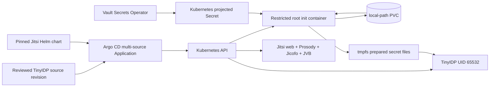
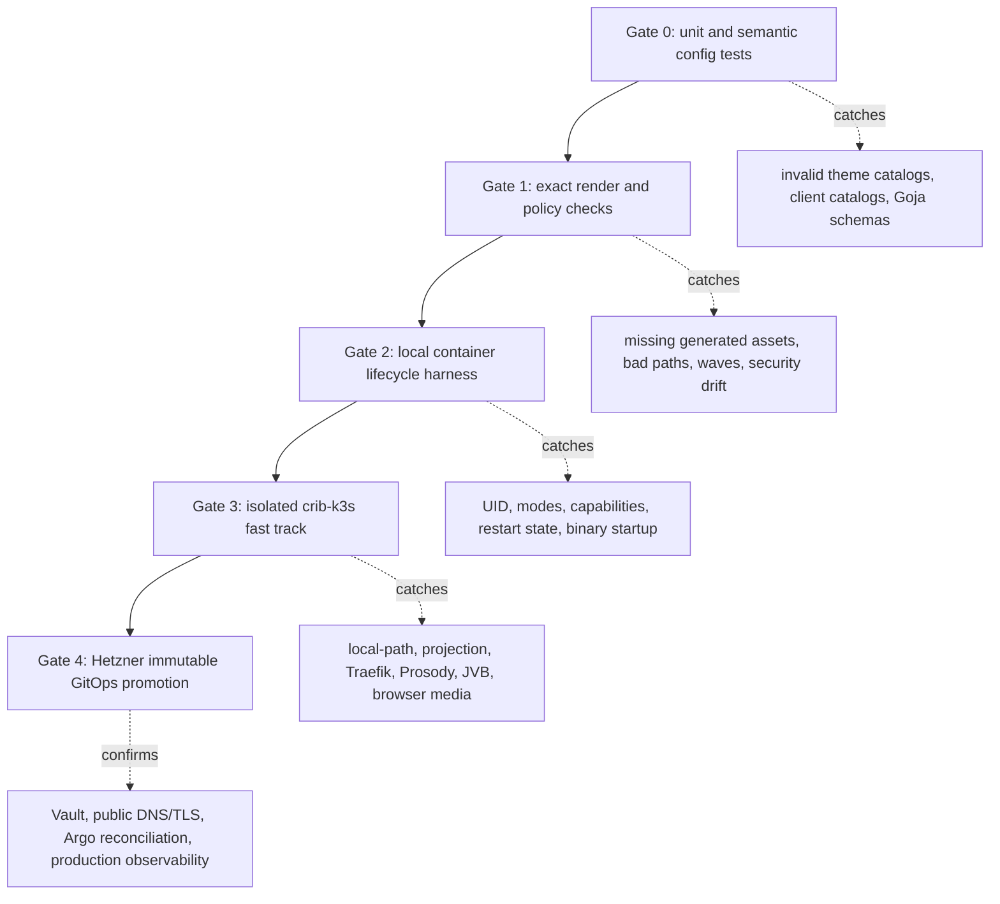

# TinyIDP and Jitsi deployment validation architecture: local lifecycle harness, crib-k3s fast track, and Hetzner promotion guide

## 1. Purpose and current conclusion

This document explains why a TinyIDP and Jitsi stack that worked locally still
failed repeatedly during its Hetzner k3s rollout. It then defines a validation
architecture that exercises the production deployment contracts before an
immutable GitOps revision reaches Hetzner. The intended reader is a new intern
who understands basic Go, containers, and HTTP but has not operated this
system.

The central conclusion is that the failures were not caused by one unusually
difficult permission problem. We validated one local system and deployed a
different production artifact. The local Compose stack proved the OIDC,
TinyIDP plugin, Goja policy, Prosody JWT, Jicofo, JVB, TLS, signup, logout, and
two-browser media paths. It did not prove:

- Kubernetes `local-path` persistent-volume ownership across a second Pod
  start.
- Linux capability behavior for a root init process restricted to
  `CHOWN` and `FOWNER`.
- Kubernetes projected Secret ownership and interaction with `fsGroup`.
- The exact ConfigMap generated by the production Kustomization.
- The current `serve-production` startup contract for every required file.
- Argo CD sync-wave scheduling and active-operation revision behavior.

The immediate rollout blocker is also no longer ambiguous. The deployed
TinyIDP revision reaches production UI catalog loading and stops with:

```text
Error: theme "default" stylesheet must be a CSS basename
```

The production `themes.json` omits `stylesheet`, and the production ConfigMap
does not include a CSS file. The local Compose profile has both
`"stylesheet": "jitsi.css"` and `jitsi.css`; this was a configuration-parity
failure that should have been detected before deployment.

## 2. System foundation

### 2.1 TinyIDP

TinyIDP is the identity provider. Its `serve-production` command owns browser
sessions, signup and login workflows, authorization interactions, OAuth/OIDC
codes and tokens, local users, audit output, and the Jitsi integration route.
In this deployment it also runs a bounded Goja policy before it issues a
Jitsi meeting token.

The production process has two HTTP listeners:

- The public listener serves OIDC, signup/login pages, static theme assets,
  and `/integrations/jitsi/*`.
- The private administrative listener serves `/healthz`, `/readyz`, and
  `/metrics`.

Traefik terminates public TLS. TinyIDP therefore uses
`trusted-proxy-http` and accepts forwarded origin information only from an
explicit cluster CIDR. The public issuer remains an HTTPS URL even though the
pod receives HTTP from Traefik.

### 2.2 Jitsi

Jitsi is a set of cooperating services:

- **Jitsi web** serves the browser application.
- **Prosody** provides XMPP and validates Jitsi JWTs.
- **Jicofo** coordinates conferences.
- **JVB** transports WebRTC media, primarily on UDP port 10000.

TinyIDP does not replace Prosody. TinyIDP authenticates the browser and signs a
short-lived, room-bound JWT. Prosody validates that JWT. Jicofo and JVB then
perform conference control and media transport.

### 2.3 Kubernetes, Vault, and Argo CD

Kubernetes provides the pod, ConfigMap, Secret projection, PVC, Service,
Ingress, NetworkPolicy, probes, and security contexts. Vault is the durable
secret authority; Vault Secrets Operator creates a Kubernetes Secret. A
short-lived init container converts the projected secret files into
owner-private runtime files for the non-root TinyIDP server.

Argo CD owns the Hetzner deployment. The Application uses two sources:

1. A full TinyIDP Git commit and the Kustomize directory
   `deploy/kubernetes/tinyidp-jitsi`.
2. The `jitsi-contrib/jitsi-helm` chart pinned to version `2.22.0`.



## 3. Current state assessment

The project report and ticket diary provide evidence through the most recent
successful boundary. The state initializer and secret handoff have been
implemented, reviewed, merged, and advanced through immutable GitOps
revisions. The live process progressed through both of those boundaries and
then failed at the theme catalog.

| Area | State | Evidence |
| --- | --- | --- |
| Plugin and Jitsi token bridge | Implemented | TinyIDP plugin phases 1–6 and local end-to-end phase 7 tests are checked off. |
| Local Compose behavior | Passed previously | Login, signup, chooser, cancellation, policy denial, logout, malformed JWT rejection, and two-browser media were exercised. |
| PVC creation | Repaired | The PVC and consuming Deployment share sync wave 1, avoiding `WaitForFirstConsumer` deadlock. |
| Restart-safe state ownership | Repaired, needs final live restart proof | The initializer reclaims `/state` and the known private `/state/audit` child before traversal and handoff. |
| Runtime secret ownership | Repaired, needs final live metadata proof | The projected Secret is init-only; UID-65532 mode-0400 copies are created in a memory-backed `emptyDir`. |
| TinyIDP production configuration | Blocked | Production `themes.json` has no CSS basename and Kustomize includes no CSS asset. |
| Argo revision handling | Understood operationally | Desired source and active sync revision must both be checked; a stale active operation previously retried an older revision. |
| Public end-to-end validation | Not complete | Readiness, restart, public signup/login, media, logout, metrics, audit, and redacted logs remain after startup succeeds. |

At the time this guide was written, the default kubeconfig pointed to the
Hetzner Tailscale API endpoint:

```text
https://k3s-demo-1.tail879302.ts.net:6443
```

The API did not answer the diagnostic request within the working interval.
This does not establish that the cluster is down. It establishes that an
unqualified `kubectl` command is a poor development primitive: it may target
production, and a broken Tailscale or DNS path can stall the feedback loop.
Every harness command must therefore name an explicit kubeconfig, verify the
API server identity, and use an outer command timeout.

## 4. Why the existing local tests did not prevent the failures

### 4.1 The local and production configuration bundles diverged

The local Compose stack mounts:

```text
examples/tinyidp-jitsi/themes.json
examples/tinyidp-jitsi/jitsi.css
examples/tinyidp-jitsi/open-signup.js
examples/tinyidp-jitsi/jitsi-policy.js
```

Its catalog contains:

```json
{
  "defaultTheme": "jitsi",
  "themes": {
    "jitsi": {
      "productName": "TinyIDP Meetings",
      "stylesheet": "jitsi.css"
    }
  }
}
```

The production Kustomization generates a ConfigMap from:

```text
deploy/kubernetes/tinyidp-jitsi/config/clients.json
deploy/kubernetes/tinyidp-jitsi/config/themes.json
deploy/kubernetes/tinyidp-jitsi/config/open-signup.js
deploy/kubernetes/tinyidp-jitsi/config/jitsi-policy.js
```

The production catalog contains no `stylesheet`, and the generator contains
no CSS file. Both files are valid JSON. A render-only check therefore passes.
Only `productionui.LoadCatalog` detects the semantic error.

### 4.2 Compose and Kubernetes implement different filesystem contracts

The Compose `idp` container starts with a shell that creates `/state/audit`,
generates a token key, changes its mode, bootstraps users, and starts TinyIDP.
This process is not the Kubernetes security model.

The Kubernetes pod has:

- A root init container with only `CHOWN` and `FOWNER`.
- A main TinyIDP process running as UID/GID 65532.
- A read-only root filesystem.
- A `local-path` PVC whose ownership persists between Pods.
- A projected Secret whose files are root-owned.
- A memory-backed handoff directory whose files become UID-65532, mode 0400.

The Compose test was valuable, but it could not prove those Kubernetes
invariants because those objects and transitions did not exist there.

### 4.3 A first start is not a restart test

The filesystem state before the first start is approximately:

```text
/state  root:root, storage-provider-selected mode
```

After a successful TinyIDP start it is intentionally:

```text
/state        65532:65532 0700
/state/audit  65532:65532 0700
```

The second initializer must recover the latter state. A one-pass test against
an empty directory proves only installation. It says nothing about a rollout,
reschedule, or reboot.

### 4.4 Static YAML validation cannot execute application startup

The existing validator correctly checks presence and ordering:

```text
chown 0:0 /state
chown 0:0 /state/audit
mkdir -p /state/audit
chmod 0700 /state/audit
chown -R 65532:65532 /state
```

It also checks the secret copy, ownership, mode, and command-line paths. These
are useful structural invariants. They do not run:

```text
tinyidp serve-production ...
```

against the rendered ConfigMap and representative mounted files. The missing
stylesheet therefore survived the validator.

### 4.5 Argo CD adds state that local application tests do not model

Argo has both desired state and operation state:

```text
spec.sources[0].targetRevision
status.operationState.operation.sync.revisions[0]
```

If an old automated operation is retrying, changing the desired revision does
not prove that a new ReplicaSet was applied. A production validation must
observe the source revision, active operation revision, ReplicaSet, Pod, and
container arguments together.

## 5. Validation architecture

The proposed system has five gates. A change moves forward only when the gate
designed for its class of failure passes.



### 5.1 Gate 0: unit and semantic configuration tests

This gate runs without containers or Kubernetes. It should use the same Go
loaders used by `serve-production`, not a second JSON interpretation.

Required checks:

- Load every checked-in production theme catalog with its actual theme
  directory.
- Verify every declared CSS basename exists, is a regular file, and is below
  the size limit.
- Load every client catalog and verify the client/theme relationship.
- Compile the signup and Jitsi Goja programs with their declared handler and
  capability requirements.
- Verify local and production copies of shared policy/CSS assets are identical
  or, preferably, remove duplication and mount a canonical reviewed asset.

Pseudocode:

```text
for deploymentProfile in checkedInProfiles:
    clients = LoadClientCatalog(profile.clientsFile)
    themes = LoadThemeCatalog(profile.themeCatalog, profile.themeDirectory, clients)
    signup = CompileSignupProgram(profile.signupProgram)
    jitsiPolicy = CompileJitsiPolicy(profile.jitsiPolicy)

    assert themes.defaultTheme exists
    assert all client theme mappings reference declared clients and themes
    assert signup.startHandler is invokable with declared bindings
    assert jitsiPolicy handler accepts the checked-in fixture
```

The production Jitsi profile should become a table-driven test case alongside
the local profile. A malformed checked-in deployment profile must fail `go
test` before it can be merged.

### 5.2 Gate 1: exact render and policy checks

This gate renders the exact Kustomize package and pinned Helm values. It does
not manually reconstruct selected fields.

The output must be checked for:

- ConfigMap keys, including `jitsi.css`.
- The theme catalog's basename and the matching ConfigMap key.
- The same Argo wave on a `local-path` PVC and its first consumer.
- Init command ordering.
- Init and server security contexts.
- Source Secret visibility only in the init container.
- Prepared secret volume visibility only in the server.
- Readiness, liveness, Service, Ingress, NetworkPolicy, and TLS hosts.
- Matching TinyIDP/Prosody app ID, issuer, audience, domain, algorithm, and
  shared-secret Secret key.
- Pinned image, chart, and source revisions.

The validator should extract values from rendered objects rather than search
only for strings. String checks remain useful for prohibiting inline secret
material, but object-aware assertions provide better failure messages.

### 5.3 Gate 2: local container lifecycle harness

This gate runs the production init script and production TinyIDP command in
containers with production-like UIDs, capabilities, mounts, and modes. It is
smaller and faster than a complete Jitsi deployment.

The harness needs three scenarios:

1. **Fresh volume.** Start with an empty state directory. Run the init logic,
   then start TinyIDP as UID 65532 using the rendered configuration.
2. **Restarted volume.** Leave `/state` and `/state/audit` as UID 65532 mode
   0700. Run the same init logic again with only `CHOWN` and `FOWNER`, then
   start TinyIDP again.
3. **Negative inputs.** Remove CSS, change a secret to mode 0440, remove a
   required Secret key, or make a policy invalid. Assert a precise expected
   failure at the intended boundary.

The important detail is that the harness consumes files extracted from the
rendered ConfigMap. It must not mount the local Compose catalog as a substitute.

```text
render Kustomize
extract ConfigMap data to temporary read-only directory
create temporary state directory
create root-owned source secret files

run init container image with:
    UID 0
    capabilities CHOWN,FOWNER
    state mount
    source-secret mount read-only
    prepared-secret tmpfs mount

run TinyIDP image with:
    UID/GID 65532
    no capabilities
    read-only root filesystem
    exact rendered args
    extracted config
    prepared secrets
    state mount

probe /readyz
stop
repeat without deleting state
```

This harness should live under the ticket's `scripts/` directory while it is
being developed. Once stable and required by CI, move the reusable part into
the deployment package and leave the diary pointing to its final path.

### 5.4 Gate 3: isolated crib-k3s fast track

crib-k3s is the best available integration environment because it already
provides the Kubernetes behaviors we need:

- k3s and the `local-path` storage class.
- Packaged Traefik.
- cert-manager and `*.crib.scapegoat.dev` routing.
- Argo CD.
- Vault Secrets Operator connected to the shared Hetzner Vault.
- Monitoring and centralized logging.
- A single node where JVB can use host UDP port 10000.

It is closer to Hetzner than a generic local Docker cluster, while remaining
separate from public production. Its documented kubeconfig is:

```text
/home/manuel/code/wesen/crib-k3s/kubeconfig.yaml
```

The fast track should begin as a manual, isolated namespace deployment. This
shortens the feedback loop by excluding Argo's source-pin and retry state while
we validate Kubernetes behavior. It must not modify resources owned by
crib-k3s Argo Applications.

Proposed names:

```text
namespace: tinyidp-jitsi-fasttrack
TinyIDP:    https://idp-jitsi-fasttrack.crib.scapegoat.dev
Jitsi:     https://meet-jitsi-fasttrack.crib.scapegoat.dev
client ID: tinyidp-jitsi-fasttrack
```

The fast-track overlay changes environment-specific values only:

- Namespace.
- TinyIDP issuer and Jitsi public origin.
- OIDC callback and logout URLs.
- Client ID/app ID/accepted issuer/accepted audience.
- XMPP domain.
- Trusted proxy CIDR if crib uses a different Pod CIDR.
- TLS resources appropriate for crib's wildcard or per-service certificate
  pattern.
- JVB advertised IP for Tailscale/LAN validation.

It must reuse, without re-authoring:

- The TinyIDP image under test.
- The init script.
- Security contexts.
- PVC and storage class.
- Secret projection and runtime handoff.
- Signup program.
- Jitsi policy.
- Theme CSS.
- Probes and internal services.
- Pinned Jitsi chart version.

For the first fast-track run, create an ephemeral Kubernetes Secret with the
same key names as VSO output. This deliberately exercises Kubernetes
projection semantics while removing remote Vault authentication from the
inner loop. Then run a second crib test using VSO. These are separate claims:

| Test | Proves | Does not prove |
| --- | --- | --- |
| Ephemeral Secret fast track | Pod projection, init handoff, TinyIDP/Jitsi shared values | Vault policy, auth mount, refresh |
| VSO-backed crib run | Cross-cluster Vault auth, Secret creation, refresh/restart targets | Hetzner public route |
| Hetzner production | Actual Vault path, Argo ownership, public DNS/TLS, production networking | Nothing beyond observed checks |

Every crib command must guard its target:

```sh
KUBECONFIG=/home/manuel/code/wesen/crib-k3s/kubeconfig.yaml
expected_server=https://k3s-proxmox:6443
actual_server="$(kubectl --kubeconfig="$KUBECONFIG" config view \
  --minify -o jsonpath='{.clusters[0].cluster.server}')"
test "$actual_server" = "$expected_server"

timeout 15s kubectl --kubeconfig="$KUBECONFIG" get nodes
```

The namespace should carry labels identifying manual ownership and expiry.
Cleanup is an explicit, reviewed step after evidence is collected. The
production manifests remain Argo-owned; no production Application should ever
point at the fast-track namespace.

### 5.5 Gate 4: Hetzner immutable GitOps promotion

Promotion occurs only after the same image and deployment bundle pass crib.
The GitOps PR pins a full TinyIDP source commit and a concrete image digest or
immutable SHA tag. The production change contains no untested reconstruction
of the crib configuration.

After merge, collect:

```text
Application spec source revision
active operation revision
sync status and health
Deployment generation
new ReplicaSet hash
Pod image ID
rendered container arguments
PVC binding and ownership lifecycle
prepared-secret metadata only
public TLS responses
browser/Jitsi behavior
metrics, audit event classes, and redacted logs
```

Do not print Secret values, passwords, authorization codes, cookies, or JWTs
while collecting evidence.

## 6. Configuration architecture

The deployment currently has duplicated local and production assets. Some
duplication is necessary because issuer and callback URLs differ, but policy
and presentation assets should not drift silently.

### 6.1 Separate invariant and environment-specific data

Invariant assets:

- `open-signup.js`
- `jitsi-policy.js`
- `jitsi.css`
- JSON schemas and policy fixtures

Environment-specific data:

- Client ID.
- Issuer and callback URLs.
- Post-logout URL.
- Jitsi public origin and XMPP domain.
- Trusted proxy CIDR.
- TLS host and Secret name.
- Secret source reference.

A practical first implementation is to keep complete local and production
catalogs but add semantic tests and byte-equality checks for invariant assets.
The later cleanup can move invariant files to one canonical directory consumed
by both Compose and Kustomize. Do not introduce a runtime templating layer just
to avoid a small reviewed environment overlay.

### 6.2 Add a deployment contract manifest

A small non-secret contract document can drive validation:

```yaml
profile: tinyidp-jitsi-prod
issuer: https://idp-jitsi.yolo.scapegoat.dev
publicOrigin: https://meet.yolo.scapegoat.dev
clientID: tinyidp-jitsi-prod
xmppDomain: meet.yolo.scapegoat.dev
theme:
  name: default
  stylesheet: jitsi.css
runtime:
  uid: 65532
  gid: 65532
  statePath: /state
  secretMode: "0400"
jitsi:
  algorithm: HS256
  udpPort: 10000
```

This file is not a new runtime configuration system. It is a test oracle for
cross-resource assertions. The actual Kubernetes and TinyIDP files remain the
runtime inputs.

## 7. Test matrix

### 7.1 Startup and filesystem matrix

| Case | Initial state | Expected result |
| --- | --- | --- |
| Fresh PVC | Empty root-owned mount | Init prepares state; TinyIDP becomes Ready. |
| Restart | UID-65532, mode-0700 state and audit | Init reclaims known paths, hands back, TinyIDP becomes Ready. |
| Missing audit child | Private state, no audit directory | Init creates audit and hands it back. |
| Missing Secret key | One projected key absent | Init fails before TinyIDP starts, with the missing path visible but no value. |
| Source Secret mode differs | Kubernetes-projected source | Prepared copies remain UID-65532 mode 0400. |
| Prepared file is 0440 | Deliberate negative fixture | TinyIDP rejects it. |
| CSS omitted | Catalog references absent asset | Semantic test and startup harness both fail before deployment. |
| Invalid CSS path | URL, traversal, or nested path | Catalog loader rejects it as not a CSS basename. |

### 7.2 Identity and conferencing matrix

| Case | Expected result |
| --- | --- |
| Unauthenticated room join | Jitsi sends the browser to TinyIDP. |
| Explicit signup | A new identity is created and a room-bound token returns to Jitsi. |
| Existing login | The browser returns with a valid token. |
| Missing verified email | Goja policy returns the themed denial page. |
| Cancel | The integration shows a themed recoverable error. |
| Malformed JWT | Prosody rejects conference admission. |
| Token for wrong room/domain/app | Prosody rejects conference admission. |
| Remembered session with chooser | TinyIDP shows the account chooser. |
| Provider logout | A later room requires authentication again. |
| Two browser contexts | Both join the same conference and establish media through JVB. |

### 7.3 Operations matrix

| Case | Evidence |
| --- | --- |
| Initial rollout | Ready Pod, Bound PVC, healthy probes. |
| Deliberate restart | New Pod becomes Ready on the existing PVC. |
| Secret refresh | VSO updates destination and intended workloads restart. |
| Argo source advance | Desired revision, active revision, ReplicaSet, and Pod agree. |
| Metrics | Plugin request and Jitsi token counters are present without sensitive labels. |
| Audit | Expected event classes exist; no secret or JWT is emitted. |
| Logs | Errors identify safe paths/contracts; credentials and tokens are redacted. |

## 8. Implementation phases and tasks

### Phase A: repair the current deterministic blocker

- Add a reviewed production `jitsi.css`.
- Add `"stylesheet": "jitsi.css"` to the production theme.
- Add the CSS file to `configMapGenerator.files`.
- Extend the deployment validator to assert that every catalog stylesheet is a
  generated ConfigMap key.
- Add a Go semantic test that loads the checked-in production clients and
  theme catalog from their real paths.
- Run focused tests and the manifest validator.

Exit criterion: the exact production configuration bundle loads through the
same TinyIDP catalog code used at startup.

### Phase B: implement the local lifecycle harness

- Add a ticket script that renders Kustomize into a temporary directory.
- Extract the generated ConfigMap data without modifying source files.
- Run the state initializer with only `CHOWN` and `FOWNER`.
- Start TinyIDP as UID/GID 65532 with the rendered configuration and prepared
  secret files.
- Probe readiness, stop the process, and run the complete sequence again
  against retained state.
- Add negative fixtures for missing CSS and owner-inappropriate secret modes.
- Record exact commands and results in the diary.

Exit criterion: fresh start, retained-state restart, and negative contract
tests are deterministic on one workstation.

### Phase C: implement the crib-k3s fast-track overlay

- Verify crib cluster access using its explicit kubeconfig and target guard.
- Inspect the actual Pod CIDR, StorageClass, wildcard TLS Secret strategy, free
  JVB UDP port, and node advertised IP.
- Create an isolated Kustomize/Helm overlay for the fast-track hosts and client
  identity.
- Render the same pinned Jitsi chart version.
- Create an ephemeral non-Git Secret with production key names.
- Apply into `tinyidp-jitsi-fasttrack` with a dedicated field manager.
- Validate first start and deliberate restart on the same PVC.
- Run the browser matrix with crib origins and unique test accounts.
- Collect metrics, audit classes, and redacted logs.

Exit criterion: the exact security and lifecycle model passes on k3s with
Traefik, local-path, Prosody, Jicofo, and JVB.

### Phase D: validate crib VSO integration

- Create or verify the least-privilege crib Vault role and policy for the
  fast-track namespace.
- Switch the overlay from the ephemeral Secret to `VaultStaticSecret`.
- Verify destination creation without reading Secret values.
- Rotate a test value and verify the intended rollout targets restart.
- Re-run readiness and a short authentication/conference smoke.

Exit criterion: shared Vault delivery and refresh behavior pass independently
of the application lifecycle tests.

### Phase E: promote to Hetzner

- Commit the TinyIDP deployment correction and harness.
- Pass focused CI and review.
- Pin the merged TinyIDP commit in the Hetzner Argo Application.
- Confirm the active operation advances to the desired revision.
- Confirm initial readiness and a deliberate restart.
- Run the complete public browser/media matrix.
- Inspect audit, metrics, and redacted logs.
- Check off ticket task `p7s3` only after all evidence is recorded.

Exit criterion: Argo reports Synced/Healthy and every production validation
claim has recorded evidence.

## 9. File map for an implementer

| File | Why it matters |
| --- | --- |
| `deploy/kubernetes/tinyidp-jitsi/deployment.yaml` | Defines the init lifecycle, server UID, capabilities, mounts, args, and probes. |
| `deploy/kubernetes/tinyidp-jitsi/kustomization.yaml` | Defines the exact production ConfigMap keys. |
| `deploy/kubernetes/tinyidp-jitsi/config/themes.json` | Current startup blocker; must declare a valid local CSS basename. |
| `deploy/kubernetes/tinyidp-jitsi/config/clients.json` | Defines the production OIDC browser client and callback. |
| `deploy/kubernetes/tinyidp-jitsi/config/open-signup.js` | Defines the scripted signup workflow. |
| `deploy/kubernetes/tinyidp-jitsi/config/jitsi-policy.js` | Defines meeting-token authorization policy. |
| `deploy/kubernetes/tinyidp-jitsi/scripts/validate.sh` | Current structural render validator. |
| `internal/productionui/catalog.go` | Implements the authoritative theme/catalog semantic checks. |
| `examples/tinyidp-jitsi/compose.yaml` | Working local behavior stack, but not a substitute for Kubernetes lifecycle tests. |
| `examples/tinyidp-jitsi/jitsi.css` | Existing local presentation asset and likely starting point for reviewed production CSS. |
| `examples/tinyidp-jitsi/browser-tests/tests/jitsi-plugin.spec.ts` | Existing identity, denial, logout, malformed-token, and two-browser behavior matrix. |
| `gitops/applications/tinyidp-jitsi.yaml` in the Hetzner repo | Pins the production TinyIDP source, image, Jitsi chart, public hosts, and JVB networking. |
| `/home/manuel/code/wesen/crib-k3s/kubeconfig.yaml` | Explicit crib target; must be named by every fast-track command. |
| `/home/manuel/code/wesen/crib-k3s/README.md` | Documents crib's k3s, Traefik, DNS, TLS, Argo, and access model. |

## 10. Review rules

A reviewer should reject a change if any of these conditions is true:

- A deployment configuration is tested by parsing JSON but not by the
  authoritative TinyIDP loader.
- The local harness supplies files that are not in the rendered ConfigMap.
- A restart test deletes or replaces the state volume between runs.
- The init container gains `DAC_OVERRIDE`, privileged mode, or a broad host
  mount without a separately approved design.
- The TinyIDP server sees the source projected Secret.
- Secret values, passwords, cookies, authorization codes, or JWTs appear in
  logs or evidence.
- A crib command relies on the default kube context.
- A manually applied fast-track object shares a namespace or field ownership
  with an Argo-managed application.
- A Hetzner source pin is called deployed without confirming the active
  operation revision and new ReplicaSet.

## 11. Design decisions and alternatives

### Decision: use crib-k3s before adding a disposable local k3s distribution

crib-k3s already matches the relevant production substrate and has shared
Vault connectivity. It provides greater immediate value than installing
another local cluster tool. A disposable k3d cluster remains useful for CI
once the lifecycle harness stabilizes, but it is not required to resolve the
current blocker.

### Decision: keep manual crib deployment separate from production GitOps

Manual deployment is appropriate only for the isolated fast-track namespace.
It removes Argo from the inner debugging loop while preserving Kubernetes,
storage, projection, ingress, and media behavior. Once the deployment is
stable, an optional crib Argo Application can test GitOps behavior as a
separate gate.

### Decision: test projected Secrets before VSO

The application consumes a Kubernetes Secret, not Vault directly. An
ephemeral Secret proves projection and init semantics quickly. VSO
authentication and refresh are then tested independently. Combining both in
the first test makes failures harder to classify.

### Alternative: rely only on Compose

Compose remains the fastest complete application behavior test, but it cannot
prove k3s storage, Kubernetes projection, pod security contexts, or Argo
behavior. It remains Gate 0/behavior evidence, not the final deployment gate.

### Alternative: deploy every change directly to Hetzner

This provides production realism but produces slow feedback, consumes public
DNS/TLS/Argo state, and turns deterministic startup mistakes into production
incidents. It should be the promotion environment, not the primary debugger.

## 12. Completion definition

This work is complete when all of the following are true:

- The production theme catalog and CSS load through `productionui`.
- The exact rendered TinyIDP configuration starts locally as UID 65532.
- The init sequence passes both fresh-state and retained-state runs with only
  `CHOWN` and `FOWNER`.
- The crib fast-track passes first start, restart, signup/login, denial,
  malformed token, logout, and two-browser media tests.
- The crib VSO test proves Secret delivery and safe refresh.
- The same reviewed source/image/chart revisions reach Hetzner through GitOps.
- Hetzner Argo is Synced/Healthy.
- Public TinyIDP and Jitsi TLS endpoints pass the browser/media matrix.
- Metrics, audit records, and redacted logs contain the expected operational
  evidence without sensitive material.
- Ticket task `p7s3` is checked and the diary records exact commands, failures,
  revisions, and review instructions.

## 13. References

- `PROJECT REPORT - tiny-idp - Jitsi Production Rollout and Least-Privilege Startup.md`
  in the go-go-parc Obsidian vault.
- Ticket diary Steps 17–21 in
  `reference/01-research-diary.md`.
- `TINYIDP-JITSI-001` for the earlier OIDC/Jitsi protocol design.
- `TINYIDP-JITSI-K3S-001` for the original Hetzner deployment boundary.
- crib-k3s `README.md`, shared Vault/VSO guide, and post-reboot validation
  material.
